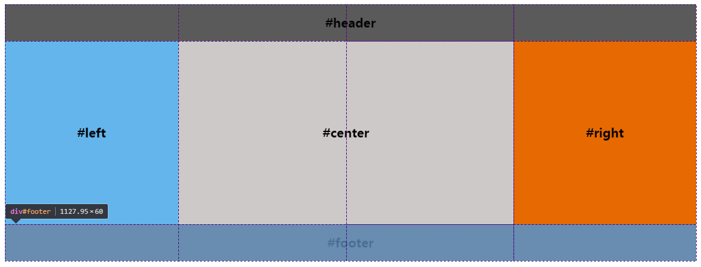

# 圣杯布局

## 浮动

1. 先定义好header和footer的样式，使之横向撑满。
2. 在container中的三列设为浮动和相对定位(后面会用到)，center要放在最前面，footer清除浮动。
3. 三列的左右两列分别定宽200px和150px，中间部分center设置100%撑满
4. 这样因为浮动的关系，center会占据整个container，左右两块区域被挤下去了
5. 接下来设置left的 margin-left: -100%;，让left回到上一行最左侧
6. 但这会把center给遮住了，所以这时给外层的container设置 padding-left: 200px;padding-right: 150px;，给left和right空出位置
7. 这时left并没有在最左侧，因为之前已经设置过相对定位，所以通过 left: -200px; 把left拉回最左侧
8. 同样的，对于right区域，设置 margin-left: -150px; 把right拉回第一行
9. 这时右侧空出了150px的空间，所以最后设置 right: -150px;把right区域拉到最右侧就行了。

## **flex弹性盒子**

1. header和footer设置样式，横向撑满。
2. container中的left、center、right依次排布即可
3. 给container设置弹性布局 `display: flex;`
4. left和right区域定宽，center设置 `flex: 1;` 即可

## **grid布局**

如上图所示，我们把body划分成三行四列的网格，其中有5条列网格线

1. 给body元素添加display: grid;属性变成一个grid(网格)
2. 给header元素设置grid-row: 1; 和 grid-column: 1/5; 意思是占据第一行网格的从第一条列网格线开始到第五条列网格线结束
3. 给footer元素设置grid-row: 1; 和 grid-column: 1/5; 意思是占据第三行网格的从第一条列网格线开始到第五条列网格线结束
4. 给left元素设置grid-row: 2; 和 grid-column: 1/2; 意思是占据第二行网格的从第一条列网格线开始到第二条列网格线结束
5. 给center元素设置grid-row: 2; 和 grid-column: 2/4; 意思是占据第二行网格的从第二条列网格线开始到第四条列网格线结束
6. 给right元素设置grid-row: 2; 和 grid-column: 4/5; 意思是占据第二行网格的从第四条列网格线开始到第五条列网格线结束