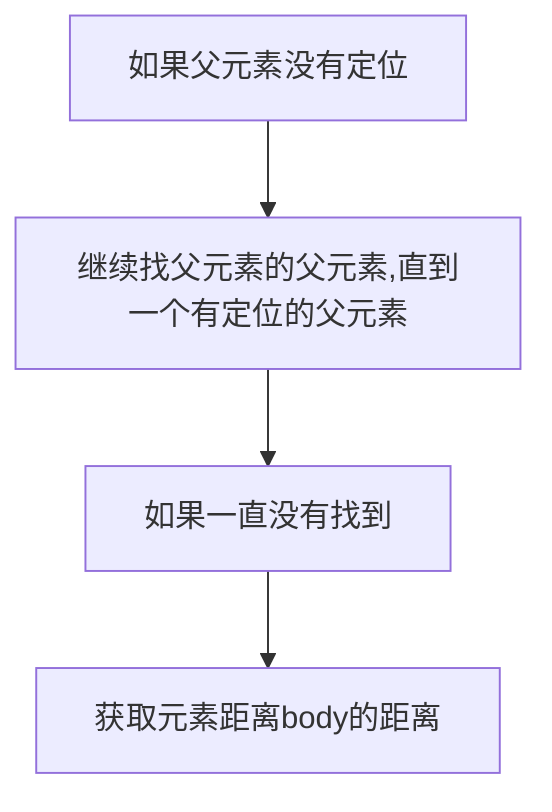

# 加载 使用
## 在浏览器加载时调用方法

```js
window.onload = function(){}
```

## 监听事件触发时调用方法

```js
window.addEventListener('scroll', (e) => {})
```

## 事件触发

```js
        // 1. 获取元素
        var btn = document.querySelector('button');
        // 2. 注册事件
        btn.onclick = function() {}
```
# DOM结构

## 获取DOM节点

```js
function queryChild() {
      // 获取DOM结构
      const dom = document.getElementsByClassName('aa')[0]
      // 获取DOM结构子节点
      const child = document.getElementsByClassName('aa')[0].children[1];
      console.log(dom);
      console.log(child);
    }
    queryChild();
```
## 是向一个元素节点的末尾追加一个节点  appendChild

```js
function myFunction() {
      var newItem = document.createElement("LI")
      var textnode = document.createTextNode("Water")
      newItem.appendChild(textnode)

      var list = document.getElementById("myList")
      list.insertBefore(newItem, list.childNodes[0]);
    }
```


## 封装一个getStyle方法用于获取元素的样式


```js
const aa = document.getElementsByClassName('aa')[0];
    function getStyle(element, attr) {
      if (window.getComputedStyle) {
        return window.getComputedStyle(element, null)[attr];
      } else {
        return element.currentStyle[attr];
      }
    }
    console.log(getStyle(aa, "height"))
```

## 获取一个DOM节点

```js
<div class="article">
    <h2>假如爱有天意</h2>
    <p>吾爱有三</p>
    <p>为日</p>
    <p>为月</p>
    <p>为卿</p>
  </div>
  <script>
    const domclass = document.getElementsByClassName('article')[0]
    console.log(domclass);//打印出dom结构
  </script>
```
## 获取一个节点属性样式

```js

const domclass = document.getElementsByClassName('article')[0]
    console.log(domclass.style);
```
## 获取一个节点单一属性值 
只能行内标签 get set remove

```js
      var a = document.getElementsByClassName('article')[0];
      console.log(a.style);
      var b = a.getAttribute("style");
```

## 删除一个DOM节点
只有一个办法，找父亲搞儿子
```js
function remove() {
      var parent = document.getElementsByClassName('article')[0];
      const h2 = document.getElementsByTagName('h2')[0]
      h2.parentNode.removeChild(h2);
    }
    remove();
```

## 创建DOM节点

```js
Box.innerHTML += `<div></div>`
```

## 给DOM节点添加一些css样式 设置属性

```js
var x = document.getElementById("demo");
    //错误用法，正确使用是设置html元素的的属性类型
    x.setAttribute('height', '100px');
    //正确用法 可以设置多个css属性值 设置的是内联css属性
    //在 vue 声明周期 created 时获取可以获取到dom元素
    //但是使用vue的$refs获取不到dom元素
    document.getElementById("demo").setAttribute('style', 'color:red');
    
    
  
$("#w3s").attr("href","http://www.w3school.com.cn/jquery");
```
**或者直接.color='red'**

```js
document.getElementsByClassName('article')[0].style.backgroundColor = 'purple'
```
## 给元素添加class类名

不要同时使用，会出现问题。
```js
        // 添加：节点.classList.add("类名")；
      // 删除：节点.classList.remove("类名")；
```
# 窗口滚动  scrollTop  scrollLeft

```js
 document.documentElement.scrollTop
 document.body.scrollTop
```

# 窗口偏移量

## offsetLeft和offetTop

如果父元素有定位
获取当前元素距离有定位的父元素的距离





## offsetWidth和offsetHeight

获取元素内容宽高+padding宽高+border宽高的和

# 其他封装

## 格式化时间:YYYY-MM-DD HH-mm-ss

times是一个时间戳:指定时间距离格林威治时间的毫秒数,是可选参数
```js

    function formatDate(times) {
      var time = new Date;
      if (times) {
        //如果进入此处,说明time有实参赋值,因为如果没有实参赋值,他是undefined
        //如果传入参数,表示不是当前时间,是你指定的时间
        time.setTime(times)
      }
      //年
      var year = time.getFullYear();
      //月
      var month = time.getMonth() + 1;//month取值0-11之间,显示要变成1-12之间,所以+1
      //如果月份是一位数,前面要补0;
      month = month < 10 ? "0" + month : month;//三目运算
      //日
      var date = time.getDate();
      //如果日是一位数,前面要补0;
      date = date < 10 ? "0" + date : date;
      //小时
      var hour = time.getHours();
      hour = hour < 10 ? "0" + hour : hour;
      //分
      var minute = time.getMinutes();
      minute = minute < 10 ? "0" + minute : minute;
      //秒
      var second = time.getSeconds();
      second = second < 10 ? "0" + second : second;
      return year + "-" + month + "-" + date + " " + hour + ":" + minute + ":" + second;
    }
```


## 懒加载封装

```js
function lazyload() {
    let viewHeight = document.body.clientHeight //获取可视区高度
    let imgs = document.querySelectorAll('img[data-src]')
    imgs.forEach((item, index) => {
        if (item.dataset.src === '') return

        // 用于获得页面中某个元素的左，上，右和下分别相对浏览器视窗的位置
        let rect = item.getBoundingClientRect()
        if (rect.bottom >= 0 && rect.top < viewHeight) {
            item.src = item.dataset.src
            item.removeAttribute('data-src')
        }
    })
}

function throttle(fn, delay) {
    let timer
    let prevTime
    return function (...args) {
        const currTime = Date.now()
        const context = this
        if (!prevTime) prevTime = currTime
        clearTimeout(timer)

        if (currTime - prevTime > delay) {
            prevTime = currTime
            fn.apply(context, args)
            clearTimeout(timer)
            return
        }

        timer = setTimeout(function () {
            prevTime = Date.now()
            timer = null
            fn.apply(context, args)
        }, delay)
    }
}

window.addEventListener('scroll', throttle(lazyload, 200))
```

# 注意

如果是获取到伪数组或者是  可以将其转化成数组【...node】

