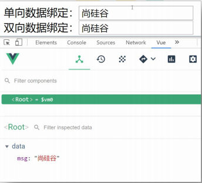
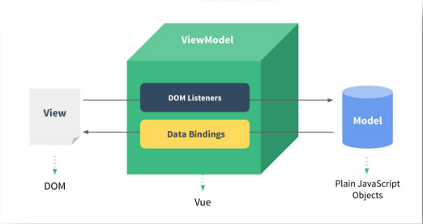
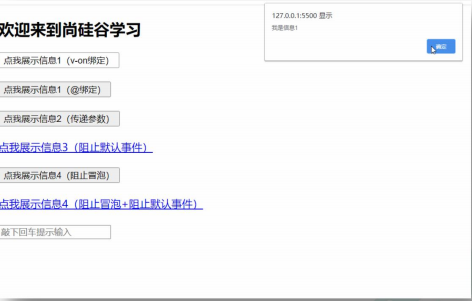
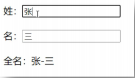
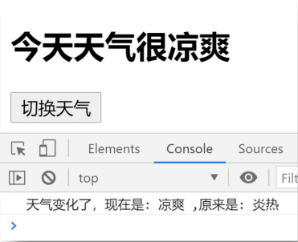
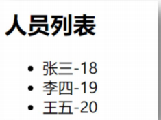
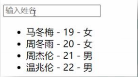
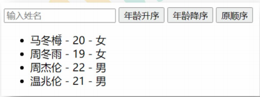
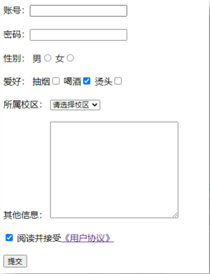
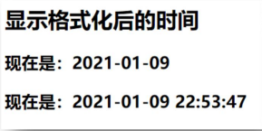

### 1. 4 .数据绑定

#### 1. 4. 1 .效果
  

#### 1. 4. 2 .单向数据绑定

>1 .语法：v-bind:href="xxx"或简写为:href  
2 .特点：数据只能从data流向页面

#### 1. 4. 3 .双向数据绑定

>1 .语法：v-mode:value="xxx"或简写为v-model="xxx" 
2 .特点：数据不仅能从data流向页面，还能从页面流向data
### 1. 5 .MVVM模型

>1 .M：模型(Model)：对应data中的数据 
2 .V：视图(View)：模板 
3 .VM：视图模型(ViewModel)：Vue实例对象

  

### 1. 6 .事件处理

#### 1. 6. 1 .效果
  
#### 1. 6. 2 .绑定监听

>1 .v-on:xxx="fun" 
2 .@xxx="fun" 
3 .@xxx="fun(参数)" 
4 .默认事件形参:event 
5 .隐含属性对象:$event
#### 1. 6. 3 .事件修饰符

>1 ..prevent:阻止事件的默认行为event.preventDefault() 
2 ..stop:停止事件冒泡event.stopPropagation()

#### 1. 6. 4 .按键修饰符

>1 .keycode:操作的是某个keycode值的键 
2 ..keyName:操作的某个按键名的键(少部分)
### 1. 7 .计算属性与监视

#### 1. 7. 1 .效果
  
#### 1. 7. 2 .计算属性-computed

>1. 要显示的数据不存在，要通过计算得来。
2. 在computed对象中定义计算属性。
3. 在页面中使用{{方法名}}来显示计算的结果。

#### 1. 7. 3 .监视属性-watch

  

>1. 通过通过vm对象的$watch()或watch配置来监视指定的属性
2. 当属性变化时,回调函数自动调用,在函数内部进行计算

### 1. 8 .class与style绑定

#### 1. 8. 1 .理解

###### 1. 在应用界面中,某个(些)元素的样式是变化的

###### 2. class/style绑定就是专门用来实现动态样式效果的技术

#### 1. 8. 2 .class绑定

>1. :class='xxx'
2. 表达式是字符串:'classA'
3. 表达式是对象:{classA:isA,classB:isB}
4. 表达式是数组:['classA','classB']

#### 1. 8. 3 .style绑定

>1. :style="{color:activeColor,fontSize:fontSize+'px'}"
2. 其中activeColor/fontSize是data属性

### 1. 9 .条件渲染

#### 1. 9. 1 .条件渲染指令

>1. v-if与v-else
2. v-show

#### 1. 9. 2 .比较v-if与v-show

>1. 如果需要频繁切换v-show较好
2. 当条件不成立时,v-if的所有子节点不会解析(项目中使用)

### 1. 10 .列表渲染

#### 1. 10. 1 .效果

  

  

  

#### 1. 10. 2 .列表显示指令

> 遍历数组:v-for/index  
遍历对象:v-for/key

### 1. 11 .收集表单数据
  
### 1. 12 .过滤器

#### 1. 12. 1 .效果
  

#### 1. 12. 2 .理解过滤器

###### 1. 功能:对要显示的数据进行特定格式化后再显示

###### 2. 注意:并没有改变原本的数据,是产生新的对应的数据

### 1. 13 .内置指令与自定义指令

#### 1. 13. 1 .常用内置指令

* 1 .v-text:更新元素的textContent
* 2 .v-html:更新元素的innerHTML
* 3 .v-if:如果为true,当前标签才会输出到页面
* 4 .v-else:如果为false,当前标签才会输出到页面
* 5 .v-show:通过控制display样式来控制显示/隐藏
* 6 .v-for:遍历数组/对象
* 7 .v-on:绑定事件监听,一般简写为@
* 8 .v-bind:绑定解析表达式,可以省略v-bind
* 9 .v-model:双向数据绑定
* 10 .v-cloak:防止闪现,与css配合:[v-cloak]{display:none}

## 
