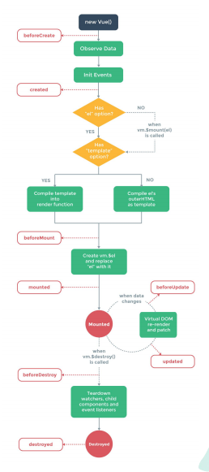
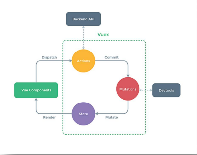
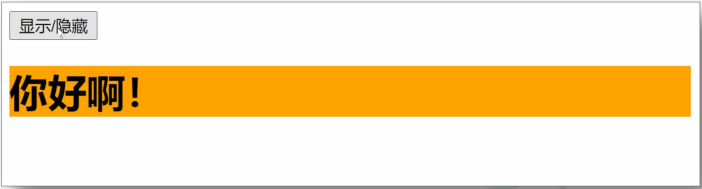
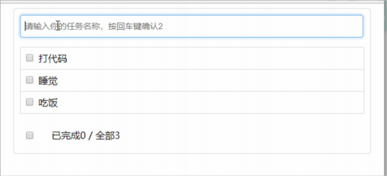

# vue

* [官方网站](https://cn.vuejs.org)
* 遵循MVVM的模式
* 编码简洁
* 本身只关注UI，可以轻松引入vue插件或其他第三方库
* 借鉴angular的模板与数据绑定
* 借鉴react的组件与虚拟DOM

## vue的一些常用插件

* vue-cli               vue脚手架
* vue-resource(axios)   ajax请求
* vue-router            路由
* vuex                  状态管理
* vue-lazyload          图片懒加载
* vue-scroller          页面滑动相关
* mint-ui               基于vue的UI组件库(移动端)
* element-ui            基于vue的UI组件库(PC端)

### github

https://github.com/thomas373737/vue2Study

https://github.com/thomas373737/vue2Study.git

## 什么是 vue

1. 构建用户界面
   + 用 vue 往 html 页面中填充数据，非常的方便
2. 框架
   + 框架是一套现成的解决方案，程序员只能遵守框架的规范，去编写自己的业务功能！
   + 要学习 vue，就是在学习 vue 框架中规定的用法！
   + vue 的指令、组件（是对 UI 结构的复用）、路由、Vuex、vue 组件库
   + 只有把上面掌握以后，才有开发 vue 项目的能力！


### vue 的两个特性

1. 数据驱动视图：

   + 数据的变化**会驱动视图**自动更新
   + 好处：程序员只管把数据维护好，那么页面结构会被 vue 自动渲染出来！

   ### MVVM模型

   >1 .M：模型(Model)：对应data中的数据<br>
   >2 .V：视图(View)：模板<br>
   >3 .VM：视图模型(ViewModel)：Vue实例对象

     

   ### 

2. 双向数据绑定：

   > 在网页中，form 表单负责**采集数据**，Ajax 负责**提交数据**。

   + js 数据的变化，会被自动渲染到页面上
   + 页面上表单采集的数据发生变化的时候，会被 vue 自动获取到，并更新到 js 数据中

> 注意：数据驱动视图和双向数据绑定的底层原理是 MVVM（Mode 数据源、View 视图、ViewModel 就是 vue 的实例）

## 使用Vue脚手架

### 初始化脚手架

#### 说明

>1. Vue脚手架是Vue官方提供的标准化开发工具（开发平台）。

2. 最新的版本是 4 .x。
3. 文档:https://cli.vuejs.org/zh/。

### 具体步骤

第一步（仅第一次执行）：全局安装@vue/cli。

```
npm install -g @vue/cli
```

第二步： **切换到你要创建项目的目录** ，然后使用命令创建项目

```
vue create 项目名
```

第三步：启动项目

```
npm run serve
```

备注：

1. 如ht出tp现s:/下/re载g缓ist慢ry请.n配pm置.tanopbmao淘.o宝rg镜像：npm config set registry

2. Vue脚手架隐藏了所有webpack相关的配置，若想查看具体的webpakc配置，
   请执行：vue inspect > output.js

#### 模板项目的结构

##### ├──node_modules

##### ├──public

##### │ ├──favicon.ico:页签图标

##### │ └──index.html:主页面

##### ├──src

##### │ ├──assets:存放静态资源

##### │ │ └──logo.png

##### │ │──component:存放组件

##### │ │ └──HelloWorld.vue

##### │ │──App.vue:汇总所有组件

##### │ │──main.js:入口文件

##### ├──.gitignore:git版本管制忽略的配置

##### ├──babel.config.js:babel的配置文件

##### ├──package.json:应用包配置文件

##### ├──README.md:应用描述文件

##### ├──package-lock.json：包版本控制文件


### **vue** **项目的运行流程**

在工程化的项目中，vue 要做的事情很单纯：通过 main.js 把 App.vue 渲染到 index.html 的指定区域中。

其中：

① App.vue 用来编写待渲染的模板结构

② index.html 中需要预留一个 el 区域

③ main.js 把 App.vue 渲染到了 index.html 所预留的区域中

```vue
  <title>测试$mount方法</title>
</head>

<body>
  <div id="app">{{username}}</div>

  <script src="./lib/vue-2.6.12.js"></script>
  <script>
    const vm = new Vue({
      data: {
        username: 'admin'
      }
    })
// 替换app渲染
    vm.$mount('#app')
  </script>
```

## vue 指令

### 1. 内容渲染指令

#### v-text

指令的缺点：会覆盖元素内部原有的内容！


#### {{ }}

**插值表达式**：在实际开发中用的最多，只是内容的占位符，不会覆盖原有的内容！**用于内容节点**

功能：用于解析标签体内容。

​              写法：{{xxx}}，xxx是js表达式，且可以**直接读取到data中的所有属性。**

#### v-html

指令的作用：可以**把带有标签的字符串**，渲染成真正的 HTML 内容！

```vue
<body>
  <!-- 学习点🍎 v-text v-html {{插值表达式}} -->
   <!-- 希望 Vue 能够控制下面的这个 div，帮我们在把数据填充到 div 内部 -->
  <div id="app">
    <p v-text="username"></p>
    <p v-text="gender">性别：</p>

    <hr>

    <p>姓名：{{ username }}</p>
    <p>性别：{{ gender }}</p>

    <hr>

    <div v-text="info"></div>
    <div>{{ info }}</div>
        <!--可以渲染dom -->
    <div v-html="info"></div>
  </div>

  <!-- 1. 导入 Vue 的库文件，在 window 全局就有了 Vue 这个构造函数 -->
  <script src="./lib/vue-2.6.12.js"></script>
  <!-- 2. 创建 Vue 的实例对象 -->
  <script>
    // 创建 Vue 的实例对象
    const vm = new Vue({
      // el 属性是固定的写法，表示当前 vm 实例要控制页面上的哪个区域，接收的值是一个选择器
      el: '#app',
      // data 对象就是要渲染到页面上的数据
      data: {
        username: 'zhangsan',
        gender: '女',
        info: '<h4 style="color: red; font-weight: bold;">upupup！！！</h4>'
      }
    })
  </script>
```


### 2. 属性绑定指令

#### V-bind   :

**用于属性节点内容**

>  注意：插值表达式只能用在元素的**内容节点**中，不能用在元素的**属性节点**中！

+ 在 vue 中，可以使用 `v-bind:` 指令，**为元素的属性动态绑定值**；

+ 简写是英文的 `:`

+ 在使用 v-bind 属性绑定期间，如果绑定内容需要进行动态拼接，则字符串的外面应该包裹单引号，例如：

  ```xml
  <div :title="'box' + index">这是一个 div</div>
  ```

**三目运算  ⭐⭐⭐**

```vue
  <title>属性绑定</title>
</head>

<body>
  <!-- 希望 Vue 能够控制下面的这个 div，帮我们在把数据填充到 div 内部 -->
  <div id="app">
    <input type="text" :placeholder="tips">
    <hr>
    <!-- vue 规定 v-bind: 指令可以简写为 : -->
    

    <hr>
    <div>1 + 2 的结果是：{{ 1 + 2 }}</div>
    <div>{{ tips }} 反转的结果是：{{ tips.split('').reverse().join('') }}</div>
    <div :title="'box' + index">这是一个 div</div>
    <!-- 支持三目运算🍎 -->
    <div>{{1?'true':'false'}}</div>
  </div>

  <!-- 1. 导入 Vue 的库文件，在 window 全局就有了 Vue 这个构造函数 -->
  <script src="./lib/vue-2.6.12.js"></script>
  <!-- 2. 创建 Vue 的实例对象 -->
  <script>
    // 创建 Vue 的实例对象
    const vm = new Vue({
      // el 属性是固定的写法，表示当前 vm 实例要控制页面上的哪个区域，接收的值是一个选择器
      el: '#app',
      // data 对象就是要渲染到页面上的数据
      data: {
        tips: '请输入用户名',
        photo: 'https://cn.vuejs.org/images/logo.svg',
        index: 3
      }
    })
  </script>
```

#### 样式绑定

##### class绑定

1. :class='xxx'

2. 表达式是字符串:'classA'
3. 表达式是对象:{classA:isA,classB:isB}
4. 表达式是数组:['classA','classB']

##### style绑定

1. :style="{color:activeColor,fontSize:fontSize+'px'}"

2. 其中activeColor/fontSize是data属性

##### 代码展示

```vue
<!DOCTYPE html>
<html>
	<head>
		<meta charset="UTF-8" />
		<title>绑定样式</title>
		<style>
			.basic{
				width: 400px;
				height: 100px;
				border: 1px solid black;
			}
			
			.happy{
				border: 4px solid red;;
				background-color: rgba(255, 255, 0, 0.644);
				background: linear-gradient(30deg,yellow,pink,orange,yellow);
			}
			.sad{
				border: 4px dashed rgb(2, 197, 2);
				background-color: gray;
			}
			.normal{
				background-color: skyblue;
			}

			.atguigu1{
				background-color: yellowgreen;
			}
			.atguigu2{
				font-size: 30px;
				text-shadow:2px 2px 10px red;
			}
			.atguigu3{
				border-radius: 20px;
			}
		</style>
		<script type="text/javascript" src="../js/vue.js"></script>
	</head>
	<body>
		<!-- 
			绑定样式：
					1. class样式
								写法:class="xxx" xxx可以是字符串、对象、数组。
										字符串写法适用于：类名不确定，要动态获取。
										对象写法适用于：要绑定多个样式，个数不确定，名字也不确定。
										数组写法适用于：要绑定多个样式，个数确定，名字也确定，但不确定用不用。
					2. style样式
								:style="{fontSize: xxx}"其中xxx是动态值。
								:style="[a,b]"其中a、b是样式对象。
		-->
		<!-- 准备好一个容器-->
		<div id="root">
			<!-- 绑定class样式--字符串写法，适用于：样式的类名不确定，需要动态指定 -->
			<div class="basic" :class="mood" @click="changeMood">{{name}}</div> <br/><br/>

			<!-- 绑定class样式--数组写法，适用于：要绑定的样式个数不确定、名字也不确定 -->
			<div class="basic" :class="classArr">{{name}}</div> <br/><br/>

			<!-- 绑定class样式--对象写法，适用于：要绑定的样式个数确定、名字也确定，但要动态决定用不用 -->
			<div class="basic" :class="classObj">{{name}}</div> <br/><br/>

			<!-- 绑定style样式--对象写法 -->
			<div class="basic" :style="styleObj">{{name}}</div> <br/><br/>
			<!-- 绑定style样式--数组写法 -->
			<div class="basic" :style="styleArr">{{name}}</div>
		</div>
	</body>

	<script type="text/javascript">
		Vue.config.productionTip = false
		
		const vm = new Vue({
			el:'#root',
			data:{
				name:'尚硅谷',
				mood:'normal',
				classArr:['atguigu1','atguigu2','atguigu3'],
				classObj:{
					atguigu1:false,
					atguigu2:false,
				},
				styleObj:{
					fontSize: '40px',
					color:'red',
				},
				styleObj2:{
					backgroundColor:'orange'
				},
				styleArr:[
					{
						fontSize: '40px',
						color:'blue',
					},
					{
						backgroundColor:'gray'
					}
				]
			},
			methods: {
				changeMood(){
					const arr = ['happy','sad','normal']
					const index = Math.floor(Math.random()*3)
					this.mood = arr[index]
				}
			},
		})
	</script>
	
</html>
```


### 3. 事件绑定

#### v-on:  简写是 `@`

1. 语法格式为：

   ```xml
   <button @click="add"></button>
   
   methods: {
      add() {
   			// 如果在方法中要修改 data 中的数据，可以通过 this 访问到
   			this.count += 1
      }
   }
   ```

```vue
 <title>事件绑定</title>
</head>

<body>
  <!-- 希望 Vue 能够控制下面的这个 div，帮我们在把数据填充到 div 内部 -->
  <div id="app">
    <p>count 的值是：{{ count }}</p>
    <!-- 在绑定事件处理函数的时候，可以使用 () 传递参数 -->
    <!-- v-on: 指令可以被简写为 @ -->
    <button @click="add(1)">+1</button>
    <button @click="sub">-1</button>
  </div>

  <!-- 1. 导入 Vue 的库文件，在 window 全局就有了 Vue 这个构造函数 -->
  <script src="./lib/vue-2.6.12.js"></script>
  <!-- 2. 创建 Vue 的实例对象 -->
  <script>
    // 创建 Vue 的实例对象
    const vm = new Vue({
      // el 属性是固定的写法，表示当前 vm 实例要控制页面上的哪个区域，接收的值是一个选择器
      el: '#app',
      // data 对象就是要渲染到页面上的数据
      data: {
        count: 0
      },
      // methods 的作用，就是定义事件的处理函数
      methods: {
        add(n) {
          // 在 methods 处理函数中，this 就是 new 出来的 vm 实例对象
          // console.log(vm === this)
          console.log(vm)
          // vm.count += 1
          this.count += n
        },
        sub() {
          // console.log('触发了 sub 处理函数')
          this.count -= 1
        }
      }
    })
  </script>
```


1. `$event` 的应用场景：如果默认的事件对象 e 被覆盖了，则可以手动传递一个  $event。例如：（只传入1的话，打印e就打印不出来被覆盖，需要作为参数传入）

   🍎事件对象，里面有属性可以操作  不传入的话默认就有事件对象

   ```xml
   <button @click="add(3, $event)"></button>
   
   methods: {
      add(n, e) {
   			// 如果在方法中要修改 data 中的数据，可以通过 this 访问到
   			this.count += 1
      }
   }
   ```

```vue
<title>事件对象$event</title>
</head>

<body>
  <!-- 希望 Vue 能够控制下面的这个 div，帮我们在把数据填充到 div 内部 -->
  <div id="app">
    <p>count 的值是：{{ count }}</p>
    <!-- 如果 count 是偶数，则 按钮背景变成红色，否则，取消背景颜色 -->
    <!-- <button @click="add">+N</button> -->
    <!-- vue 提供了内置变量，名字叫做 $event，它就是原生 DOM 的事件对象 e -->
    <button @click="add($event, 1)">+N</button>
  </div>

  <!-- 1. 导入 Vue 的库文件，在 window 全局就有了 Vue 这个构造函数 -->
  <script src="./lib/vue-2.6.12.js"></script>
  <!-- 2. 创建 Vue 的实例对象 -->
  <script>
    // 创建 Vue 的实例对象
    const vm = new Vue({
      // el 属性是固定的写法，表示当前 vm 实例要控制页面上的哪个区域，接收的值是一个选择器
      el: '#app',
      // data 对象就是要渲染到页面上的数据
      data: {
        count: 0
      },
      methods: {
        add(e, n) {
          this.count += n
          console.log(e,'$event对象🍎🍎🍎')

          // 判断 this.count 的值是否为偶数
          if (this.count % 2 === 0) {
            // 偶数    🍌🍌target事件源
            e.target.style.backgroundColor = 'red'
          } else {
            // 奇数
            e.target.style.backgroundColor = ''
          }
        }
      },
    })
  </script>
```


1. 事件修饰符：

   Vue中的事件修饰符：

   ​            1.prevent：阻止默认事件（常用）；
   
   ​            2.stop：阻止事件冒泡（常用）；

   ​            3.once：事件只触发一次（常用）；

   ​            4.capture：使用事件的捕获模式；
   
   ​            5.self：只有event.target是当前操作的元素时才触发事件；
   
   ​            6.passive：事件的默认行为立即执行，无需等待事件回调执行完毕；


```vue
<!DOCTYPE html>
<html>
	<head>
		<meta charset="UTF-8" />
		<title>事件修饰符</title>
		<!-- 引入Vue -->
		<script type="text/javascript" src="../js/vue.js"></script>
		<style>
			*{
				margin-top: 20px;
			}
			.demo1{
				height: 50px;
				background-color: skyblue;
			}
			.box1{
				padding: 5px;
				background-color: skyblue;
			}
			.box2{
				padding: 5px;
				background-color: orange;
			}
			.list{
				width: 200px;
				height: 200px;
				background-color: peru;
				overflow: auto;
			}
			li{
				height: 100px;
			}
		</style>
	</head>
	<body>
		<!-- 
				Vue中的事件修饰符：
						1.prevent：阻止默认事件（常用）；
						2.stop：阻止事件冒泡（常用）；
						3.once：事件只触发一次（常用）；
						4.capture：使用事件的捕获模式；
						5.self：只有event.target是当前操作的元素时才触发事件；
						6.passive：事件的默认行为立即执行，无需等待事件回调执行完毕；
		-->
		<!-- 准备好一个容器-->
		<div id="root">
			<h2>欢迎来到{{name}}学习</h2>
			<!-- 阻止默认事件（常用） -->
			<a href="http://www.atguigu.com" @click.prevent="showInfo">点我提示信息</a>

			<!-- 阻止事件冒泡（常用） -->
			<div class="demo1" @click="showInfo">
				<button @click.stop="showInfo">点我提示信息</button>
				<!-- 修饰符可以连续写 -->
				<!-- <a href="http://www.atguigu.com" @click.prevent.stop="showInfo">点我提示信息</a> -->
			</div>

			<!-- 事件只触发一次（常用） -->
			<button @click.once="showInfo">点我提示信息</button>

			<!-- 使用事件的捕获模式 -->
			<div class="box1" @click.capture="showMsg(1)">
				div1
				<div class="box2" @click="showMsg(2)">
					div2
				</div>
			</div>

			<!-- 只有event.target是当前操作的元素时才触发事件； -->
			<div class="demo1" @click.self="showInfo">
				<button @click="showInfo">点我提示信息</button>
			</div>

			<!-- 事件的默认行为立即执行，无需等待事件回调执行完毕； -->
			<ul @wheel.passive="demo" class="list">
				<li>1</li>
				<li>2</li>
				<li>3</li>
				<li>4</li>
			</ul>

		</div>
	</body>

	<script type="text/javascript">
		Vue.config.productionTip = false //阻止 vue 在启动时生成生产提示。

		new Vue({
			el:'#root',
			data:{
				name:'尚硅谷'
			},
			methods:{
				showInfo(e){
					alert('同学你好！')
					// console.log(e.target)
				},
				showMsg(msg){
					console.log(msg)
				},
				demo(){
					for (let i = 0; i < 100000; i++) {
						console.log('#')
					}
					console.log('累坏了')
				}
			}
		})
	</script>
</html>
```


### 4. v-model 指令

1. input 输入框
   + type="radio"
   + type="checkbox"
   + type="xxxx"
2. textarea
3. select

双向数据绑定 数据不仅能从data流向页面，还可以从页面流向data

修饰符：number trim  lazy

```vue
<title>双向绑定指令</title>
</head>

<body>
  <!-- 希望 Vue 能够控制下面的这个 div，帮我们在把数据填充到 div 内部 -->
  <div id="app">
    <p>用户的名字是：{{ username }}</p>
    <!-- 双向绑定 -->
    <input type="text" v-model="username">
    <hr>
    <!-- 单向绑定 -->
    <input type="text" :value="username">
    <hr>
    <select v-model="city">
      <option value="">请选择城市</option>
      <option value="1">北京</option>
      <option value="2">上海</option>
      <option value="3">广州</option>
    </select>
  </div>

  <!-- 1. 导入 Vue 的库文件，在 window 全局就有了 Vue 这个构造函数 -->
  <script src="./lib/vue-2.6.12.js"></script>
  <!-- 2. 创建 Vue 的实例对象 -->
  <script>
    // 创建 Vue 的实例对象
    const vm = new Vue({
      // el 属性是固定的写法，表示当前 vm 实例要控制页面上的哪个区域，接收的值是一个选择器
      el: '#app',
      // data 对象就是要渲染到页面上的数据
      data: {
        username: 'zhangsan',
        city: '2'
      }
    })
  </script>
```


```vue
  <title>09.v-model的修饰符</title>
</head>

<body>
  <!-- v-model的修饰符   number  trim  lazy-->
  <!-- 希望 Vue 能够控制下面的这个 div，帮我们把数据填充到 div 内部 -->
  <div id="app">
    <!-- 转为数值类型 -->
    <input type="text" v-model.number="n1"> + <input type="text" v-model.number="n2"> = <span>{{ n1 + n2 }}</span>
    <hr>
    <!-- 过滤空白字符 -->
    <input type="text" v-model.trim="username">
    <button @click="showName">获取用户名</button>
    <hr>
    <!-- change时更新 -->
    <input type="text" v-model.lazy="username">
  </div>

  <!-- 1. 导入 Vue 的库文件，在 window 全局就有了 Vue 这个构造函数 -->
  <script src="./lib/vue-2.6.12.js"></script>
  <!-- 2. 创建 Vue 的实例对象 -->
  <script>
    // 创建 Vue 的实例对象
    const vm = new Vue({
      // el 属性是固定的写法，表示当前 vm 实例要控制页面上的哪个区域，接收的值是一个选择器
      el: '#app',
      // data 对象就是要渲染到页面上的数据
      data: {
        username: 'zhangsan',
        n1: 1,
        n2: 2
      },
      methods: {
        showName() {
          console.log(`用户名是："${this.username}"`)
        }
      },
    })
  </script>
```


### 5. 条件渲染指令

#### v-show 

的原理是：动态为元素添加或移除 `display: none` 样式，来实现元素的显示和隐藏     **还存在只是隐藏了--操作display**

+ 如果要频繁的切换元素的显示状态，用 v-show 性能会更好

1. `v-if` 的原理是：每次动态创建或移除元素，实现元素的显示和隐藏   **不存在了直接消失--操作DOM**
   + 如果刚进入页面的时候，某些元素默认不需要被展示，而且后期这个元素很可能也不需要被展示出来，此时 v-if 性能更好

>  在实际开发中，绝大多数情况，不用考虑性能问题，直接使用 v-if 就好了！！！

写法：v-show="表达式"

​                    适用于：切换频率较高的场景。

​                    特点：不展示的DOM元素未被移除，仅仅是使用样式隐藏掉

​      备注：使用v-if的时，元素可能无法获取到，而使用v-show一定可以获取到。

```vue
<!DOCTYPE html>
<html>
	<head>
		<meta charset="UTF-8" />
		<title>条件渲染</title>
		<script type="text/javascript" src="../js/vue.js"></script>
	</head>
	<body>
		<!-- 
				条件渲染：
							1.v-if
										写法：
												(1).v-if="表达式" 
												(2).v-else-if="表达式"
												(3).v-else="表达式"
										适用于：切换频率较低的场景。
										特点：不展示的DOM元素直接被移除。
										注意：v-if可以和:v-else-if、v-else一起使用，但要求结构不能被“打断”。

							2.v-show
										写法：v-show="表达式"
										适用于：切换频率较高的场景。
										特点：不展示的DOM元素未被移除，仅仅是使用样式隐藏掉
								
							3.备注：使用v-if的时，元素可能无法获取到，而使用v-show一定可以获取到。
		 -->
		<!-- 准备好一个容器-->
		<div id="root">
			<h2>当前的n值是:{{n}}</h2>
			<button @click="n++">点我n+1</button>
			<!-- 使用v-show做条件渲染 -->
			 <h2 v-show="false">欢迎来到{{name}}</h2> 
			 <h2 v-show="1 === 1">欢迎来到{{name}}</h2> 

		</div>
	</body>

	<script type="text/javascript">
		Vue.config.productionTip = false

		const vm = new Vue({
			el:'#root',
			data:{
				name:'尚硅谷',
				n:0
			}
		})
	</script>
</html>
```


#### v-if 

在使用的时候，有两种方式：

1. 直接给定一个布尔值 true 或 false

   ```xml
   <p v-if="true">被 v-if 控制的元素</p>
   ```

2. 给 v-if 提供一个判断条件，根据判断的结果是 true 或 false，来控制**元素的显示和隐藏⭐⭐⭐**

   ```xml
   <p v-if="type === 'A'">良好</p>
   ```

写法：

​                        (1).v-if="表达式" 

​                        (2).v-else-if="表达式"

​                        (3).v-else="表达式"

​                    适用于：切换频率较低的场景。

​                    特点：不展示的DOM元素直接被移除。

​                    注意：v-if可以和:v-else-if、v-else一起使用，但要求结构不能被“打断”。


```vue
  <title>条件渲染指令</title>
</head>

<body>
  <!-- 希望 Vue 能够控制下面的这个 div，帮我们把数据填充到 div 内部 -->
  <div id="app">
    <p v-if="flag">这是被 v-if 控制的元素</p>
    <p v-show="flag">这是被 v-show 控制的元素</p>

    <hr>
    <div v-if="type === 'A'">优秀</div>
    <div v-else-if="type === 'B'">良好</div>
    <div v-else-if="type === 'C'">一般</div>
    <div v-else>差</div>
  </div>

  <!-- 1. 导入 Vue 的库文件，在 window 全局就有了 Vue 这个构造函数 -->
  <script src="./lib/vue-2.6.12.js"></script>
  <!-- 2. 创建 Vue 的实例对象 -->
  <script>
    // 创建 Vue 的实例对象
    const vm = new Vue({
      // el 属性是固定的写法，表示当前 vm 实例要控制页面上的哪个区域，接收的值是一个选择器
      el: '#app',
      // data 对象就是要渲染到页面上的数据
      data: {
        // 如果 flag 为 true，则显示被控制的元素；如果为 false 则隐藏被控制的元素
        flag: false,
        type: 'A'
      }
    })
  </script>
```


### 6.列表渲染指令

#### v-for 

基于一个数组来循环渲染列表结构 需要借助**item in items** 形式语法 items待循环数组  item是被循环的每一项

```vue
<tr v-for="(item, index) in list" :key="item.id">
          <td>{{ index }}</td>
          <td>{{ item.id }}</td>
          <td>{{ item.name }}</td>
        </tr>v-fot=“item in list” 
```

key 的值只能是字符串或数字类型

key的值必须具有唯一性（即: key的值不能重复)

建议把数据项id属性的值作为key的值（因为id属性的值具有唯一性)

使用index的值当作key的值没有任何意义(因为index的值不具有唯一性)

建议使用v-for 指令时一定要指定key的值（既提升性能、又防止列表状态紊乱)

```vue
<!DOCTYPE html>
<html>
	<head>
		<meta charset="UTF-8" />
		<title>基本列表</title>
		<script type="text/javascript" src="../js/vue.js"></script>
	</head>
	<body>
		<!-- 
				v-for指令:
						1.用于展示列表数据
						2.语法：v-for="(item, index) in xxx" :key="yyy"
						3.可遍历：数组、对象、字符串（用的很少）、指定次数（用的很少）
		-->
		<!-- 准备好一个容器-->
		<div id="root">
			<!-- 遍历数组 -->
			<h2>人员列表（遍历数组）</h2>
			<ul>
				<li v-for="(p,index) of persons" :key="index">
					{{p.name}}-{{p.age}}
				</li>
			</ul>

			<!-- 遍历对象 -->
			<h2>汽车信息（遍历对象）</h2>
			<ul>
				<li v-for="(value,k) of car" :key="k">
					{{k}}-{{value}}
				</li>
			</ul>

			<!-- 遍历字符串 -->
			<h2>测试遍历字符串（用得少）</h2>
			<ul>
				<li v-for="(char,index) of str" :key="index">
					{{char}}-{{index}}
				</li>
			</ul>
			
			<!-- 遍历指定次数 -->
			<h2>测试遍历指定次数（用得少）</h2>
			<ul>
				<li v-for="(number,index) of 5" :key="index">
					{{index}}-{{number}}
				</li>
			</ul>
		</div>

		<script type="text/javascript">
			Vue.config.productionTip = false
			
			new Vue({
				el:'#root',
				data:{
					persons:[
						{id:'001',name:'张三',age:18},
						{id:'002',name:'李四',age:19},
						{id:'003',name:'王五',age:20}
					],
					car:{
						name:'奥迪A8',
						price:'70万',
						color:'黑色'
					},
					str:'hello'
				}
			})
		</script>
</html>
```

总结vue数据检测

```vue
<!DOCTYPE html>
<html>
	<head>
		<meta charset="UTF-8" />
		<title>总结数据监视</title>
		<style>
			button{
				margin-top: 10px;
			}
		</style>
		<!-- 引入Vue -->
		<script type="text/javascript" src="../js/vue.js"></script>
	</head>
	<body>
		<!--
			Vue监视数据的原理：
				1. vue会监视data中所有层次的数据。

				2. 如何监测对象中的数据？
								通过setter实现监视，且要在new Vue时就传入要监测的数据。
									(1).对象中后追加的属性，Vue默认不做响应式处理
									(2).如需给后添加的属性做响应式，请使用如下API：
													Vue.set(target，propertyName/index，value) 或 
													vm.$set(target，propertyName/index，value)

				3. 如何监测数组中的数据？
									通过包裹数组更新元素的方法实现，本质就是做了两件事：
										(1).调用原生对应的方法对数组进行更新。
										(2).重新解析模板，进而更新页面。

				4.在Vue修改数组中的某个元素一定要用如下方法：
							1.使用这些API:push()、pop()、shift()、unshift()、splice()、sort()、reverse()
							2.Vue.set() 或 vm.$set()
				
				特别注意：Vue.set() 和 vm.$set() 不能给vm 或 vm的根数据对象 添加属性！！！
		-->
		<!-- 准备好一个容器-->
		<div id="root">
			<h1>学生信息</h1>
			<button @click="student.age++">年龄+1岁</button> <br/>
			<button @click="addSex">添加性别属性，默认值：男</button> <br/>
			<button @click="student.sex = '未知' ">修改性别</button> <br/>
			<button @click="addFriend">在列表首位添加一个朋友</button> <br/>
			<button @click="updateFirstFriendName">修改第一个朋友的名字为：张三</button> <br/>
			<button @click="addHobby">添加一个爱好</button> <br/>
			<button @click="updateHobby">修改第一个爱好为：开车</button> <br/>
			<button @click="removeSmoke">过滤掉爱好中的抽烟</button> <br/>
			<h3>姓名：{{student.name}}</h3>
			<h3>年龄：{{student.age}}</h3>
			<h3 v-if="student.sex">性别：{{student.sex}}</h3>
			<h3>爱好：</h3>
			<ul>
				<li v-for="(h,index) in student.hobby" :key="index">
					{{h}}
				</li>
			</ul>
			<h3>朋友们：</h3>
			<ul>
				<li v-for="(f,index) in student.friends" :key="index">
					{{f.name}}--{{f.age}}
				</li>
			</ul>
		</div>
	</body>

	<script type="text/javascript">
		Vue.config.productionTip = false //阻止 vue 在启动时生成生产提示。

		const vm = new Vue({
			el:'#root',
			data:{
				student:{
					name:'tom',
					age:18,
					hobby:['抽烟','喝酒','烫头'],
					friends:[
						{name:'jerry',age:35},
						{name:'tony',age:36}
					]
				}
			},
			methods: {
				addSex(){
					// Vue.set(this.student,'sex','男')
					this.$set(this.student,'sex','男')
				},
				addFriend(){
					this.student.friends.unshift({name:'jack',age:70})
				},
				updateFirstFriendName(){
					this.student.friends[0].name = '张三'
				},
				addHobby(){
					this.student.hobby.push('学习')
				},
				updateHobby(){
					// this.student.hobby.splice(0,1,'开车')
					// Vue.set(this.student.hobby,0,'开车')
					this.$set(this.student.hobby,0,'开车')
				},
				removeSmoke(){
					this.student.hobby = this.student.hobby.filter((h)=>{
						return h !== '抽烟'
					})
				}
			}
		})
	</script>
</html>
```


### 品牌列表案例


实现状态改变（input label 用法）  添加产品（form表单默认提交以及逻辑）删除商品（涉及filter用法）

```vue
 <title>品牌列表案例</title>
  <link rel="stylesheet" href="./lib/bootstrap.css">
  <link rel="stylesheet" href="./css/brandlist.css">
</head>
<body>
  <div id="app">
    <!-- 卡片区域 -->
    <div class="card">
      <div class="card-header">
        添加品牌
      </div>
      <div class="card-body">
        <!-- 添加品牌的表单区域 -->
        <!-- form 表单元素有⭐⭐⭐ submit 事件 -->
        <form @submit.prevent="add">
          <div class="form-row align-items-center">
            <div class="col-auto">
              <div class="input-group mb-2">
                <div class="input-group-prepend">
                  <div class="input-group-text">品牌名称</div>
                </div>
                <input type="text" class="form-control" placeholder="请输入品牌名称" v-model.trim="brand">
              </div>
            </div>
            <div class="col-auto">
              <button type="submit" class="btn btn-primary mb-2">添加</button>
            </div>
          </div>
        </form>
      </div>
    </div>

    <!-- 表格区域 -->
    <table class="table table-bordered table-hover table-striped">
      <thead>
        <tr>
          <th scope="col">#</th>
          <th scope="col">品牌名称</th>
          <th scope="col">状态</th>
          <th scope="col">创建时间</th>
          <th scope="col">操作</th>
        </tr>
      </thead>
      <tbody>
        <tr v-for="item in list" :key="item.id">
          <td>{{ item.id }}</td>
          <td>{{ item.name }}</td>
          <td>
            <div class="custom-control custom-switch">
              <!-- 使用 v-model 实现双向数据绑定    :id  :for 动态生成不一样id 这样就不影响-->
              <input type="checkbox" class="custom-control-input" :id="'cb' + item.id" v-model="item.status">
              <!-- 使用 v-if 结合 v-else 实现按需渲染 -->
              <label class="custom-control-label" :for="'cb' + item.id" v-if="item.status">已启用</label>
              <label class="custom-control-label" :"'cb' + item.id" v-else>已禁用</label>
            </div>
          </td>
          <td>{{ item.time }}</td>
          <td>
            <a href="javascript:;" @click="remove(item.id)">删除</a>
          </td>
        </tr>
      </tbody>
    </table>
  </div>

  <script src="./lib/vue-2.6.12.js"></script>
  <script>
    const vm = new Vue({
      el: '#app',
      data: {
        // 用户输入的品牌名称
        brand: '',
        // nextId 是下一个，可用的 id
        nextId: 4,
        // 品牌的列表数据
        list: [
          { id: 1, name: '宝马', status: true, time: new Date() },
          { id: 2, name: '奔驰', status: false, time: new Date() },
          { id: 3, name: '奥迪', status: true, time: new Date() },
        ],
      },
      methods: {
        // 点击链接，删除对应的品牌信息   过滤不等传过id，返回新数组给list
        remove(id) {
          this.list = this.list.filter(item => item.id !== id)
        },
        // 阻止表单的默认提交行为之后，触发 add 方法
        add() {
          // 如果判断到 brand 的值为空字符串，则 return 出去
          if (this.brand === '') return alert('必须填写品牌名称！')

          // 如果没有被 return 出去，应该执行添加的逻辑
          // 1. 先把要添加的品牌对象，整理出来
          const obj = {
            id: this.nextId,
            name: this.brand,
            status: true,
            time: new Date()
          }
          // 2. 往 this.list 数组中 push 步骤 1 中得到的对象
          this.list.push(obj)
          // 3. 清空 this.brand；让 this.nextId 自增 +1
          this.brand = ''
          this.nextId++
        }
      },
    })
  </script>
```


## 过滤器filters

### 过滤器的注意点

1. 要定义到 filters 节点下，**本质是一个函数**
2. 在过滤器函数中，**一定要有 return 值**
3. 在过滤器的形参中，可以获取到“管道符”前面待处理的那个值
4. 如果全局过滤器和私有过滤器名字一致，此时按照**⭐就近原则⭐**，调用的是”私有过滤器“
5. vue3删除了 
6. **可以多方过滤只是前一个管道符要和使用过滤器一样携带参数以及方法名**

**常用于插值表达式  v-bind属性绑定** （文本格式化）

```vue
 <title>过滤器的基本使用</title>
</head>
<body>
  <div id="app">
    <p>message 的值是：{{ message | capi }}</p>
  </div>
  <script src="./lib/vue-2.6.12.js"></script>
  <script>
    const vm = new Vue({
      el: '#app',
      data: {
        message: 'hello vue.js'
      },
      // 过滤器函数，必须被定义到 filters 节点之下
      // 过滤器本质上是函数
      filters: {
        // 注意：🍎过滤器函数形参中的 val，永远都是“管道符”前面的那个值
        capi(val) {
          // 字符串有 charAt 方法，这个方法接收索引值，表示从字符串中把索引对应的字符，获取出来
          // val.charAt(0)
          const first = val.charAt(0).toUpperCase()
          // 字符串的 slice 方法，可以截取字符串，从指定索引往后截取
          const other = val.slice(1)
          // 强调：过滤器中，一定要有一个返回值  就是渲染值
          return first + other
        }
      }
    })
  </script>
```

**私有和全局过滤器的使用**

```vue
  <title>过滤器的基本使用</title>
</head>

<body>
  <div id="app">
    <p>message 的值是：{{ message | capi }}</p>
  </div>

  <div id="app2">
    <p>message 的值是：{{ message | capi }}</p>
  </div>

  <script src="./lib/vue-2.6.12.js"></script>
  <script>
    // 使用 Vue.filter() 定义⭐全局过滤器
    Vue.filter('capi', function (str) {
      const first = str.charAt(0).toUpperCase()
      const other = str.slice(1)
      return first + other + '~~~'
    })

    const vm = new Vue({
      el: '#app',
      data: {
        message: 'hello vue.js'
      },
      // 过滤器函数，必须被定义到 filters 节点之下
      // 过滤器本质上是函数
      filters: {
        // 注意：过滤器函数形参中的 val，永远都是“管道符”前面的那个值
        capi(val) {
          // 字符串有 charAt 方法，这个方法接收索引值，表示从字符串中把索引对应的字符，获取出来
          // val.charAt(0)
          const first = val.charAt(0).toUpperCase()
          // 字符串的 slice 方法，可以截取字符串，从指定索引往后截取
          const other = val.slice(1)
          // 强调：过滤器中，一定要有一个返回值
          return first + other
        }
      }
    })

    // ----------------------------------

    const vm2 = new Vue({
      el: '#app2',
      data: {
        message: 'cheupup'
      }
    })
  </script>
```


### 理解过滤器

#### 1. 功能:对要显示的数据进行特定格式化后再显示

#### 2. 注意:并没有改变原本的数据,是产生新的对应的数据


## 监听器watch 🌟

固定语法：两个参数，1是新值 2是旧值 即新值在前旧值在后

1、通过通过vm对象的$watch()或watch配置来监视指定的属性

2、当属性变化时,回调函数自动调用,在函数内部进行计算

### 监听器的格式

**监听谁就把谁当方法名字**

1. 方法格式的侦听器

   + 缺点1：**无法在刚进入页面的时候，自动触发**！！！
   + 缺点2：如果侦听的是一个对象，如果对象中的属性发生了变化，不会触发侦听器！！！

2. 对象格式的侦听器

   + 好处1：可以通过 **immediate** 选项，让侦听器自动触发！！！

   监听变化自动触发里面事件
   
   ```vue
   <!DOCTYPE html>
   <html>
   	<head>
   		<meta charset="UTF-8" />
   		<title>天气案例_监视属性</title>
   		<!-- 引入Vue -->
   		<script type="text/javascript" src="../js/vue.js"></script>
   	</head>
   	<body>
   		<!-- 
   				监视属性watch：
   					1.当被监视的属性变化时, 回调函数自动调用, 进行相关操作
   					2.监视的属性必须存在，才能进行监视！！
   					3.监视的两种写法：
   							(1).new Vue时传入watch配置
   							(2).通过vm.$watch监视
   		 -->
   		<!-- 准备好一个容器-->
   		<div id="root">
   			<h2>今天天气很{{info}}</h2>
   			<button @click="changeWeather">切换天气</button>
   		</div>
   	</body>
   
   	<script type="text/javascript">
   		Vue.config.productionTip = false //阻止 vue 在启动时生成生产提示。
   		
   		const vm = new Vue({
   			el:'#root',
   			data:{
   				isHot:true,
   			},
   			computed:{
   				info(){
   					return this.isHot ? '炎热' : '凉爽'
   				}
   			},
   			methods: {
   				changeWeather(){
   					this.isHot = !this.isHot
   				}
   			},
   			/* watch:{  🍎
   				isHot:{
   					immediate:true, //初始化时让handler调用一下
   					//handler什么时候调用？当isHot发生改变时。
   					handler(newValue,oldValue){
   						console.log('isHot被修改了',newValue,oldValue)
   					}
   				}
   			} */
   		})
   
   		vm.$watch('isHot',{
   			immediate:true, //初始化时让handler调用一下
   			//handler什么时候调用？当isHot发生改变时。
   			handler(newValue,oldValue){
   				console.log('isHot被修改了',newValue,oldValue)
   			}
   		})
   	</script>
   </html>
   ```
   
   
   
   + 好处2：可以通过 **deep** 选项，让侦听器深度监听对象中每个属性的变化！！！

```vue
<!DOCTYPE html>
<html>
	<head>
		<meta charset="UTF-8" />
		<title>天气案例_深度监视</title>
		<!-- 引入Vue -->
		<script type="text/javascript" src="../js/vue.js"></script>
	</head>
	<body>
		<!-- 
				深度监视：
						(1).Vue中的watch默认不监测对象内部值的改变（一层）。
						(2).配置deep:true可以监测对象内部值改变（多层）。
				备注：
						(1).Vue自身可以监测对象内部值的改变，但Vue提供的watch默认不可以！
						(2).使用watch时根据数据的具体结构，决定是否采用深度监视。
		 -->
		<!-- 准备好一个容器-->
		<div id="root">
			<h2>今天天气很{{info}}</h2>
			<button @click="changeWeather">切换天气</button>
			<hr/>
			<h3>a的值是:{{numbers.a}}</h3>
			<button @click="numbers.a++">点我让a+1</button>
			<h3>b的值是:{{numbers.b}}</h3>
			<button @click="numbers.b++">点我让b+1</button>
			<button @click="numbers = {a:666,b:888}">彻底替换掉numbers</button>
			{{numbers.c.d.e}}
		</div>
	</body>

	<script type="text/javascript">
		Vue.config.productionTip = false //阻止 vue 在启动时生成生产提示。
		
		const vm = new Vue({
			el:'#root',
			data:{
				isHot:true,
				numbers:{
					a:1,
					b:1,
					c:{
						d:{
							e:100
						}
					}
				}
			},
			computed:{
				info(){
					return this.isHot ? '炎热' : '凉爽'
				}
			},
			methods: {
				changeWeather(){
					this.isHot = !this.isHot
				}
			},
			watch:{
				isHot:{
					// immediate:true, //初始化时让handler调用一下
					//handler什么时候调用？当isHot发生改变时。
					handler(newValue,oldValue){
						console.log('isHot被修改了',newValue,oldValue)
					}
				},
				//监视多级结构中某个属性的变化
				/* 'numbers.a':{
					handler(){
						console.log('a被改变了')
					}
				} */
				//监视多级结构中所有属性的变化
				numbers:{
					deep:true,
					handler(){
						console.log('numbers改变了')
					}
				}
			}
		})

	</script>
</html>
```


### 简写

```vue
<!DOCTYPE html>
<html>
	<head>
		<meta charset="UTF-8" />
		<title>天气案例_监视属性_简写</title>
		<!-- 引入Vue -->
		<script type="text/javascript" src="../js/vue.js"></script>
	</head>
	<body>
		<!-- 准备好一个容器-->
		<div id="root">
			<h2>今天天气很{{info}}</h2>
			<button @click="changeWeather">切换天气</button>
		</div>
	</body>

	<script type="text/javascript">
		Vue.config.productionTip = false //阻止 vue 在启动时生成生产提示。
		
		const vm = new Vue({
			el:'#root',
			data:{
				isHot:true,
			},
			computed:{
				info(){
					return this.isHot ? '炎热' : '凉爽'
				}
			},
			methods: {
				changeWeather(){
					this.isHot = !this.isHot
				}
			},
			watch:{
				//正常写法
				/* isHot:{
					// immediate:true, //初始化时让handler调用一下
					// deep:true,//深度监视
					handler(newValue,oldValue){
						console.log('isHot被修改了',newValue,oldValue)
					}
				}, */
				//简写  🍎
				/* isHot(newValue,oldValue){
					console.log('isHot被修改了',newValue,oldValue,this)
				} */
			}
		})

		//正常写法
		/* vm.$watch('isHot',{
			immediate:true, //初始化时让handler调用一下
			deep:true,//深度监视
			handler(newValue,oldValue){
				console.log('isHot被修改了',newValue,oldValue)
			}
		}) */

		//简写
		/* vm.$watch('isHot',(newValue,oldValue)=>{
			console.log('isHot被修改了',newValue,oldValue,this)
		}) */

	</script>
</html>
```


## 计算属性 computed

### 1.定义：

**要用的属性不存在，要通过已有属性计算得来。**

###  2.原理：

底层借助了Objcet.defineproperty方法提供的getter和setter。

###  3.get函数什么时候执行？

​                (1).初次读取时会执行一次。

​                (2).当依赖的数据发生改变时会被再次调用。

###   4.优势：

与methods实现相比，内部有缓存机制（复用），效率更高，调试方便。

1. 实现了代码的复用

2. **只要计算属性中依赖的数据源变化了，则计算属性会自动重新求值**！

   要显示的数据不存在，要通过计算得来。

3. 在computed对象中定义计算属性。

4. 在页面中使用{{方法名}}来显示计算的结果。

### 5.备注：

​              1.计算属性最终会出现在vm上，直接读取使用即可。

​              2.如果计算属性要被修改，那必须写set函数去响应修改，且set中要引起计算时依赖的数据发生改变。

### 6.特点：

1. 定义的时候，要被定义为“方法”
2. 在使用计算属性的时候，当**普通的属性**使用即可

### 使用方法实现计算属性功能

```vue
 <title>计算属性</title>
  <script src="./lib/vue-2.6.12.js"></script>
  <style>
    .box {
      width: 200px;
      height: 200px;
      border: 1px solid #ccc;
    }
  </style>
</head>

<body>
  <div id="app">
    <div>
      <span>R：</span>
      <input type="text" v-model.number="r">
    </div>
    <div>
      <span>G：</span>
      <input type="text" v-model.number="g">
    </div>
    <div>
      <span>B：</span>
      <input type="text" v-model.number="b">
    </div>
    <hr>

    <!-- 专门用户呈现颜色的 div 盒子 -->
    <!-- 在属性身上，: 代表  v-bind: 属性绑定 -->
    <!-- :style 代表动态绑定一个样式对象，它的值是一个 {  } 样式对象 -->
    <!-- 当前的样式对象中，只包含 backgroundColor 背景颜色 -->
    <div class="box" :style="{ backgroundColor: `rgb(${r}, ${g}, ${b})` }">
      {{ `rgb(${r}, ${g}, ${b})` }}
    </div>
    <button @click="show">按钮</button>
  </div>

  <script>
    // 创建 Vue 实例，得到 ViewModel
    var vm = new Vue({
      el: '#app',
      data: {
        // 红色
        r: 0,
        // 绿色
        g: 0,
        // 蓝色
        b: 0
      },
      methods: {
        // 点击按钮，在终端显示最新的颜色
        show() {
          console.log(`rgb(${this.r}, ${this.g}, ${this.b})`)
        }
      },
    });
  </script>
```

### 使用计算属性方式

```vue
 <title>使用计算属性改造案例</title>
  <script src="./lib/vue-2.6.12.js"></script>
  <style>
    .box {
      width: 200px;
      height: 200px;
      border: 1px solid #ccc;
    }
  </style>
</head>

<body>
  <div id="app">
    <div>
      <span>R：</span>
      <input type="text" v-model.number="r">
    </div>
    <div>
      <span>G：</span>
      <input type="text" v-model.number="g">
    </div>
    <div>
      <span>B：</span>
      <input type="text" v-model.number="b">
    </div>
    <hr>

    <!-- 专门用户呈现颜色的 div 盒子 -->
    <!-- 在属性身上，: 代表  v-bind: 属性绑定 -->
    <!-- :style 代表动态绑定一个样式对象，它的值是一个 {  } 样式对象 -->
    <!-- 当前的样式对象中，只包含 backgroundColor 背景颜色 -->
    <div class="box" :style="{ backgroundColor: rgb }">
      {{ rgb }}
    </div>
    <button @click="show">按钮</button>
  </div>

  <script>
    // 创建 Vue 实例，得到 ViewModel
    var vm = new Vue({
      el: '#app',
      data: {
        // 红色
        r: 0,
        // 绿色
        g: 0,
        // 蓝色
        b: 0
      },
      methods: {
        // 点击按钮，在终端显示最新的颜色
        show() {
          console.log(this.rgb)
        }
      },
      // 所有的计算属性，都要定义到 computed 节点之下
      // 计算属性在定义的时候，⭐要定义成“方法格式”
      computed: {
        // rgb ⭐作为一个计算属性，被定义成了方法格式，
        // 最终，在这个方法中，要返回一个生成好的 rgb(x,x,x) 的字符串
        rgb() {
          return `rgb(${this.r}, ${this.g}, ${this.b})`
        }
      }
    });

    console.log(vm)
  </script>
```

### 尚硅谷讲解

#### 原理

```vue
<!DOCTYPE html>
<html>
	<head>
		<meta charset="UTF-8" />
		<title>姓名案例_计算属性实现</title>
		<!-- 引入Vue -->
		<script type="text/javascript" src="../js/vue.js"></script>
	</head>
	<body>
		<!--
			计算属性：
					1.定义：要用的属性不存在，要通过已有属性计算得来。
					2.原理：底层借助了Objcet.defineproperty方法提供的getter和setter。
					3.get函数什么时候执行？
								(1).初次读取时会执行一次。
								(2).当依赖的数据发生改变时会被再次调用。
					4.优势：与methods实现相比，内部有缓存机制（复用），效率更高，调试方便。
					5.备注：
							1.计算属性最终会出现在vm上，直接读取使用即可。
							2.如果计算属性要被修改，那必须写set函数去响应修改，且set中要引起计算时依赖的数据发生改变。
		 -->
		<!-- 准备好一个容器-->
		<div id="root">
			姓：<input type="text" v-model="firstName"> <br/><br/>
			名：<input type="text" v-model="lastName"> <br/><br/>
			测试：<input type="text" v-model="x"> <br/><br/>
			全名：<span>{{fullName}}</span> <br/><br/>
			<!-- 全名：<span>{{fullName}}</span> <br/><br/>
			全名：<span>{{fullName}}</span> <br/><br/>
			全名：<span>{{fullName}}</span> -->
		</div>
	</body>

	<script type="text/javascript">
		Vue.config.productionTip = false //阻止 vue 在启动时生成生产提示。

		const vm = new Vue({
			el:'#root',
			data:{
				firstName:'张',
				lastName:'三',
				x:'你好'
			},
			methods: {
				demo(){
					
				}
			},
			computed:{
				fullName:{
					//get有什么作用？当有人读取fullName时，get就会被调用，且返回值就作为fullName的值
					//get什么时候调用？1.初次读取fullName时。2.所依赖的数据发生变化时。
					get(){
						console.log('get被调用了')
						// console.log(this) //此处的this是vm
						return this.firstName + '-' + this.lastName
					},
					//set什么时候调用? 当fullName被修改时。
					set(value){
						console.log('set',value)
						const arr = value.split('-')
						this.firstName = arr[0]
						this.lastName = arr[1]
					}
				}
			}
		})
	</script>
</html>
```

简写即工作使用

```vue
<!DOCTYPE html>
<html>
	<head>
		<meta charset="UTF-8" />
		<title>姓名案例_计算属性实现</title>
		<!-- 引入Vue -->
		<script type="text/javascript" src="../js/vue.js"></script>
	</head>
	<body>
		<!-- 准备好一个容器-->
		<div id="root">
			姓：<input type="text" v-model="firstName"> <br/><br/>
			名：<input type="text" v-model="lastName"> <br/><br/>
			全名：<span>{{fullName}}</span> <br/><br/>
		</div>
	</body>

	<script type="text/javascript">
		Vue.config.productionTip = false //阻止 vue 在启动时生成生产提示。

		const vm = new Vue({
			el:'#root',
			data:{
				firstName:'张',
				lastName:'三',
			},
			computed:{
				//完整写法
				/* fullName:{
					get(){
						console.log('get被调用了')
						return this.firstName + '-' + this.lastName
					},
					set(value){
						console.log('set',value)
						const arr = value.split('-')
						this.firstName = arr[0]
						this.lastName = arr[1]
					}
				} */
				//简写
				fullName(){
					console.log('get被调用了')
					return this.firstName + '-' + this.lastName
				}
			}
		})
	</script>
</html>
```


## mixin混入

两个组件共享一个配置

如果组件data中参数有值，那就以此为主。没有值则会使用mixin中的值

1、mixin.js

```js
export const hunhe = {
	methods: {
		showName(){
			alert(this.name)
		}
	},
	mounted() {
		console.log('你好啊！')
	},
}
```


1.1、局部暴露

```vue
<template>
	<div>
		<h2 @click="showName">学生姓名：{{name}}</h2>
		<h2>学生性别：{{sex}}</h2>
	</div>
</template>

<script>
	import {hunhe} from '../mixin'

	export default {
		name:'Student',
		data() {
			return {
				name:'张三',
				sex:'男'
			}
		},
		mixins:[hunhe]
	}
</script>
```

1.2、全局暴露

Main,js

```js
Vue.mixin(hunhe)
```


页面

```vue
<template>
	<div>
		<h2 @click="showName">学校名称：{{name}}</h2>
		<h2>学校地址：{{address}}</h2>
	</div>
</template>

<script>
	export default {
		name:'School',
		data() {
			return {
				name:'尚硅谷',
				address:'北京',
				x:666
			}
		},
	}
</script>
```


## axios

> axios 是一个专注于网络请求的库！

### axios 的基本使用

1、安装

```
npm install axios -S
```

2、组件请求实例

```vue
<template>
	<div>
		<button @click="getStudents">获取学生信息</button>
		<button @click="getCars">获取汽车信息</button>
	</div>
</template>

<script>
	import axios from 'axios'
	export default {
		name:'App',
		methods: {
			getStudents(){
				axios.get('http://localhost:8080/students').then(
					response => {
						console.log('请求成功了',response.data)
					},
					error => {
						console.log('请求失败了',error.message)
					}
				)
			},
			getCars(){
				axios.get('http://localhost:8080/demo/cars').then(
					response => {
						console.log('请求成功了',response.data)
					},
					error => {
						console.log('请求失败了',error.message)
					}
				)
			}
		},
	}
</script>

```


1. 发起 GET 请求： 方法 地址 参数

   ```js
   axios({
     // 请求方式
     method: 'GET',
     // 请求的地址
     url: 'http://www.liulongbin.top:3006/api/getbooks',
     // URL 中的查询参数
     params: {
       id: 1
     }
   }).then(function (result) {
     console.log(result)
   })
   ```

2. 发起 POST 请求：

   ```js
   document.querySelector('#btnPost').addEventListener('click', async function () {
     // ⭐如果调用某个方法的返回值是 Promise 实例，则前面可以添加 await！ 不用.then获取返回值
     // await 只能用在被 async “修饰”的方法中
     //结构赋值 将获取到的数据下一层的data拿出来：进行重命名
     const { data: res } = await axios({
       method: 'POST', 
       url: 'http://www.liulongbin.top:3006/api/post',
       data: {
         name: 'zs',
         age: 20
       }
     })
     console.log(res.data)
   })
   ```


### axios封装使用

**vue挂载全局，并配置公共头**

main.js

```
// 全局挂载AXIOS
import axios from 'axios'
axios.defaults.baseURL='http://localhost:8000'
Vue.prototype.$http = axios
```

需要复用api  封装

掘金讲解

https://juejin.cn/post/6844903652881072141#comment


**项目实例封装**

 auth.js

```js

const TOKEN_KEY = '__TOKEN';
export function getTokenAUTH() {
   return localStorage.getItem(TOKEN_KEY);
}
```

myAxios.js

```js
import axios from 'axios';
import { ElLoading, ElMessage } from 'element-plus';
import {getTokenAUTH} from '@/utils/auth';

const pendingMap = new Map();

const LoadingInstance = {
  _target: null,
  _count: 0
};

function myAxios(axiosConfig, customOptions, loadingOptions) {
  const service = axios.create({
    baseURL: 'http://localhost:8888', // 设置统一的请求前缀
    timeout: 10000, // 设置统一的超时时长
  });

  // 自定义配置
  let custom_options = Object.assign({
    repeat_request_cancel: true, // 是否开启取消重复请求, 默认为 true
    loading: false, // 是否开启loading层效果, 默认为false
    reduct_data_format: true, // 是否开启简洁的数据结构响应, 默认为true
    error_message_show: true, // 是否开启接口错误信息展示,默认为true
    code_message_show: false, // 是否开启code不为0时的信息提示, 默认为false
  }, customOptions);

  // 请求拦截
  service.interceptors.request.use(
    config => {
      removePending(config);
      custom_options.repeat_request_cancel && addPending(config); 
      // 创建loading实例
      if (custom_options.loading) {
        LoadingInstance._count++;
        if(LoadingInstance._count === 1) {
          LoadingInstance._target = ElLoading.service(loadingOptions);
        }
      }
      // 自动携带token
      if (getTokenAUTH() && typeof window !== "undefined") {
        config.headers.Authorization = getTokenAUTH();
      }

      return config;
    }, 
    error => {
      return Promise.reject(error);
    }
  );

  // 响应拦截
  service.interceptors.response.use(
    response => {
      removePending(response.config);
      custom_options.loading && closeLoading(custom_options); // 关闭loading

      if(custom_options.code_message_show && response.data && response.data.code !== 0) {
        ElMessage({
          type: 'error',
          message: response.data.message
        })
        return Promise.reject(response.data); // code不等于0, 页面具体逻辑就不执行了
      }

      return custom_options.reduct_data_format ? response.data : response;
    },
    error => {
      error.config && removePending(error.config);
      custom_options.loading && closeLoading(custom_options); // 关闭loading
      custom_options.error_message_show && httpErrorStatusHandle(error); // 处理错误状态码
      return Promise.reject(error); // 错误继续返回给到具体页面
    }
  );

  return service(axiosConfig)
}

export default myAxios;

/**
 * 处理异常
 * @param {*} error 
 */
function httpErrorStatusHandle(error) {
  // 处理被取消的请求
  if(axios.isCancel(error)) return console.error('请求的重复请求：' + error.message);
  let message = '';
  if (error && error.response) {
    switch(error.response.status) {
      case 302: message = '接口重定向了！';break;
      case 400: message = '参数不正确！';break;
      case 401: message = '您未登录，或者登录已经超时，请先登录！';break;
      case 403: message = '您没有权限操作！'; break;
      case 404: message = `请求地址出错: ${error.response.config.url}`; break; // 在正确域名下
      case 408: message = '请求超时！'; break;
      case 409: message = '系统已存在相同数据！'; break;
      case 500: message = '服务器内部错误！'; break;
      case 501: message = '服务未实现！'; break;
      case 502: message = '网关错误！'; break;
      case 503: message = '服务不可用！'; break;
      case 504: message = '服务暂时无法访问，请稍后再试！'; break;
      case 505: message = 'HTTP版本不受支持！'; break;
      default: message = '异常问题，请联系管理员！'; break
    }
  }
  if (error.message.includes('timeout')) message = '网络请求超时！';
  if (error.message.includes('Network')) message = window.navigator.onLine ? '服务端异常！' : '您断网了！';

  ElMessage({
    type: 'error',
    message
  })
}

/**
 * 关闭Loading层实例
 * @param {*} _options 
 */
function closeLoading(_options) {
  if(_options.loading && LoadingInstance._count > 0) LoadingInstance._count--;
  if(LoadingInstance._count === 0) {
    LoadingInstance._target.close();
    LoadingInstance._target = null;
  }
}

/**
 * 储存每个请求的唯一cancel回调, 以此为标识
 * @param {*} config 
 */
function addPending(config) {
  const pendingKey = getPendingKey(config);
  config.cancelToken = config.cancelToken || new axios.CancelToken((cancel) => {
    if (!pendingMap.has(pendingKey)) {
      pendingMap.set(pendingKey, cancel);
    }
  });
}

/**
 * 删除重复的请求
 * @param {*} config 
 */
function removePending(config) {
  const pendingKey = getPendingKey(config);
  if (pendingMap.has(pendingKey)) {
     const cancelToken = pendingMap.get(pendingKey);
     // cancelToken()这里传递的pendingKey可以给到上面异常处理传递一个提示信息，查看控制台能打印取消的接口情况。
     // if(axios.isCancel(error)) return console.error('请求的重复请求：' + error.message);
     cancelToken(pendingKey);
     pendingMap.delete(pendingKey);
  }
}

/**
 * 生成唯一的每个请求的唯一key
 * @param {*} config 
 * @returns 
 */
function getPendingKey(config) {
  let {url, method, params, data} = config;
  if(typeof data === 'string') data = JSON.parse(data); // response里面返回的config.data是个字符串对象
  return [url, method, JSON.stringify(params), JSON.stringify(data)].join('&');
}

```


下面我们来 `goods.js` 中编写获取商品列表的API。

```js
import myAxios from './axios';

export function getListAPI(paramsList) {
  return ⭐myAxios⭐({
    url: '/api/list',
    method: 'get',
  })
}
类似风格参照
export function CustomerPool(data) {
⭐是二次封装的api
    return ⭐request⭐({
        url: '/queryCustomerPool',
        method: 'post',
        data
    })
}
```

如果请求是绝对路径，也可以直接填入url参数中，`baseUrl` 参数不并会再加上个前缀，这是baseUrl参数的特性哦。

三、最后我们在页面中具体使用，在 `App.vue` 文件中随便加一个按钮，点击触发请求。

```js
<template>
  <button @click="getList">点击</button>
</template>

<script lang='ts'>
import {defineComponent} from 'vue'
import {getListAPI} from '@/api/goods.js';
export default defineComponent({
  setu() { 
    function getList() {
      getListAPI().then(res => {
        console.log(res)
      })
    }
    return {
      getList
    }
  }
})
</script>
```

到此我们就简单的划分出API管理层了，每次我们新增加一个API，只需要找到对应模块的API文件添加，在具体页面导入使用就行了。 
 可以用 `xxxAPI` 结尾来标记为API方法以防和普通方法混合

### 案例 hq

/utils/auth.js

```js
import Cookies from 'js-cookie'

export function getToken() {
    return Cookies.get('authorization')
}

export function setToken(token) {
    return Cookies.set('authorization', token)
}

export function removeToken() {
    return Cookies.remove('authorization')
}
```

/utils/request.js

```js
import axios from 'axios'
import { MessageBox, Message } from 'element-ui'
import store from '@/store'
import { getToken } from '@/utils/auth'

// create an axios instance
const service = axios.create({
    baseURL: 'http://localhost:3001/api', // url = base url + request url      https://www.hqtcsz.cn/hqtcsz_crm/api
    // withCredentials: true, // send cookies when cross-domain requests
    timeout: 5000 // request timeout
})

// request interceptor
service.interceptors.request.use(
    config => {
        // do something before request is sent

        if (store.getters.token) {
            // let each request carry token
            // ['X-Token'] is a custom headers key
            // please modify it according to the actual situation
            config.headers['authorization'] = getToken()
        }
        return config
    },
    error => {
        // do something with request error
        console.log(error) // for debug
        return Promise.reject(error)
    }
)

// response interceptor
service.interceptors.response.use(
    /**
     * If you want to get http information such as headers or status
     * Please return  response => response
     */

    /**
     * Determine the request status by custom code
     * Here is just an example
     * You can also judge the status by HTTP Status Code
     */
    response => {
        const res = response.data
            // if the custom code is not 20000, it is judged as an error.
        if (res.code !== 200) {
            console.log(res)
            Message({
                message: res.msg || 'Error',
                type: 'error',
                duration: 3000
            })

            // 50008: Illegal token; 50012: Other clients logged in; 50014: Token expired;
            if (res.code == '-1010') {
                // to re-login
                MessageBox.confirm('登录失效，请重新登录', '退出', {
                    confirmButtonText: '确认',
                    closeOnPressEscape: false,
                    closeOnClickModal: false,
                    type: 'warning',
                    showClose: false,
                    showCancelButton: false
                }).then(() => {
                    store.dispatch('user/resetToken').then(() => {
                        location.reload()
                    })
                })
            }
            return Promise.reject(new Error(res.msg || 'Error'))
        } else {
            // Message({
            //     message: res.msg,
            //     type: 'success',
            //     duration: 2000
            // })
            return res
        }
    },
    error => {
        console.log('err' + error) // for debug
        Message({
            message: error.message,
            type: 'error',
            duration: 5 * 1000
        })
        return Promise.reject(error)
    }
)

export default service
```

/api/customerpool.js

```js
import request from '@/utils/request'

/**
 * @description: 客户池列表查询接口
 * @param {*} data
 * @return {*}
 */
export function CustomerPool(data) {
    return request({
        url: '/queryCustomerPool',
        method: 'post',
        data
    })
}

/**
 * @description: 线上列表查询
 * @param {*} data
 * @return {*}
 */
export function queryOnlineCustomers(data) {
    return request({
        url: '/queryOnlineCustomers',
        method: 'post',
        data
    })
}
```

使用

```js
    /**
     * @description: 客户池列表查询
     * @param {*}
     * @return {*}
     */
    queryCustomerPool(){
      console.log(this.form);
      this.loading = true;
      let data = {
        customer_sale:this.customerSelectValue == 1?this.name:'',
        customer_intention:this.form.intention,
        customer_products:this.form.Intended_products,
        customer_source:this.form.source,
        customer_phone:this.form.searchValue,
        customer_status:this.form.region,
        pageSize:this.form.pageSize,
        pageNo:this.form.pageNo
      }
      queryOnlineCustomers(data).then(response => {
        console.log(response)
        let newData = response.data;
        this.form.pageSize = newData.pageSize;
        this.form.pageNo = newData.pageNo;
        this.form.total = newData.total;
        this.tableData = newData.rows;
        this.tableDataNow = this.tableData;
        this.loading = false;
      }).catch(error=>{
        this.loading = false;
      })
    },
```


## vue组件

三大组成  template script style

```vue
<!--Home页面  -->
<template>

</template>

<script>
//这里可以导入其他文件（比如：组件，工具js，第三方插件js，json文件，图片文件等等）
//例如：import 《组件名称》 from '《组件路径》';

export default {
  //import引入的组件需要注入到对象中才能使用
  name:'Home',
  components: {},
  data() {
    //这里存放数据
    return {
  
    };
  },
  //监听属性 类似于data概念
  computed: {},
  //监控data中的数据变化
  watch: {},
  //方法集合
  methods: {
  
  },
  //生命周期 - 创建完成（可以访问当前this实例）
  created() {
  
  },
  //生命周期 - 挂载完成（可以访问DOM元素）
  mounted() {
  
  },
  beforeCreate() {}, //生命周期 - 创建之前
  beforeMount() {}, //生命周期 - 挂载之前
  beforeUpdate() {}, //生命周期 - 更新之前
  updated() {}, //生命周期 - 更新之后
  beforeDestroy() {}, //生命周期 - 销毁之前
  destroyed() {}, //生命周期 - 销毁完成
  activated() {}, //如果页面有keep-alive缓存功能，这个函数会触发
  }
</script>
<style lang='css' scoped>

</style>
```

less添加 

```vue
<style lang='css' scoped>  </style>
```

**全局组件，每个组件都能使用这个组件**

在vue项目的main.js入口文件中，通过Vue.component()方法，可以注册全局组件。示例代码如下;

```
//导入需要全局注册的组件
import Count from '@/components/Count.vue'
//参数1:字符串格式，表示组件的"注册名称”
//参数2:需要被全局注册的那个组件
Vue.component( 'MyCount' , Count)
```

### 组件共享 传值

#### 父组件向子组件传值

父组件向子组件共享数据需要使用自定义属性。

**父组件**  组件使用者

```vue
<template>
  <div class="left-container">
    <h3>Left 组件</h3>
    <Count :init=9></Count>//🍎属性名字任意取。子组件对象接收即可
  </div>
</template>

<script>
import Count from "../components/Count.vue";
export default {
  components: {
    Count,
  },
};
```

**子组件**    组件封装者

```vue
<template>
   <div class=''>init:{{init}}</div>
</template>

<script>
//这里可以导入其他文件（比如：组件，工具js，第三方插件js，json文件，图片文件等等）
//例如：import 《组件名称》 from '《组件路径》';
export default {
  //import引入的组件需要注入到对象中才能使用
  props:['init'],  //🍎属性名字任意取
  components: {},
  data() {
    //这里存放数据
    return {
  
    };
  },
```

**修改props值，即将props值转存到data中。data中数据可读可写。props只可读**

**直接操作传过来的参数会直接报错**

```vue
<template>
  <div class="aaa">
    <div class="aa">init:{{ zz }}</div>
    <button @click="zz += 1">+1</button>
  </div>
</template>

<script>
//这里可以导入其他文件（比如：组件，工具js，第三方插件js，json文件，图片文件等等）
//例如：import 《组件名称》 from '《组件路径》';
export default {
  //import引入的组件需要注入到对象中才能使用
  props: ["init"],
  components: {},
  data() {
    //这里存放数据
    return {
        zz:this.init
    };
  },
```

**default默认值以及type类型值和required必填项校验❤️**

父组件不传初始值 给默认值

在声明自定义属性时，可以通过 type 来定义属性的值类型。

在声明自定义属性时，可以通过 required 选项，将属性设置为必填项，强制用户必须传递属性的值。：

```vue
<template>
  <div class="aaa">
    <div class="aa">init:{{ zz }}</div>
    <button @click="zz += 1">+1</button>
  </div>
</template>

<script>
//这里可以导入其他文件（比如：组件，工具js，第三方插件js，json文件，图片文件等等）
//例如：import 《组件名称》 from '《组件路径》';
export default {
  //import引入的组件需要注入到对象中才能使用
  //   props: ["init"],
  props: {
    // 自定义属性A:{配置选项}
    init: {
      // 如果父组件没传init参数，则默认值生效🍎
      default: 0,
      // 用type属性定义属性的值类型🍎
      //如果传递过来属性值不符合此类型,则会终端报错
      type:Number，
      //必填项校验，不填报错 🍎首先验证它，只关注父组件有没有传参数
      required:true
    },
  },
  components: {},
  data() {
    //这里存放数据
    return {
      zz: this.init,
    };
  },
```


#### 子组件向父组件传值

子组件向父组件共享数据使用自定义事件。

**子组件**

```vue
export default {
	data() {
		return { count: 0 }
	},
methods: {
	add() {
		this.count += 1
		//修改数据时，通过$emit()触发自定义事件🍎🍎🍎
		this.$emit( 'numchange', this.count)
		}
}}
```

**父组件**

```vue
<Son @numchange="getNewCount"></ Son>

export default {
	data() {
		return { countFromSon: 0 }
	},
methods : {
	getNewCount(val) {
		this.countFromSon = val
		}
	}
}
```


#### 兄弟组件之间传值

在 vue2.x 中，兄弟组件之间数据共享的方案是 **EventBus**。

**EventBus** **的使用步骤**

① 创建 eventBus.js 模块，并向外共享一个 Vue 的实例对象

② 在数据发送方，调用 bus.$emit('事件名称', 要发送的数据) 方法触发自定义事件

③ 在数据接收方，调用 bus.$on('事件名称', 事件处理函数) 方法注册一个自定义事件

**兄弟组件 A（数据发送方）**

```vue
import bus from './eventBus.js’
export default {
	data() {
		return {
            msg: 'hello vue.js'
		}
	},
	methods: {
		sendMsg() {
			bus.$emit('share', this.msg)
		} 
	} 
}
```

**eventBus.js**

```js
import Vue from 'vue'
// 向外共享 Vue 的实例对象
export default new Vue()
```

**兄弟组件 C（数据接收方）**

```vue
import bus from './eventBus.js'
export default {
	data() {
		return {
			msgFromLeft: ''
		}
	},
	created() {
		bus.$on('share', val => {
			this.msgFromLeft = val
		})
	} 
}
```

#### 消息订阅与发布

##### 理解

* 1 .这种方式的思想与全局事件总线很相似
* 2 .它包含以下操作:
  * ( 1 ) 订阅消息--对应绑定事件监听
  * ( 2 ) 发布消息--分发事件
  * ( 3 ) 取消消息订阅--解绑事件监听
* 3 .需要引入一个消息订阅与发布的第三方实现库: **PubSubJS**

##### 使用PubSubJS

* 1 .在线文档:https://github.com/mroderick/PubSubJS
* 2 .下载:npminstall-Spubsub-js
* 3 .相关语法
  * ( 1 ) importPubSubfrom'pubsub-js' //引入
  * ( 2 ) PubSub.subscribe(‘msgName’,functon(msgName,data){})
  * ( 3 ) PubSub.publish(‘msgName’,data):发布消息,触发订阅的回调函数调用
  * ( 4 ) PubSub.unsubscribe(token):取消消息的订阅

##### 代码：

School.vue

```vue
<template>
	<div class="school">
		<h2>学校名称：{{name}}</h2>
		<h2>学校地址：{{address}}</h2>
	</div>
</template>

<script>
	import pubsub from 'pubsub-js'
	export default {
		name:'School',
		data() {
			return {
				name:'尚硅谷',
				address:'北京',
			}
		},
		mounted() {
      //❤️❤️❤️
			this.pubId = pubsub.subscribe('hello',(msgName,data)=>{
				console.log(this)
				// console.log('有人发布了hello消息，hello消息的回调执行了',msgName,data)  操作数据❤️❤️
			})
		},
		beforeDestroy() {
      // 撤销❤️❤️❤️
			pubsub.unsubscribe(this.pubId)
		},
	}
</script>

<style scoped>
	.school{
		background-color: skyblue;
		padding: 5px;
	}
</style>
```

Student.vue

```vue
<template>
	<div class="student">
		<h2>学生姓名：{{name}}</h2>
		<h2>学生性别：{{sex}}</h2>
		<button @click="sendStudentName">把学生名给School组件</button>
	</div>
</template>

<script>
	import pubsub from 'pubsub-js'
	export default {
		name:'Student',
		data() {
			return {
				name:'张三',
				sex:'男',
			}
		},
		mounted() {
			// console.log('Student',this.x)
		},
		methods: {
			sendStudentName(){
				// ❤️❤️❤️
				pubsub.publish('hello',666)
			}
		},
	}
</script>
```


#### 全局事件总线🌟

##### 理解

* 1. Vue原型对象上包含事件处理的方法

    * 1 ) $on(eventName,listener):绑定自定义事件监听
    * 2 ) $emit(eventName,data):分发自定义事件
    * 3 ) $off(eventName):解绑自定义事件监听
    * 4 ) $once(eventName,listener):绑定事件监听,但只能处理一次

* 2. 所有组件实例对象的原型对象的原型对象就是Vue的原型对象

    * 1 ) 所有组件对象都能看到Vue原型对象上的属性和方法
    * 2 ) Vue.prototype.$bus=newVue(),所有的组件对象都能看到$bus这个属性对象

* 3. 全局事件总线

    * 1 ) 包含事件处理相关方法的对象(只有一个)
    * 2 ) 所有的组件都可以得到

##### 指定事件总线对象   main.js

```js
new Vue({ 
    beforeCreate () { // 尽量早的执行挂载全局事件总线对象的操作 Vue.prototype.$globalEventBus = this 
    }, 
    }).$mount('#root')
```

##### 绑定事件

```js
this.$globalEventBus.$on('deleteTodo', this.deleteTodo)
```

##### 分发事件

```js
this.$globalEventBus.$emit('deleteTodo', this.index)
```

##### 解绑事件

```js
this.$globalEventBus.$off('deleteTodo')
```

##### 代码：

###### main.js  指定事件总线对象

```js
//引入Vue
import Vue from 'vue'
//引入App
import App from './App.vue'
//关闭Vue的生产提示
Vue.config.productionTip = false

//创建vm
new Vue({
	el:'#app',
	render: h => h(App),
	beforeCreate() {
		Vue.prototype.$bus = this //安装全局事件总线
	},
})
```

###### School.vue  绑定事件  解绑事件

```vue
<template>
	<div class="school">
		<h2>学校名称：{{name}}</h2>
		<h2>学校地址：{{address}}</h2>
	</div>
</template>

<script>
	export default {
		name:'School',
		data() {
			return {
				name:'尚硅谷',
				address:'北京',
			}
		},
		mounted() {
			// console.log('School',this)
			this.$bus.$on('hello',(data)=>{
				console.log('我是School组件，收到了数据',data)
			})
		},
		beforeDestroy() {
			this.$bus.$off('hello')
		},
	}
</script>

<style scoped>
	.school{
		background-color: skyblue;
		padding: 5px;
	}
</style>
```

###### Student.vue    分发事件

```vue
<template>
	<div class="student">
		<h2>学生姓名：{{name}}</h2>
		<h2>学生性别：{{sex}}</h2>
		<button @click="sendStudentName">把学生名给School组件</button>
	</div>
</template>

<script>
	export default {
		name:'Student',
		data() {
			return {
				name:'张三',
				sex:'男',
			}
		},
		mounted() {
			// console.log('Student',this.x)
		},
		methods: {
			sendStudentName(){
				this.$bus.$emit('hello',this.name)
			}
		},
	}
</script>

<style lang="less" scoped>
	.student{
		background-color: pink;
		padding: 5px;
		margin-top: 30px;
	}
</style>

```


### 组件的props

props 是组件的自定义属性，在封装通用组件的时候，合理地使用 props 可以极大的提高**组件的复用性**！


### 组件样式冲突问题 scoped

默认情况下，写在 .vue 组件中的样式会**全局生效**，因此很容易造成多个组件之间的样式冲突问题。

导致组件之间样式冲突的根本原因是：

① 单页面应用程序中，所有组件的 DOM 结构，都是基于唯一的 index.html 页面进行呈现的

② 每个组件中的样式，都会影响整个 index.html 页面中的 DOM 元素

**为了提高开发效率和开发体验，vue 为 style 节点提供了 scoped 属性，从而防止组件之间的样式冲突问题：**

```vue
<style lang="less" scope>
/* 🍎style节点的scoped属性，用来自动为每个组件分配唯一的“自定义属性",
并自动为当前组件的 DOM标签和 style 样式应用这个自定义属性，防止组件的样式冲突问题 */
.left-container {
  padding: 0 20px 20px;
  background-color: orange;
  min-height: 250px;
  flex: 1;
}
</style>
```


**如果给当前组件的 style 节点添加了 scoped 属性，则当前组件的样式对其子组件是不生效的。**

```vue
<style lang="less" scope>
.title {
  color: red; /* 不加/deep/ 时，生成的选择器格式为.title[data-v-052242de]  */
}
```

**如果想让某些样式对子组件生效，可以使用 /deep/ 深度选择器。**

```css
/deep/ .title {
  color: red; /* 加上 /deep/ 时，生成的选择器格式为[data-v-052242de] .title */
}
</style>
```

### vue组件实例对象

每一个vue组件里都是实例对象，而每一个组件都是一个模板。由pack.json配置编译器编译成dom对象。浏览器是无法直接解析vue后缀文件的

### 动态组件

动态组件指的是动态切换组件的显示与隐藏。

vue 提供了一个内置的 <component> 组件，专门用来实现动态组件的渲染。

```vue
<template>
  <div class="app-container">
    <!-- 通过is属性，的动态渲染指定组件 -->
    <component :is="comName"></component>
    <!-- 点击按钮，动态切换组件名称 -->
    <button @click="comName = 'Left'">展示Left组件</button>
    <button @click="comName = 'Right'">展示right组件</button>
  </div>
</template>
<script>
// 1. 导入需要使用的 .vue 组件
import Left from "@/components/Left.vue";
import Right from "@/components/Right.vue";

export default {
  data() {
    return {
      // 当前要渲染组件名称
      comName: Left,
    };
  },
  components: {
    Left,
    Right,
  },
};
</script>
```


#### 使用 keep-alive 保持状态

默认情况下，切换动态组件时无法保持组件的状态。此时可以使用 vue 内置的 <keep-alive> 组件保持动态组件的状态。示例代码如下：

```vue
<keep-alive>
      <component :is="comName"></component>
</keep-alive>
```

####  keep-alive 对应的生命周期函数

当组件被**缓存**时，会自动触发组件的 deactivated 生命周期函数。

当组件被**激活**时，会自动触发组件的 activated 生命周期函数。

```vue
export default {
  created() {
    console.log("组件被创建了");
  },
  destroyed() {
    console.log("组件被销毁了");
  },
  activated() {
    console.log("Left 组件被激活了!");
  },
  deactivated() {
    console.log("Left 组件被缓存了! ");
  },
}
```

#### **keep-alive 的** **include** 属性

include 属性用来指定：只有名称匹配的组件会被缓存。多个组件名之间使用英文的逗号分隔：

```vue
<keep-alive include="MyLeft,MyRight">
      <component :is="comName"></component>
</keep-alive>
```

#### 组件name属性

声明组件没有为组件指定名称，则组件的名称默认就是注册时候名称


## vue的生命周期

### 14. 2 .生命周期流程图



生命周期（Life Cycle）是指一个组件从创建 -> 运行 -> 销毁的整个阶段，强调的是一个时间段。

生命周期函数：是由 vue 框架提供的内置函数，会伴随着组件的生命周期，自动按次序执行。

```bash
1、beforeCreate
　　在实例初始化之后，数据观测和event/watcher时间配置之前被调用。
2、created
　　实例已经创建完成之后被调用。在这一步，实例已经完成以下的配置：🍎数据观测，属性和方法的运算，watch/event事件回调。然而，挂载阶段还没开始，$el属性目前不可见。组件模板结构尚未生成  ⭐⭐⭐发送ajax请求⭐⭐⭐
3、beforeMount
　　在挂载开始之前被调用：相关的render函数首次被调用。
　　该钩子在服务器端渲染期间不被调用。
4、mounted
　　el被新创建的vm.$el替换，并挂在到实例上去之后调用该钩子函数。如果root实例挂载了一个文档内元素，当mounted被调用时vm.$el也在文档内。
　　该钩子在服务端渲染期间不被调用。  ⭐⭐⭐可以获取操作dom结构⭐⭐⭐
5、beforeUpdate
　　数据更新时调用，发生在虚拟DOM重新渲染和打补丁之前。
　　你可以在这个钩子中进一步第更改状态，这不会触发附加的重渲染过程。
　　该钩子在服务端渲染期间不被调用。
6、updated
　　由于数据更改导致的虚拟DOM重新渲染和打补丁，在这之后会调用该钩子。
　　当这个钩子被调用时，组件DOM已经更新，所以你现在可以执行依赖于DOM的操作。然而在大多数情况下，你应该避免在此期间更改状态，因为这可能会导致更新无限循环。⭐⭐⭐操作最新的dom结构⭐⭐⭐
　　该钩子在服务端渲染期间不被调用。
7、activated(keep-alive)
　　keep-alive组件激活时调用。
　　该钩子在服务器端渲染期间不被调用。
8、deactivated(keep-alive)
　　keep-alive组件停用时调用。
　　该钩子在服务端渲染期间不被调用。
9、beforeDestroy 【类似于React生命周期的componentWillUnmount】
　　路由跳转加载的时候会调用。（有时用到eventBus事件总线事件不触发的时候，放到此生命周期里问题就解决了。）
　　实例销毁之间调用。在这一步，实例仍然完全可用。
　　该钩子在服务端渲染期间不被调用。
　　需要注意的是当组件使用了<keep-alive>进行缓存组件数据时，beforeDestroy生命周期也不会执行。
10、destroyed
　　Vue实例销毁后调用。调用后，Vue实例指示的所有东西都会解绑定，所有的事件监听器会被移除，所有的子实例也会被销毁。
　　该钩子在服务端渲染不会被调用。
```


```vue
  //生命周期 - 创建完成（可以访问当前this实例）
  created() {},
  //生命周期 - 挂载完成（可以访问DOM元素）
  mounted() {},
  beforeCreate() {}, //生命周期 - 创建之前
  beforeMount() {}, //生命周期 - 挂载之前
  beforeUpdate() {}, //生命周期 - 更新之前
  updated() {}, //生命周期 - 更新之后
  beforeDestroy() {}, //生命周期 - 销毁之前
  destroyed() {}, //生命周期 - 销毁完成
  activated() {}, //如果页面有keep-alive缓存功能，这个函数会触发
  }
```


## ref 

### this.$refs.名字.style.color='red'

ref 用来辅助开发者在不依赖于 jQuery 的情况下，获取 DOM 元素或组件的引用。

每个 vue 的组件实例上，都包含一个 $refs 对象，里面存储着对应的 DOM 元素或组件的引用。默认情况下，

组件的 $refs 指向一个空对象。除非绑定在DOM节点上

使用ref引用页面DOM元素

```vue
<template>
  <div class="ref" ref="refDom">
    <h2>吾爱有三</h2>
    <p>一为日</p>
    <p>二为月</p>
    <p>三为卿</p>
    <button @click="handle">点击获取ref元素</button>
  </div>
</template>
  methods: {
    handle() {
      console.log(this,'查看$ref是否为空对象');
      console.log(this.$refs.refDom,'查看DOM结构是否能获取到');
      this.$refs.refDom.style.color='red'
    },
  },
```

使用ref引用组件实例

ref组件

```vue
<template>
  <div class="ref" >
    <Refcomponent ref="RefComponent"></Refcomponent>
     //父组件调用子组件实例方法重置🍎
    <button @click="resertComponent">重置子组件count</button>
  </div>
</template>
<script>
import Refcomponent from './RefComponent.vue'
export default {
  //import引入的组件需要注入到对象中才能使用
  components: {
    Refcomponent
  },
  //方法集合
  methods: {
    handle() {
      console.log(this,'查看$ref是否为空对象');
      console.log(this.$refs.refDom,'查看DOM结构是否能获取到');
      this.$refs.refDom.style.color='red'
    },
    resertComponent(){
      console.log(this.$refs.RefComponent);//🍎
      this.$refs.RefComponent.resert();//苹果
    }
  },
```


ref子组件实例

```vue
<template>
  <div class="Refc">
    <h2>ref组件实例 {{ count }}</h2>
    <button @click="count += 1">+1</button>
    <button @click="resert">重置count</button>//子组件内重置
  </div>
</template>
<script>

export default {
  //import引入的组件需要注入到对象中才能使用
  components: {},
  data() {
    //这里存放数据
    return {
      count: 0,
    };
  },
  //方法集合
  methods: {
      resert(){
          this.count=0
      }
  },
```

### this.$nextTick(cb) 方法

组件的 $nextTick(cb) 方法，会把 cb 回调推迟到下一个 DOM 更新周期之后执行。通俗的理解是：**等组件的DOM 更新完成之后，再执行 cb 回调函数**。从而能保证 cb 回调函数可以操作到最新的 DOM 元素。

```vue
<input
      type="text"
      v-if="inputVisible"
      @blur="showButton"
      ref="iptRef"
    /><button @click="showInput">展示输入框</button>
 methods: {
    showInput(){
      this.inputVisible=true;
      this.$nextTick(()=>{
        this.$refs.iptRef.focus();
      })
      // console.log(this.$refs.iptRef);
    }
  },
```

数据改变了，那么iptRef获取不到元素结构。也就无法使用focus。

使用nextTick获取更新后的（DOM重新渲染完成）DOM结构

## 插槽

插槽（Slot）是 vue 为组件的封装者提供的能力。允许开发者在封装组件时，把不确定的、希望由用户指定的部分定义为插槽。

可以把插槽认为是组件封装期间，为用户预留的内容的占位符

基本结构：

/components/Category.vue

```vue
<template>
	<div class="category">
		<h3>{{title}}分类🌟</h3>
		<!-- 定义一个插槽（挖个坑，等着组件的使用者进行填充） -->
		<slot>❤️我是一些默认值，当使用者没有传递具体结构时，我会出现</slot>
	</div>
</template>

<script>
	export default {
		name:'Category',
		props:['title']
	}
</script>

```

App.vue

```vue
<template>
	<div class="container">
		<Category title="美食"🌟 >
			
		</Category>

		<Category title="游戏"🌟 >
			<ul❤️>
				<li v-for="(g,index) in games" :key="index">{{g}}</li>
			</ul>
		</Category>

		<Category title="电影"🌟>
			<video❤️ controls src="http://clips.vorwaerts-gmbh.de/big_buck_bunny.mp4"></video>
		</Category>
	</div>
</template>

<script>
	import Category from './components/Category'
	export default {
		name:'App',
		components:{Category},
		data() {
			return {
				foods:['火锅','烧烤','小龙虾','牛排'],
				games:['红色警戒','穿越火线','劲舞团','超级玛丽'],
				films:['《教父》','《拆弹专家》','《你好，李焕英》','《尚硅谷》']
			}
		},
	}
</script>

<style scoped>
	.container{
		display: flex;
		justify-content: space-around;
	}
</style>

```


**封装组件时，可以为预留的 <slot> 插槽提供后备内容（默认内容）。如果组件的使用者没有为插槽提供任何内容，则后备内容会生效**。

### 具名插槽

**如果在封装组件时需要预留多个插槽节点，则需要为每个 <slot> 插槽指定具体的 name 名称。这种带有具体名称的插槽叫做“具名插槽”。**示例代码如下：

v-slot：default  **简写**  #default

v-slot不能直接用在元素身上，必须在template身上

```vue
<template>
  <div class="app-container">
    <h1>App 根组件</h1>
    <left>
      <template v-slot:alot>
        <p>这是再left组件内声明的p标签</p>
      </template>
    </left>
    <Article>
      <template #header🌟>
        <h2><<爱莲说>></h2>
      </template>
      <template #text>
        <h2>莲，出淤泥而不染。濯清莲而不妖</h2>
      </template>
      <template #auto>
        <h2>柳宗元</h2>
      </template>
    </Article>
  </div>
</template>

<script>
// 1. 导入需要使用的 .vue 组件
import Left from "@/components/Left.vue";
import Article from "@/components/Article.vue";
```

```vue
<template>
  <div class="left-container">
    <h3>Left 组件</h3>
    <hr />
    <!-- 声明插槽区域 -->
    <slot name='alot'>这🍎里可以放默认内容，如果没有指定则显示默认内容</slot>
  </div>
</template>
```

```vue
<template>
  <div class="">
    <!-- 文章标题 -->
    <slot name="header🌟">我是一些默认值，当使用者没有传递具体结构时，我会出现1</slot>
    <!-- 文章内容 -->
    <slot name="text">我是一些默认值，当使用者没有传递具体结构时，我会出现1</slot>
    <!-- 文章作者 -->
    <slot name="auto">我是一些默认值，当使用者没有传递具体结构时，我会出现1</slot>
  </div>
</template>

<script>
```


### 作用域插槽

在封装组件的过程中，可以为预留的 <slot> 插槽绑定 props 数据，这种带有 props 数据的 <slot> 叫做“作用域插槽”。

插槽

```vue
<template>
  <div class="app-container">
    //⭐⭐⭐作用域插槽对外提供的数据对象，可以使用解构赋值简化数据的接收过程
      <template #text="{ msg, user}">
        <p>{{ msg }}</p>
        <p>{{ user.name }}</p>
        <p>{{ user.age }}</p>
        <h2>莲，出淤泥而不染。濯清莲而不妖</h2>
      </template>
//  🚩第二种演示
			<template>
				<div class="category">
					<h3>{{title}}分类</h3>
					<slot :games="games" msg="hello">我是默认的一些内容</slot>
				</div>
			</template>

      </template>
    </Article>
  </div>
</template>
<script> //第二种演示数据🚩
	export default {
		name:'Category',
		props:['title'],
		data() {
			return {
				games:['红色警戒','穿越火线','劲舞团','超级玛丽'],
			}
		},
	}
</script>
```

App.vue

```vue
<template>
  <div class="">
    <!-- 文章内容 -->
    <slot name="text" msg="hello word" :user="userinfo"></slot>
    //🚩  第二种演示
    	<Category title="游戏">
			<template slot-scope="{games}">
				<h4 v-for="(g,index) in games" :key="index">{{g}}</h4>
			</template>
		</Category>
  </div>
</template>

<script>
export default {
  name: "Article",
  components: {},
  data() {
    //这里存放数据
    return {
      userinfo: {
        name: "za",
        age: 20,
      },
      games:['红色警戒','穿越火线','劲舞团','超级玛丽'],
    };
  },
```

可以打印出 hello word以及 za  20   莲，出淤泥而不染。濯清莲而不妖


## 自定义指令


### 私有自定义指令

在每个 vue 组件中，可以在 directives 节点下声明私有自定义指令。

```vue
<template>
  <div class="app-container">
    <h1 v-color>App 根组件</h1>
  </div>
</template>

<script>
// 1. 导入需要使用的 .vue 组件
import Left from "@/components/Left.vue";

export default {
  data() {
    return {};
  },
  directives: {
    color: {
      //为绑定到的 HTML元素设置红色的文字
      bind(el) {
        //形参中的el是绑定了此指令的、原生的DOM对象⭐
        el.style.color = 'red'
      },
    },
  },
```

在 template 结构中使用自定义指令时，可以通过等号（=）的方式，为当前指令动态绑定参数值：

通过 binding获取指令的参数值:在声明自定义指令时，可以通过形参中的第二个参数，来接收指令的参数值：

```vue
<template>
  <div class="app-container">
      //🍎🍎🍎
    <h1 v-color='color'>App 根组件</h1>
  </div>
</template>

<script>
// 1. 导入需要使用的 .vue 组件
import Left from "@/components/Left.vue";
export default {
  data() {
    return {
      color:'red'
    };
  },
  directives: {
    color: {
      //为绑定到的 HTML元素设置红色的文字 🍎🍎🍎
      bind(el,binding) {
        //形参中的el是绑定了此指令的、原生的DOM对象⭐
        el.style.color =binding.value
      },
    },
  },
```

bind 函数只调用 1 次：当指令第一次绑定到元素时调用，当 DOM 更新时 bind 函数不会被触发。 update 函数会在每次 DOM 更新时被调用。没有updat就不会事件触发改变Dom

```vue
<template>
  <div class="app-container">
    <h1 v-color="color">App 根组件</h1>
    <button @click="color = 'blue'">点击变颜色</button>
  </div>
</template>

<script>
export default {
  data() {
    return {
      color: "red",
    };
  },
  directives: {
    color: {
      //为绑定到的 HTML元素设置红色的文字
      bind(el, binding) {
        //形参中的el是绑定了此指令的、原生的DOM对象⭐
        el.style.color = binding.value;
        console.log(binding);
      },
      // 每次DOM 更新时被调用
      update(el, binding) {
        el.style.color = binding.value;
      },
    },
  },
```

**缩写**

```vue
<template>
  <div class="app-container">
    <h1 v-color="color">App 根组件</h1>
    <button @click="color = 'blue'">点击变颜色</button>
  </div>
</template>

<script>
// 1. 导入需要使用的 .vue 组件
import Left from "@/components/Left.vue";

export default {
  data() {
    return {
      color: "red",
    };
  },
  directives: {
    // color: {
    //   //为绑定到的 HTML元素设置红色的文字
    //   bind(el, binding) {
    //     //形参中的el是绑定了此指令的、原生的DOM对象⭐
    //     el.style.color = binding.value;
    //     console.log(binding);
    //   },
    //   // 每次DOM 更新时被调用
    //   update(el, binding) {
    //     el.style.color = binding.value;
    //   },
    // },
    color(el, binding) {
      el.style.color = binding.value;
    },
  },
```


### 全局自定义指令

全局共享的自定义指令需要通过“Vue.directive()”进行声明，示例代码如下：

直接缩写形式，未缩写格式参照上代码

```vue
//参数1:字符串，表示全局自定义指令的名字
//参数2:对象，用来接收指令的参数值
Vue.directive('color', function (el,binding) {
  el.style.color = binding.value
})
```

## vuex



### vuex是什么

>1. 概念：专门在Vue中实现集中式状态（数据）管理的一个Vue插件，对vue应
>     用中多个组件的共享状态进行集中式的管理（读/写），也是一种组件间通信的方
>     式，且适用于任意组件间通信。

2. Github地址:https://github.com/vuejs/vuex


### 状态自管理应用

* 单向数据流view->actions->state->view

1. state 驱动应用的数据源
2. view 以声明方式将数据映射到页面上
3. actions 响应在view上的用户输入导致的状态变化(包含n个更新状态的方法)


### 多组件共享状态

1. 多个视图依赖于同一个状态
2. 来个多个视图的行为要操作这个状态
3. 基础的解决办法
   1. 将数据以及操作这些数据的行为都定义在父组件中
   2. 将数据与行为通过组件传递的方式传递给子组件(可能有多级传递的问题)
4. vuex就是一个统一管理这些状态的容器


#### 状态管理流程

1. vue component调用dispatch来触发action从而间接更新状态
2. action调用commit来触发mutation从而直接更新状态，其中与后台的交互在action中执行
3. 开发工具只能监听mutation改变状态的行为，mutation直接修改state中的数据
4. state的更新导致getter中计算属性的更新
5. state与getter共同渲染vue component中的页面

#### 5. 1 Vuex工作原理图

  

### vuex核心概念和API

不需要共享的状态不应该使用这个技术

### store

* 所有用vuex管理的组件中都多了一个属性$store，它就是一个store对象
* 属性：
  * state: 注册好的state对象
  * getter: 注册好的getter对象
* 方法:
  * dispatch(actionname, data): 分发调用action
  * commit(mutationname, {data}): 直接调用mutation,第二个参数必须是对象

### state

* 1 .vuex管理的状态对象
* 2 .它应该是唯一的
* 3 .示例代码：

### actions

* 1 .值为一个对象，包含多个响应用户动作的回调函数
* 2 .通过commit()来触发mutation中函数的调用,间接更新state
* 3 .如何触发actions中的回调？在组件中使用: $store.dispatch('对应的action回调名') 触发
* 4 .可以包含异步代码（定时器,ajax等等）
  * 包含多个对应事件回调函数的对象
  * 通过使用函数中的第一个参数commit来调用对应的mutation来间接实现更新
  * 第二个形参是state，第三个形参是dispatch传入的data


### mutations

* 1 .值是一个对象，包含多个直接更新state的方法
* 2 .谁能调用mutations中的方法？如何调用？在action中使用： commit('对应的mutations方法名') 触发
* 3 .mutations中方法的特点：不能写异步代码、只能单纯的操作state
  * 包含多个直接更新状态的函数的对象
  * 第一个形参是state，第二个形参是commit传入的data


### getters

* 1 .值为一个对象，包含多个用于返回数据的函数
* 2 .如何使用？—— $store.getters.xxx
  * 包含多个getter计算属性函数的对象
  * 函数中的第一个形参是state


### modules

* 1 .包含多个module
* 2 .一个module是一个store的配置对象
* 3 .与一个组件（包含有共享数据）对应


### 简化组件内使用

* vuex中有`mapState, mapGetters, mapActions`几个组件绑定的辅助函数
* 这些函数的返回值是一个对象，这些对象包含了与传入这些函数的参数同名的函数

```javascript
import {mapGetters} from ''vuex
import store from './store'
new Vue({
    computed: {
        ...mapGetters({isOddOrNot: 'isOddOrNot1'}) //当vuex与组件内命名不统一时要使用对象作为传入的参数，否则可以使用数组作为参数...mapGetters(['isOddOrNot'])
    }
    store
})
```


## 路由

SPA 指的是一个 web 网站只有唯一的一个 HTML 页面，所有组件的展示与切换都在这唯一的一个页面内完成。

此时，不同组件之间的切换需要通过前端路由来实现。

结论：在 SPA 项目中，不同功能之间的切换，要依赖于前端路由来完成！

**前端路由**

通俗易懂的概念：Hash 地址与组件之间的对应关系。

```vue
<template>
  <div class="app-container">
    <h1>App 根组件</h1>

    <a href="#/home">首页</a>
    <a href="#/movie">电影</a>
    <a href="#/about">关于</a>
    <hr />

  <component :is="comName"></component>
    <!-- <Home></Home>
    <Movie></Movie>
    <About></About> -->
  </div>
</template>

<script>
// 导入组件
import Home from '@/components/Home.vue'
import Movie from '@/components/Movie.vue'
import About from '@/components/About.vue'

export default {
  name: 'App',
  data() {
    return {
      comName:Home
    }
  },
  // 注册组件
  components: {
    Home,
    Movie,
    About
  },
  created() {
    window.onhashchange=()=>{
      switch(location.hash){
        case '#/home':
          this.comName = 'Home'
          break
        case '#/movie':
          this.comName = 'Movie'
          break
        case '#/about':
          this.comName = 'About'
          break
      }
    }
  },
}
</script>
```

### vue-router

vue-router 的官方文档地址：https://router.vuejs.org/zh/

**vue-router 安装和配置的步骤**

① 安装 vue-router 包

```node
npm i vue-router@3.5.2 -S
```

② 创建路由模块

在 src 源代码目录下，新建 router/index.js 路由模块，并初始化如下的代码：

```js
// 1．导入 Vue和VueRouter 的包
import Vue from 'vue'
import VueRouter from 'vue-router'
// 2．调用Vue.use()）函数，把 VueRouter安装为Vue的插件
Vue.use(VueRouter)
// 3．创建路由的实例对象
const router = new VueRouter()
// 4．向外共享路由的实例对象
export default router
```

③ 导入并挂载路由模块

在 src/main.js 入口文件中，导入并挂载路由模块。示例代码如下：

```js
import Vue from 'vue'
import App from './App.vue'
// 1．导入路由模块，拿到路由实例对象
//在进行模块化导入时候，如果给定文件夹，则默认导入这个文件夹下，名字叫做index.js文件
import router from '@/router'

new Vue({
  render: h => h(App),
  // 2．挂载路由模块
router: router
}).$mount('#app')
```

④ 声明路由链接和占位符

在 src/App.vue 组件中，使用 vue-router 提供的 **<router-link>** 和 <router-view> 声明路由链接和占位符：

```vue
<template>
  <div class="app-container">
    <h1>App 根组件</h1>
    <router-link to='home'>首页</router-link>
    <router-link to='movie'>电影</router-link>
    <router-link to='about'>关于</router-link>
    <hr />
      <router-view></router-view>
  </div>
</template>
```

⑤声明路由匹配规则

在 src/router/index.js 路由模块中，通过 routes 数组声明路由的匹配规则。示例代码如下：

```js
// 1．导入 Vue和VueRouter 的包
import Vue from 'vue'
import VueRouter from 'vue-router'
//导入需要使用路由切换展示的组件🍎
import Home from '@/components/Home.vue'
import Movie from '@/components/Movie.vue'
import About from '@/components/About.vue'
// 2．调用Vue.use()）函数，把 VueRouter安装为Vue的插件
Vue.use(VueRouter)
// 3．创建路由的实例对象
const router = new VueRouter(
  {//🍎
    routes: [//在routes数组中，声明路由的匹配规则
      // path表示要匹配的 hash地址;component表示要展示的路由组件
      { path: '/home', component: Home },
      { path: '/movie', component: Movie },
      { path: '/about', component: About }
    ]
  }
)
// 4．向外共享路由的实例对象
export default router
```

### 路由重定向    redirect

路由重定向指的是：用户在访问地址 A 的时候，强制用户跳转到地址 C ，从而展示特定的组件页面。

通过路由规则的 redirect 属性，指定一个新的路由地址，可以很方便地设置路由的重定向：

```js
const router = new VueRouter({
//在routes数组中，声明路由的匹配规则
routes: [
//当用户访问/ 的时候，通过redirect属性跳转到/home对应的路由规则
{ path: '/', redirect: '/home'},
{ path: '/home' ,component: Home },
{ path: '/movie' ,component: Movie },
{ path: '/about' ,component: About }
]
})
```

### 嵌套路由   router link

通过路由实现组件的嵌套展示，叫做嵌套路由。

> 1、声明子路由链接和子路由占位符

在 Home.vue 组件中，声明 tab1 和 tab2 的子路由链接以及子路由占位符。示例代码如下：

子路由以及子路由嵌套路由. 

```vue
<template>
<div class="about-container">
	<h3>About组件</h3>
	<!-- 1．在关于页面中，声明两个子路由链接-->
	<router-link to="/about/tab1">tab1</router-link>			
    <router-link to="/about/tab2">tab2</router-link>
	<hr />
	<!-- 2．在关于页面中，声明子路由的占位符-->
	<router-view></router-view>
</div>
</template>
```


> 2、通过 children 属性声明子路由规则

在 src/router/index.js 路由模块中，导入需要的组件，并使用 children 属性声明子路由规则：

```js
import Tab1 from '@/ components/tabs/Tab1.vue'
import Tab2 from '@/components/tabs/Tab2.vue'
const router = new VueRouter({
	routes: [
		{ //home页面的路由规则（父级路由规则)
			path: '/home', component: Home,
        children: [ // 1．通过children属性，嵌套声明子级路由规则
          { path: 'tab1', component: Tab1 },// 2．访问/about/tab1时，展示Tab1 组件
          { path: 'tab2', component: Tab2 } //2．访问labout/tab2时，展示 Tab2组件
        ]
      },
      { path: '/movie', component: Movie },
      { path: '/about', component: About }
    ]
			}
		]
	})
```

### 动态路由匹配

动态路由指的是：把 Hash 地址中可变的部分定义为参数项，从而提高路由规则的复用性。 

在 vue-router 中使用英文的冒号（**:**）来定义路由的参数项。示例代码如下：

```js
//路由中的动态参数以︰进行声明，冒号后面的是动态参数的名称
{ path: '/movie/ :id', component: Movie }
//将以下3个路由规则，合并成了一个，提高了路由规则的复用性
{ path: '/movie/1',component: Movie }
{ path: '/movie/2' , component: Movie }
{ path: '/movie/3', component: Movie }
```

### $route.params 参数对象

在动态路由渲染出来的组件中，可以使用 **this.$route.params** 对象访问到动态匹配的参数值。

```vue
<template>
	<div class="movie-container">
		<!-- this.$route是路由的"参数对象”-->
		<h3>Movie 组件 -- {{ this.$route.params.id}}</h3>
	</div>
</template>
<script>
export default {
	name:'Movie'
}
</ script>
```

### $route.query

```vue
<template>
	<div>
		<ul>
			<li v-for="m in messageList" :key="m.id">
				<!-- 跳转路由并携带query参数，to的字符串写法 -->
				<!-- <router-link :to="`/home/message/detail?id=${m.id}&title=${m.title}`">{{m.title}}</router-link>&nbsp;&nbsp; -->

				<!-- 跳转路由并携带query参数，to的对象写法 -->
				<router-link :to="{
					path:'/home/message/detail',
					query:{
						id:m.id,
						title:m.title
					}
				}">
					{{m.title}}
				</router-link>
			
			</li>
		</ul>
		<hr>
		<router-view></router-view>
	</div>
</template>

<script>
	export default {
		name:'Message',
		data() {
			return {
				messageList:[
					{id:'001',title:'消息001'},
					{id:'002',title:'消息002'},
					{id:'003',title:'消息003'}
				]
			}
		},
	}
</script>
```

```vue
<template>
	<ul>
		<li>消息编号：{{$route.query.id}}</li>
		<li>消息标题：{{$route.query.title}}</li>
	</ul>
</template>

<script>
	export default {
		name:'Detail',
		mounted() {
			console.log(this.$route)
		},
	}
</script>
```


### 使用 props 接收路由参数  另一种拿参方式

为了简化路由参数的获取形式，vue-router 允许在路由规则中开启 props 传参。示例代码如下：

```vue
// 1、⭐在定义路由规则时，声明props: true选项，
//即可在Movie 组件中，以 props的形式接收到路由规则匹配到的参数项
{ path: '/movie/ : id', component: Movie, props: true}


<template>
	<!--⭐ 3、直接使用props中接收的路由参数-->
	<h3>MyMovie组件--- {{id}}</h3>
</template>
<script>

export default {
	props: [ 'id'] // 2、⭐使用props接收路由规则中匹配到的参数项
}
</script>
```

**打印this.$route得出两参数**

path 路径部分

fullpath 完整路径携带参数

###  声明式导航 & 编程式导航

#### 声明式导航

在浏览器中，点击链接实现导航的方式，叫做声明式导航。例如：

⚫ 普通网页中点击 <a> 链接、vue 项目中点击 <router-link> 都属于声明式导航

在浏览器中，调用 API 方法实现导航的方式，叫做编程式导航。例如：

⚫ 普通网页中调用 location.href 跳转到新页面的方式，属于编程式导航

#### vue-router 中的编程式导航 API

vue-router 提供了许多编程式导航的 API，其中最常用的导航 API 分别是：

> this.$router.push('hash 地址')

⚫ 跳转到指定 hash 地址，并增加一条历史记录

##### $router.push

调用 this.$router.push() 方法，可以跳转到指定的 hash 地址，从而展示对应的组件页面。示例代码如下：

```vue
<template>
	<div class="home-container">
		<h3>Home组件</h3>
		<button @click="gotoMovie">跳转到Movie 页面</button>
	</div>
</template>
<script>
export default {
	methods:{
		gotoMovie() { this.$router.push( '/movie/1') }
		}
}
</script>
```


##### this.$router.replace('hash 地址') 

⚫ 跳转到指定的 hash 地址，并替换掉当前的历史记录

调用 this.$router.replace() 方法，可以跳转到指定的 hash 地址，从而展示对应的组件页面。

push 和 replace 的区别：

⚫ push 会增加一条历史记录

⚫ replace 不会增加历史记录，而是替换掉当前的历史记录


##### this.$router.go(数值 n)

⚫ 实现导航历史前进、后退

调用 this.$router.go() 方法，可以在浏览历史中前进和后退。示例代码如下：

```vue
<template>
	<h3>MyMovie组件 --- iiid}}</h3>
	<button @click="goBack">后退</button>
</template>
<script>
export default {
	props: [ 'id'],
	methods: {
		goBack() { this.$router.go(-1) }//后退到之前的组件页面
	}，
}
</script>
```

在实际开发中，一般只会前进和后退一层页面。因此 vue-router 提供了如下两个便捷方法：

① $router.back()

⚫ 在历史记录中，后退到上一个页面

② $router.forward()

⚫ 在历史记录中，前进到下一个页面

## 导航守卫

导航守卫可以控制路由的访问权限。

### 全局前置守卫

每次发生路由的导航跳转时，都会触发全局前置守卫。因此，在全局前置守卫中，程序员可以对每个路由进行访问权限的控制：

```js
//创建路由实例对象
const router = new VueRouter({ ... })
//调用路由实例对象的 beforeEach方法，即可声明“全局前置守卫”
//每次发生路由导航跳转的时候，都会自动触发fn这个“回调函数”
router.beforeEach(fn)
```

### 全局后置守卫

全局后置路由守卫————初始化的时候被调用、每次路由切换之后被调用

```js
router.afterEach((to,from)=>{
	console.log('后置路由守卫',to,from)
	document.title = to.meta.title || '硅谷系统'
})

```

### 组件内路由导航守卫

通过路由规则，进入该组件时被调用

```vue
		beforeRouteEnter (to, from, next) {
			console.log('About--beforeRouteEnter',to,from)
			if(to.meta.isAuth){ //判断是否需要鉴权
				if(localStorage.getItem('school')==='atguigu'){
					next()
				}else{
					alert('学校名不对，无权限查看！')
				}
			}else{
				next()
			}
		},
```

通过路由规则，离开该组件时被调用

```vue
beforeRouteLeave (to, from, next) {
			console.log('About--beforeRouteLeave',to,from)
			next()
		}
	}
```


### 守卫方法的 3 个形参

全局前置守卫的回调函数中(fn)接收 3 个形参，格式为：

```js
//创建路由实例对象
const router = new VueRouter({ ... })
//全局前置守卫
router.beforeEach((to,from，next) => {
	//to 是将要访问的路由的信息对象
	// from是将要离开的路由的信息对象
	// next是一个函数，调用next(）表示放行，允许这次路由导航
})
```

### next 函数的 3 种调用方式

当前用户拥有后台主页的访问权限，直接放行：next()

当前用户没有后台主页的访问权限，强制其跳转到登录页面：next('/login')

当前用户没有后台主页的访问权限，不允许跳转到后台主页：next(false)

### 控制后台主页的访问权限

```js

// 为 router 实例对象，声明全局前置导航守卫
// 只要发生了路由的跳转，必然会触发 beforeEach 指定的 function 回调函数
router.beforeEach(function(to, from, next) {
  // to 表示将要访问的路由的信息对象
  // from 表示将要离开的路由的信息对象
  // next() 函数表示放行的意思
  // 分析：
  // 1. 要拿到用户将要访问的 hash 地址
  // 2. 判断 hash 地址是否等于 /main。
  // 2.1 如果等于 /main，证明需要登录之后，才能访问成功
  // 2.2 如果不等于 /main，则不需要登录，直接放行  next()
  // 3. 如果访问的地址是 /main。则需要读取 localStorage 中的 token 值
  // 3.1 如果有 token，则放行
  // 3.2 如果没有 token，则强制跳转到 /login 登录页
  if (to.path === '/main') {
    // 要访问后台主页，需要判断是否有 token
    const token = localStorage.getItem('token')
    if (token) {
      next()
    } else {
      // 没有登录，强制跳转到登录页
      next('/login')
    }
  } else {
    next()
  }
})
```

## Vue UI组件库

#### 7. 1 移动端常用UI组件库

1. Vant https://youzan.github.io/vant

2. CubeUI https://didi.github.io/cube-ui
3. MintUI [http://mint-ui.github.io](http://mint-ui.github.io)

#### 7. 2 PC端常用UI组件库

1. ElementUI https://element.eleme.cn

2. IViewUI https://www.iviewui.com
3. Ant Design of Vue https://www.antdv.com/


## 过度与动画

####  效果



#### vue动画的理解

* 本质是操作css中的transition与aniamtion
* 过渡动画的编码流程
  1. 使用transition标签包裹需要动画的元素
  2. transition的name属性指定class的前缀
  3. 使用类xxx-enter-active,xxx-leave-active编写过渡动画基本属性,可以使用animation与transition
  4. 当动画基本属性设置为transition时要使用类xxx-enter,xxx-leave-to编写动画完成时的效果


# vue源码分析

* 使用github上的mvvm库来分析vue中如何实现数据绑定等一系列mvvm行为
* 详细过程参考vueSrcCodeAnalysis文件夹

### 基础准备

* 为了看懂源码需要熟悉这些基础知识

#### 将伪数组转换成真数组

* `Array.prototype.slice.call()`    ES5方案
  * 使用数组上的原型链方法
* `Array.from(arrLike, mapfunc)`    ES6方案
  * 传入两个参数，第一个参数是伪数组，第二个参数是需要对伪数组每个元素执行的函数

#### 获取DOM节点类型

* `nodeType` 返回节点类型
* `getAttributeNode(attr)` 获取某个节点中的特定的属性节点

#### 对象相关

* `Object.defineProperty(obj, propertyname, describetors)`
* 在ES6笔记中有详细介绍
* 此为vue的核心语法，由于IE8及以下不支持此语法因此vue不支持IE8及以下
* `Object.keys(obj)`获取对象可枚举属性组成的数组
* `obj.hasOwnProperty(property)`判断某属性是不是不在这个对象的原型链上

#### documentFragment

* 高效批量更新多个节点
* document：对应显示页面，包含多个element，一旦更新其中的element则页面更新
* documentFragment: 包含多个element的容器对象，更新其中的element页面不会发生更新
* 通过一个例子来实现高效批量更新节点

```html
<!doctype html>
<html>
    <body>
        <ul id="test">
            <li>test</li>
            <li>test</li>
            <li>test</li>
        </ul>
    </body>
    <script>
        const ul = document.getElementById('test')
        const fragment = document.createDocumentFragment()
        let node
        while(node = ul.firstChild){    //一个子节点只可能拥有一个父节点
            fragment.appendChild(node)  //当这个子节点插入到别的节点中时，原父节点就不再拥有此子节点
        }
        [].slice.call(fragment.childNodes).forEach(node=>{  //将伪数组转换成真数组后遍历
            if(node.nodeType === 1){    //当节点为元素节点时才执行
                node.textContent = 'test1'
            }
        })
        ul.appendChild(fragment)
    </script>
</html>
```

### 数据代理

* 通过一个对象代理另一个对象中属性的操作(读写)
* vue中的数据代理: 通过vm对象来代理data对象中所有属性的操作
* 好处: 更方便的操作data中的数据
* 基本实现流程:
  1. 通过Object.defineProperty来给vm绑定与data中同名的属性值
  2. 定义getter与setter来操作data中对应的属性

```javascript
function MVVM(option){
    this._data = option.data
    let me = this
    Object.keys(this._data).forEach(item=>{
        me._proxy(item)
    })
}
MVVM.prototype._proxy = function(item){
    let me = this
    Object.defineProperty(me, item, {
        configurable: false,
        enumerable: true,
        get: function(){
            return me._data[item]
        },
        set: function(newValue){
            me._data[item] = newValue
        }
    })
}
```

### 模板解析

* 核心包括三个部分，分别是双大括号解析，事件指令与普通指令

#### 双大括号解析

1. 通过正则匹配到双大括号中的变量
2. 将变量替换成vm._data中的值
3. 将替换后的值赋值给当前节点的textContent

#### 事件指令

1. 获取事件指令
2. 从事件指令中取得事件名
3. 根据指令的值从methods中取得对应的回调函数
4. 使用addListenEvent绑定事件与回调函数并将回调函数的this使用bind方法强制绑定为vm
5. 移除事件指令

#### 一般指令

1. 获取一般指令的指令名与指令值
2. 将指令值转换成vm._data对应的值
3. 根据指令名确定需要操作元素节点什么属性
   * v-text textContent
   * v-html innerHTML
   * v-class className
4. 移除普通指令

### 数据绑定

* 涉及两个方面: 数据绑定与数据劫持

1. 数据绑定
   * 一旦更新了data中的某个值，则页面中间接或者直接使用了这个属性值的节点会发生更新
2. 数据劫持
   * 数据劫持是vue使用的用来实现数据绑定的技术
   * 基本思想: 通过defineProperty来监视data中所有属性的变化(任意层次)，一旦变化就是更新界面

* 初始化流程
  1. 实例化MVVM/Vue
  2. 在实例化MVVM的过程中实例化Observer
  3. 在Observer中给data中任意层次的每一个属性值都创建一个Dep实例
  4. 给每个属性值重新定义get与set方法，get用来绑定watcher与dep，set用来监听数据的变化
  5. 在实例化MVVM的过程中实例化Compile
  6. compile使用内部的update方法初始化界面
  7. 实例化Watcher并通过触发data中属性值的get方法来绑定watcher与dep
  8. 实例化Watcher时将update方法作为回调函数的一部分传递给Watcher
* 更新流程
  1. vm._data中的数据发生变化
  2. 触发dep的set方法并通知watcher
  3. watcher触发初始化时接收的回调函数来更新界面

### 双向绑定

* 使用v-model能够实现双向绑定，此节简述双向绑定的基本流程
* 使用v-model指令时解析模板的流程
  1. 在模板解析时判断某个节点使用的是v-model指令则进入相应的函数中
  2. 通过原生的事件监听`addListenEvent`来将这个节点监听input事件
  3. 每次触发input事件时则去修改vm._data中的数据，从而触发数据绑定，最终实现了双向绑定效果

# 功能使用

## 组件懒加载

像vue这种单页面应用，如果没有应用懒加载，运用webpack打包后的文件将会异常的大，造成进入首页时，需要加载的内容过多，时间过长，会出啊先长时间的白屏，即使做了loading也是不利于用户体验，而运用懒加载则可以将页面进行划分，需要的时候加载页面，可以有效的分担首页所承担的加载压力，减少首页加载用时

简单的说就是：进入首页不用一次加载过多资源造成用时过长！！！
**没有使用路由懒加载**

```vue
import MSite from '../pages/MSite/MSite.vue'
export default new VueRouter({
    routes:[
        {
            path:'/msite',
            component:MSite,
        },
    ]
})
```


**使用了路由懒加载**

```vue
const MSite = () => import('../pages/MSite/MSite.vue')
export default new VueRouter({
    routes:[
        {
            path:'/msite',
            component:MSite,
        },
    ]
})
```

如上所示，只是将import MSite from '../pages/MSite/MSite.vue'改成const MSite = () => import('../pages/MSite/MSite.vue')即实现了路由懒加载的效果，原因很简单：第二种方式返回路由组件的函数，只有执行此函数才会加载对应的组件。

也就是说，在执行入口js也就是main.js时，执行到const MSite = () => import('../pages/MSite/MSite.vue')时，仅仅是申明了你这个路由组件，而并没有真正去请求它，当你点击相应路由链接时才会去请求它，并且，只有第一次点击才会去请求，后续不会再重复请求。


## Todo-list案例



#### 组件化编码流程（通用）

* 1 .实现静态组件：抽取组件，使用组件实现静态页面效果<br>
* 2 .展示动态数据：
  * 2. 1 .数据的类型、名称是什么？
  * 2. 2 .数据保存在哪个组件？
* 3 .交互——从绑定事件监听开始

### App.vue

```vue
<template>
	<div id="root">
		<div class="todo-container">
			<div class="todo-wrap">
				<MyHeader :addTodo="addTodo"/>
				<MyList :todos="todos" :checkTodo="checkTodo" :deleteTodo="deleteTodo"/>
				<MyFooter :todos="todos" :checkAllTodo="checkAllTodo" :clearAllTodo="clearAllTodo"/>
			</div>
		</div>
	</div>
</template>

<script>
	import MyHeader from './components/MyHeader'
	import MyList from './components/MyList'
	import MyFooter from './components/MyFooter.vue'

	export default {
		name:'App',
		components:{MyHeader,MyList,MyFooter},
		data() {
			return {
				//由于todos是MyHeader组件和MyFooter组件都在使用，所以放在App中（状态提升）
				todos:[
					{id:'001',title:'抽烟',done:true},
					{id:'002',title:'喝酒',done:false},
					{id:'003',title:'开车',done:true}
				]
			}
		},
		methods: {
			//添加一个todo
			addTodo(todoObj){
				this.todos.unshift(todoObj)
			},
			//勾选or取消勾选一个todo
			checkTodo(id){
				this.todos.forEach((todo)=>{
					if(todo.id === id) todo.done = !todo.done
				})
			},
			//删除一个todo
			deleteTodo(id){
				this.todos = this.todos.filter( todo => todo.id !== id )
			},
			//全选or取消全选
			checkAllTodo(done){
				this.todos.forEach((todo)=>{
					todo.done = done
				})
			},
			//清除所有已经完成的todo
			clearAllTodo(){
				this.todos = this.todos.filter((todo)=>{
					return !todo.done
				})
			}
		}
	}
</script>

<style>
	/*base*/
	body {
		background: #fff;
	}
	.btn {
		display: inline-block;
		padding: 4px 12px;
		margin-bottom: 0;
		font-size: 14px;
		line-height: 20px;
		text-align: center;
		vertical-align: middle;
		cursor: pointer;
		box-shadow: inset 0 1px 0 rgba(255, 255, 255, 0.2), 0 1px 2px rgba(0, 0, 0, 0.05);
		border-radius: 4px;
	}
	.btn-danger {
		color: #fff;
		background-color: #da4f49;
		border: 1px solid #bd362f;
	}
	.btn-danger:hover {
		color: #fff;
		background-color: #bd362f;
	}
	.btn:focus {
		outline: none;
	}
	.todo-container {
		width: 600px;
		margin: 0 auto;
	}
	.todo-container .todo-wrap {
		padding: 10px;
		border: 1px solid #ddd;
		border-radius: 5px;
	}
</style>

```

### MyHeader.vue

```vue
<template>
	<div class="todo-header">
		<input type="text" placeholder="请输入你的任务名称，按回车键确认" v-model="title" @keyup.enter="add"/>
	</div>
</template>

<script>
	import {nanoid} from 'nanoid'
	export default {
		name:'MyHeader',
		//接收从App传递过来的addTodo
		props:['addTodo'],
		data() {
			return {
				//收集用户输入的title
				title:''
			}
		},
		methods: {
			add(){
				//校验数据
				if(!this.title.trim()) return alert('输入不能为空')
				//将用户的输入包装成一个todo对象
				const todoObj = {id:nanoid(),title:this.title,done:false}
				//通知App组件去添加一个todo对象
				this.addTodo(todoObj)
				//清空输入
				this.title = ''
			}
		},
	}
</script>

<style scoped>
	/*header*/
	.todo-header input {
		width: 560px;
		height: 28px;
		font-size: 14px;
		border: 1px solid #ccc;
		border-radius: 4px;
		padding: 4px 7px;
	}

	.todo-header input:focus {
		outline: none;
		border-color: rgba(82, 168, 236, 0.8);
		box-shadow: inset 0 1px 1px rgba(0, 0, 0, 0.075), 0 0 8px rgba(82, 168, 236, 0.6);
	}
</style>
```

### MyList.vue

```vue
<template>
	<ul class="todo-main">
		<MyItem 
			v-for="todoObj in todos"
			:key="todoObj.id" 
			:todo="todoObj" 
			:checkTodo="checkTodo"
			:deleteTodo="deleteTodo"
		/>
	</ul>
</template>

<script>
	import MyItem from './MyItem'

	export default {
		name:'MyList',
		components:{MyItem},
		//声明接收App传递过来的数据，其中todos是自己用的，checkTodo和deleteTodo是给子组件MyItem用的
		props:['todos','checkTodo','deleteTodo']
	}
</script>

<style scoped>
	/*main*/
	.todo-main {
		margin-left: 0px;
		border: 1px solid #ddd;
		border-radius: 2px;
		padding: 0px;
	}

	.todo-empty {
		height: 40px;
		line-height: 40px;
		border: 1px solid #ddd;
		border-radius: 2px;
		padding-left: 5px;
		margin-top: 10px;
	}
</style>
```

### MyItem.vue

```vue
<template>
	<li>
		<label>
			<input type="checkbox" :checked="todo.done" @change="handleCheck(todo.id)"/>
			<!-- 如下代码也能实现功能，但是不太推荐，因为有点违反原则，因为修改了props -->
			<!-- <input type="checkbox" v-model="todo.done"/> -->
			<span>{{todo.title}}</span>
		</label>
		<button class="btn btn-danger" @click="handleDelete(todo.id)">删除</button>
	</li>
</template>

<script>
	export default {
		name:'MyItem',
		//声明接收todo、checkTodo、deleteTodo
		props:['todo','checkTodo','deleteTodo'],
		methods: {
			//勾选or取消勾选
			handleCheck(id){
				//通知App组件将对应的todo对象的done值取反
				this.checkTodo(id)
			},
			//删除
			handleDelete(id){
				if(confirm('确定删除吗？')){
					//通知App组件将对应的todo对象删除
					this.deleteTodo(id)
				}
			}
		},
	}
</script>

<style scoped>
	/*item*/
	li {
		list-style: none;
		height: 36px;
		line-height: 36px;
		padding: 0 5px;
		border-bottom: 1px solid #ddd;
	}

	li label {
		float: left;
		cursor: pointer;
	}

	li label li input {
		vertical-align: middle;
		margin-right: 6px;
		position: relative;
		top: -1px;
	}

	li button {
		float: right;
		display: none;
		margin-top: 3px;
	}

	li:before {
		content: initial;
	}

	li:last-child {
		border-bottom: none;
	}

	li:hover{
		background-color: #ddd;
	}
	
	li:hover button{
		display: block;
	}
</style>
```

### MyFooter.vue

```vue
<template>
	<div class="todo-footer" v-show="total">
		<label>
			<!-- <input type="checkbox" :checked="isAll" @change="checkAll"/> -->
			<input type="checkbox" v-model="isAll"/>
		</label>
		<span>
			<span>已完成{{doneTotal}}</span> / 全部{{total}}
		</span>
		<button class="btn btn-danger" @click="clearAll">清除已完成任务</button>
	</div>
</template>

<script>
	export default {
		name:'MyFooter',
		props:['todos','checkAllTodo','clearAllTodo'],
		computed: {
			//总数
			total(){
				return this.todos.length
			},
			//已完成数
			doneTotal(){
				//此处使用reduce方法做条件统计
				/* const x = this.todos.reduce((pre,current)=>{
					console.log('@',pre,current)
					return pre + (current.done ? 1 : 0)
				},0) */
				//简写
				return this.todos.reduce((pre,todo)=> pre + (todo.done ? 1 : 0) ,0)
			},
			//控制全选框
			isAll:{
				//全选框是否勾选
				get(){
					return this.doneTotal === this.total && this.total > 0
				},
				//isAll被修改时set被调用
				set(value){
					this.checkAllTodo(value)
				}
			}
		},
		methods: {
			/* checkAll(e){
				this.checkAllTodo(e.target.checked)
			} */
			//清空所有已完成
			clearAll(){
				this.clearAllTodo()
			}
		},
	}
</script>

<style scoped>
	/*footer*/
	.todo-footer {
		height: 40px;
		line-height: 40px;
		padding-left: 6px;
		margin-top: 5px;
	}

	.todo-footer label {
		display: inline-block;
		margin-right: 20px;
		cursor: pointer;
	}

	.todo-footer label input {
		position: relative;
		top: -1px;
		vertical-align: middle;
		margin-right: 5px;
	}

	.todo-footer button {
		float: right;
		margin-top: 5px;
	}
</style>
```

## 求和案例

### 纯vue版本

#### /components/Count.vue

```vue
<template>
	<div>
		<h1>当前求和为：{{sum}}</h1>
		<select v-model.number="n">
			<option value="1">1</option>
			<option value="2">2</option>
			<option value="3">3</option>
		</select>
		<button @click="increment">+</button>
		<button @click="decrement">-</button>
		<button @click="incrementOdd">当前求和为奇数再加</button>
		<button @click="incrementWait">等一等再加</button>
	</div>
</template>

<script>
	export default {
		name:'Count',
		data() {
			return {
				n:1, //用户选择的数字
				sum:0 //当前的和
			}
		},
		methods: {
			increment(){
				this.sum += this.n
			},
			decrement(){
				this.sum -= this.n
			},
			incrementOdd(){
				if(this.sum % 2){
					this.sum += this.n
				}
			},
			incrementWait(){
				setTimeout(()=>{
					this.sum += this.n
				},500)
			},
		},
	}
</script>

<style lang="css">
	button{
		margin-left: 5px;
	}
</style>

```

#### App.vue

```vue
<template>
	<div>
		<Count/>
	</div>
</template>

<script>
	import Count from './components/Count'
	export default {
		name:'App',
		components:{Count},
	}
</script>

```

### vuex版本

#### /components/Count.vue

```vue
<template>
	<div>
		<h1>当前求和为：{{$store.state.sum}}</h1>
		<select v-model.number="n">
			<option value="1">1</option>
			<option value="2">2</option>
			<option value="3">3</option>
		</select>
		<button @click="increment">+</button>
		<button @click="decrement">-</button>
		<button @click="incrementOdd">当前求和为奇数再加</button>
		<button @click="incrementWait">等一等再加</button>
	</div>
</template>

<script>
	export default {
		name:'Count',
		data() {
			return {
				n:1, //用户选择的数字
			}
		},
		methods: {
			increment(){
				this.$store.commit('JIA',this.n)
			},
			decrement(){
				this.$store.commit('JIAN',this.n)
			},
			incrementOdd(){
				this.$store.dispatch('jiaOdd',this.n)
			},
			incrementWait(){
				this.$store.dispatch('jiaWait',this.n)
			},
		},
		mounted() {
			console.log('Count',this)
		},
	}
</script>

<style lang="css">
	button{
		margin-left: 5px;
	}
</style>

```

#### App.vue

```vue
<template>
	<div>
		<Count/>
	</div>
</template>

<script>
	import Count from './components/Count'
	export default {
		name:'App',
		components:{Count},
		mounted() {
			// console.log('App',this)
		},
	}
</script>

```

#### /store/index.js

```js
//该文件用于创建Vuex中最为核心的store
import Vue from 'vue'
//引入Vuex
import Vuex from 'vuex'
//应用Vuex插件
Vue.use(Vuex)

//准备actions——用于响应组件中的动作
const actions = {
	jiaOdd(context,value){
		console.log('actions中的jiaOdd被调用了')
		if(context.state.sum % 2){
			context.commit('JIA',value)
		}
	},
	jiaWait(context,value){
		console.log('actions中的jiaWait被调用了')
		setTimeout(()=>{
			context.commit('JIA',value)
		},500)
	}
}
//准备mutations——用于操作数据（state）
const mutations = {
	JIA(state,value){
		console.log('mutations中的JIA被调用了')
		state.sum += value
	},
	JIAN(state,value){
		console.log('mutations中的JIAN被调用了')
		state.sum -= value
	}
}
//准备state——用于存储数据
const state = {
	sum:0 //当前的和
}

//创建并暴露store
export default new Vuex.Store({
	actions,
	mutations,
	state,
})
```


### getters

#### /components/Count.vue

```vue
<template>
	<div>
		<h1>当前求和为：{{$store.state.sum}}</h1>
		<h3>当前求和放大10倍为：{{$store.getters.bigSum}}</h3>
		<select v-model.number="n">
			<option value="1">1</option>
			<option value="2">2</option>
			<option value="3">3</option>
		</select>
		<button @click="increment">+</button>
		<button @click="decrement">-</button>
		<button @click="incrementOdd">当前求和为奇数再加</button>
		<button @click="incrementWait">等一等再加</button>
	</div>
</template>

<script>
	export default {
		name:'Count',
		data() {
			return {
				n:1, //用户选择的数字
			}
		},
		methods: {
			increment(){
				this.$store.commit('JIA',this.n)
			},
			decrement(){
				this.$store.commit('JIAN',this.n)
			},
			incrementOdd(){
				this.$store.dispatch('jiaOdd',this.n)
			},
			incrementWait(){
				this.$store.dispatch('jiaWait',this.n)
			},
		},
		mounted() {
			console.log('Count',this.$store)
		},
	}
</script>

<style lang="css">
	button{
		margin-left: 5px;
	}
</style>

```

#### App.vue

```vue
<template>
	<div>
		<Count/>
	</div>
</template>

<script>
	import Count from './components/Count'
	export default {
		name:'App',
		components:{Count},
	}
</script>

```

/store/index.js

```js
//该文件用于创建Vuex中最为核心的store
import Vue from 'vue'
//引入Vuex
import Vuex from 'vuex'
//应用Vuex插件
Vue.use(Vuex)

//准备actions——用于响应组件中的动作
const actions = {
	jiaOdd(context,value){
		console.log('actions中的jiaOdd被调用了')
		if(context.state.sum % 2){
			context.commit('JIA',value)
		}
	},
	jiaWait(context,value){
		console.log('actions中的jiaWait被调用了')
		setTimeout(()=>{
			context.commit('JIA',value)
		},500)
	}
}
//准备mutations——用于操作数据（state）
const mutations = {
	JIA(state,value){
		console.log('mutations中的JIA被调用了')
		state.sum += value
	},
	JIAN(state,value){
		console.log('mutations中的JIAN被调用了')
		state.sum -= value
	}
}
//准备state——用于存储数据
const state = {
	sum:0 //当前的和
}
//准备getters——用于将state中的数据进行加工
const getters = {
	bigSum(state){
		return state.sum*10
	}
}

//创建并暴露store
export default new Vuex.Store({
	actions,
	mutations,
	state,
	getters
})
```


### mapState与mapGetters

#### /components/Count.vue

```vue
<template>
	<div>
		<h1>当前求和为：{{sum}}</h1>
		<h3>当前求和放大10倍为：{{bigSum}}</h3>
		<h3>我在{{school}}，学习{{subject}}</h3>
		<select v-model.number="n">
			<option value="1">1</option>
			<option value="2">2</option>
			<option value="3">3</option>
		</select>
		<button @click="increment">+</button>
		<button @click="decrement">-</button>
		<button @click="incrementOdd">当前求和为奇数再加</button>
		<button @click="incrementWait">等一等再加</button>
	</div>
</template>

<script>
	import {mapState,mapGetters} from 'vuex'
	export default {
		name:'Count',
		data() {
			return {
				n:1, //用户选择的数字
			}
		},
		computed:{
			//靠程序员自己亲自去写计算属性
			/* sum(){
				return this.$store.state.sum
			},
			school(){
				return this.$store.state.school
			},
			subject(){
				return this.$store.state.subject
			}, */

			//借助mapState生成计算属性，从state中读取数据。（对象写法）
			// ...mapState({he:'sum',xuexiao:'school',xueke:'subject'}),

			//借助mapState生成计算属性，从state中读取数据。（数组写法）
			...mapState(['sum','school','subject']),

			/* ******************************************************************** */

			/* bigSum(){
				return this.$store.getters.bigSum
			}, */

			//借助mapGetters生成计算属性，从getters中读取数据。（对象写法）
			// ...mapGetters({bigSum:'bigSum'})
			
			//借助mapGetters生成计算属性，从getters中读取数据。（数组写法）
			...mapGetters(['bigSum'])

		},
		methods: {
			increment(){
				this.$store.commit('JIA',this.n)
			},
			decrement(){
				this.$store.commit('JIAN',this.n)
			},
			incrementOdd(){
				this.$store.dispatch('jiaOdd',this.n)
			},
			incrementWait(){
				this.$store.dispatch('jiaWait',this.n)
			},
		},
		mounted() {
			const x = mapState({he:'sum',xuexiao:'school',xueke:'subject'})
			console.log(x)
		},
	}
</script>

<style lang="css">
	button{
		margin-left: 5px;
	}
</style>

```

#### App.vue

```vue
<template>
	<div>
		<Count/>
	</div>
</template>

<script>
	import Count from './components/Count'
	export default {
		name:'App',
		components:{Count},
	}
</script>

```

/store/index.js

```js
//该文件用于创建Vuex中最为核心的store
import Vue from 'vue'
//引入Vuex
import Vuex from 'vuex'
//应用Vuex插件
Vue.use(Vuex)

//准备actions——用于响应组件中的动作
const actions = {
	jiaOdd(context,value){
		console.log('actions中的jiaOdd被调用了')
		if(context.state.sum % 2){
			context.commit('JIA',value)
		}
	},
	jiaWait(context,value){
		console.log('actions中的jiaWait被调用了')
		setTimeout(()=>{
			context.commit('JIA',value)
		},500)
	}
}
//准备mutations——用于操作数据（state）
const mutations = {
	JIA(state,value){
		console.log('mutations中的JIA被调用了')
		state.sum += value
	},
	JIAN(state,value){
		console.log('mutations中的JIAN被调用了')
		state.sum -= value
	}
}
//准备state——用于存储数据
const state = {
	sum:0, //当前的和
	school:'尚硅谷',
	subject:'前端'
}
//准备getters——用于将state中的数据进行加工
const getters = {
	bigSum(state){
		return state.sum*10
	}
}

//创建并暴露store
export default new Vuex.Store({
	actions,
	mutations,
	state,
	getters
})
```


### mapMutation与mapActions

#### /components/Count.vue

```vue
<template>
	<div>
		<h1>当前求和为：{{sum}}</h1>
		<h3>当前求和放大10倍为：{{bigSum}}</h3>
		<h3>我在{{school}}，学习{{subject}}</h3>
		<select v-model.number="n">
			<option value="1">1</option>
			<option value="2">2</option>
			<option value="3">3</option>
		</select>
		<button @click="increment(n)">+</button>
		<button @click="decrement(n)">-</button>
		<button @click="incrementOdd(n)">当前求和为奇数再加</button>
		<button @click="incrementWait(n)">等一等再加</button>
	</div>
</template>

<script>
	import {mapState,mapGetters,mapMutations,mapActions} from 'vuex'
	export default {
		name:'Count',
		data() {
			return {
				n:1, //用户选择的数字
			}
		},
		computed:{
			//借助mapState生成计算属性，从state中读取数据。（对象写法）
			// ...mapState({he:'sum',xuexiao:'school',xueke:'subject'}),

			//借助mapState生成计算属性，从state中读取数据。（数组写法）
			...mapState(['sum','school','subject']),

			/* ******************************************************************** */

			//借助mapGetters生成计算属性，从getters中读取数据。（对象写法）
			// ...mapGetters({bigSum:'bigSum'})
			
			//借助mapGetters生成计算属性，从getters中读取数据。（数组写法）
			...mapGetters(['bigSum'])

		},
		methods: {
			//程序员亲自写方法
			/* increment(){
				this.$store.commit('JIA',this.n)
			},
			decrement(){
				this.$store.commit('JIAN',this.n)
			}, */

			//借助mapMutations生成对应的方法，方法中会调用commit去联系mutations(对象写法)
			...mapMutations({increment:'JIA',decrement:'JIAN'}),

			//借助mapMutations生成对应的方法，方法中会调用commit去联系mutations(数组写法)
			// ...mapMutations(['JIA','JIAN']),

			/* ************************************************* */

			//程序员亲自写方法
			/* incrementOdd(){
				this.$store.dispatch('jiaOdd',this.n)
			},
			incrementWait(){
				this.$store.dispatch('jiaWait',this.n)
			}, */

			//借助mapActions生成对应的方法，方法中会调用dispatch去联系actions(对象写法)
			...mapActions({incrementOdd:'jiaOdd',incrementWait:'jiaWait'})

			//借助mapActions生成对应的方法，方法中会调用dispatch去联系actions(数组写法)
			// ...mapActions(['jiaOdd','jiaWait'])
		},
		mounted() {
			const x = mapState({he:'sum',xuexiao:'school',xueke:'subject'})
			console.log(x)
		},
	}
</script>

<style lang="css">
	button{
		margin-left: 5px;
	}
</style>

```

#### App.vue

```vue
<template>
	<div>
		<Count/>
	</div>
</template>

<script>
	import Count from './components/Count'
	export default {
		name:'App',
		components:{Count},
	}
</script>

```

/store/index.js

```js
//该文件用于创建Vuex中最为核心的store
import Vue from 'vue'
//引入Vuex
import Vuex from 'vuex'
//应用Vuex插件
Vue.use(Vuex)

//准备actions——用于响应组件中的动作
const actions = {
	/* jia(context,value){
		console.log('actions中的jia被调用了')
		context.commit('JIA',value)
	},
	jian(context,value){
		console.log('actions中的jian被调用了')
		context.commit('JIAN',value)
	}, */
	jiaOdd(context,value){
		console.log('actions中的jiaOdd被调用了')
		if(context.state.sum % 2){
			context.commit('JIA',value)
		}
	},
	jiaWait(context,value){
		console.log('actions中的jiaWait被调用了')
		setTimeout(()=>{
			context.commit('JIA',value)
		},500)
	}
}
//准备mutations——用于操作数据（state）
const mutations = {
	JIA(state,value){
		console.log('mutations中的JIA被调用了')
		state.sum += value
	},
	JIAN(state,value){
		console.log('mutations中的JIAN被调用了')
		state.sum -= value
	}
}
//准备state——用于存储数据
const state = {
	sum:0, //当前的和
	school:'尚硅谷',
	subject:'前端'
}
//准备getters——用于将state中的数据进行加工
const getters = {
	bigSum(state){
		return state.sum*10
	}
}

//创建并暴露store
export default new Vuex.Store({
	actions,
	mutations,
	state,
	getters
})
```


### 多组件共享数据

#### /components/Count.vue

```vue
<template>
	<div>
		<h1>当前求和为：{{sum}}</h1>
		<h3>当前求和放大10倍为：{{bigSum}}</h3>
		<h3>我在{{school}}，学习{{subject}}</h3>
		<h3 style="color:red">Person组件的总人数是：{{personList.length}}</h3>
		<select v-model.number="n">
			<option value="1">1</option>
			<option value="2">2</option>
			<option value="3">3</option>
		</select>
		<button @click="increment(n)">+</button>
		<button @click="decrement(n)">-</button>
		<button @click="incrementOdd(n)">当前求和为奇数再加</button>
		<button @click="incrementWait(n)">等一等再加</button>
	</div>
</template>

<script>
	import {mapState,mapGetters,mapMutations,mapActions} from 'vuex'
	export default {
		name:'Count',
		data() {
			return {
				n:1, //用户选择的数字
			}
		},
		computed:{
			//借助mapState生成计算属性，从state中读取数据。（数组写法）
			...mapState(['sum','school','subject','personList']),
			//借助mapGetters生成计算属性，从getters中读取数据。（数组写法）
			...mapGetters(['bigSum'])
		},
		methods: {
			//借助mapMutations生成对应的方法，方法中会调用commit去联系mutations(对象写法)
			...mapMutations({increment:'JIA',decrement:'JIAN'}),
			//借助mapActions生成对应的方法，方法中会调用dispatch去联系actions(对象写法)
			...mapActions({incrementOdd:'jiaOdd',incrementWait:'jiaWait'})
		},
		mounted() {
			// const x = mapState({he:'sum',xuexiao:'school',xueke:'subject'})
			// console.log(x)
		},
	}
</script>

<style lang="css">
	button{
		margin-left: 5px;
	}
</style>

```

#### /components/Person.vue

```vue
<template>
	<div>
		<h1>人员列表</h1>
		<h3 style="color:red">Count组件求和为：{{sum}}</h3>
		<input type="text" placeholder="请输入名字" v-model="name">
		<button @click="add">添加</button>
		<ul>
			<li v-for="p in personList" :key="p.id">{{p.name}}</li>
		</ul>
	</div>
</template>

<script>
	import {nanoid} from 'nanoid'
	export default {
		name:'Person',
		data() {
			return {
				name:''
			}
		},
		computed:{
			personList(){
				return this.$store.state.personList
			},
			sum(){
				return this.$store.state.sum
			}
		},
		methods: {
			add(){
				const personObj = {id:nanoid(),name:this.name}
				this.$store.commit('ADD_PERSON',personObj)
				this.name = ''
			}
		},
	}
</script>

```


#### App.vue

```vue
<template>
	<div>
		<Count/>
		<hr>
		<Person/>
	</div>
</template>

<script>
	import Count from './components/Count'
	import Person from './components/Person'

	export default {
		name:'App',
		components:{Count,Person},
		mounted() {
			// console.log('App',this)
		},
	}
</script>

```

#### /store/index.js

```js
//该文件用于创建Vuex中最为核心的store
import Vue from 'vue'
//引入Vuex
import Vuex from 'vuex'
//应用Vuex插件
Vue.use(Vuex)

//准备actions——用于响应组件中的动作
const actions = {
	/* jia(context,value){
		console.log('actions中的jia被调用了')
		context.commit('JIA',value)
	},
	jian(context,value){
		console.log('actions中的jian被调用了')
		context.commit('JIAN',value)
	}, */
	jiaOdd(context,value){
		console.log('actions中的jiaOdd被调用了')
		if(context.state.sum % 2){
			context.commit('JIA',value)
		}
	},
	jiaWait(context,value){
		console.log('actions中的jiaWait被调用了')
		setTimeout(()=>{
			context.commit('JIA',value)
		},500)
	}
}
//准备mutations——用于操作数据（state）
const mutations = {
	JIA(state,value){
		console.log('mutations中的JIA被调用了')
		state.sum += value
	},
	JIAN(state,value){
		console.log('mutations中的JIAN被调用了')
		state.sum -= value
	},
	ADD_PERSON(state,value){
		console.log('mutations中的ADD_PERSON被调用了')
		state.personList.unshift(value)
	}
}
//准备state——用于存储数据
const state = {
	sum:0, //当前的和
	school:'尚硅谷',
	subject:'前端',
	personList:[
		{id:'001',name:'张三'}
	]
}
//准备getters——用于将state中的数据进行加工
const getters = {
	bigSum(state){
		return state.sum*10
	}
}

//创建并暴露store
export default new Vuex.Store({
	actions,
	mutations,
	state,
	getters
})
```


### vuex模块化编码

#### /components/Count.vue

```vue
<template>
	<div>
		<h1>当前求和为：{{sum}}</h1>
		<h3>当前求和放大10倍为：{{bigSum}}</h3>
		<h3>我在{{school}}，学习{{subject}}</h3>
		<h3 style="color:red">Person组件的总人数是：{{personList.length}}</h3>
		<select v-model.number="n">
			<option value="1">1</option>
			<option value="2">2</option>
			<option value="3">3</option>
		</select>
		<button @click="increment(n)">+</button>
		<button @click="decrement(n)">-</button>
		<button @click="incrementOdd(n)">当前求和为奇数再加</button>
		<button @click="incrementWait(n)">等一等再加</button>
	</div>
</template>

<script>
	import {mapState,mapGetters,mapMutations,mapActions} from 'vuex'
	export default {
		name:'Count',
		data() {
			return {
				n:1, //用户选择的数字
			}
		},
		computed:{
			//借助mapState生成计算属性，从state中读取数据。（数组写法）
			...mapState('countAbout',['sum','school','subject']),
			...mapState('personAbout',['personList']),
			//借助mapGetters生成计算属性，从getters中读取数据。（数组写法）
			...mapGetters('countAbout',['bigSum'])
		},
		methods: {
			//借助mapMutations生成对应的方法，方法中会调用commit去联系mutations(对象写法)
			...mapMutations('countAbout',{increment:'JIA',decrement:'JIAN'}),
			//借助mapActions生成对应的方法，方法中会调用dispatch去联系actions(对象写法)
			...mapActions('countAbout',{incrementOdd:'jiaOdd',incrementWait:'jiaWait'})
		},
		mounted() {
			console.log(this.$store)
		},
	}
</script>

<style lang="css">
	button{
		margin-left: 5px;
	}
</style>

```

#### /components/Person.vue

```vue
<template>
	<div>
		<h1>人员列表</h1>
		<h3 style="color:red">Count组件求和为：{{sum}}</h3>
		<h3>列表中第一个人的名字是：{{firstPersonName}}</h3>
		<input type="text" placeholder="请输入名字" v-model="name">
		<button @click="add">添加</button>
		<button @click="addWang">添加一个姓王的人</button>
		<button @click="addPersonServer">添加一个人，名字随机</button>
		<ul>
			<li v-for="p in personList" :key="p.id">{{p.name}}</li>
		</ul>
	</div>
</template>

<script>
	import {nanoid} from 'nanoid'
	export default {
		name:'Person',
		data() {
			return {
				name:''
			}
		},
		computed:{
			personList(){
				return this.$store.state.personAbout.personList
			},
			sum(){
				return this.$store.state.countAbout.sum
			},
			firstPersonName(){
				return this.$store.getters['personAbout/firstPersonName']
			}
		},
		methods: {
			add(){
				const personObj = {id:nanoid(),name:this.name}
				this.$store.commit('personAbout/ADD_PERSON',personObj)
				this.name = ''
			},
			addWang(){
				const personObj = {id:nanoid(),name:this.name}
				this.$store.dispatch('personAbout/addPersonWang',personObj)
				this.name = ''
			},
			addPersonServer(){
				this.$store.dispatch('personAbout/addPersonServer')
			}
		},
	}
</script>

```


#### App.vue

```vue
<template>
	<div>
		<Count/>
		<hr>
		<Person/>
	</div>
</template>

<script>
	import Count from './components/Count'
	import Person from './components/Person'

	export default {
		name:'App',
		components:{Count,Person},
		mounted() {
			// console.log('App',this)
		},
	}
</script>

```

#### /store/index.js

```js
//该文件用于创建Vuex中最为核心的store
import Vue from 'vue'
//引入Vuex
import Vuex from 'vuex'
import countOptions from './count'
import personOptions from './person'
//应用Vuex插件
Vue.use(Vuex)

//创建并暴露store
export default new Vuex.Store({
	modules:{
		countAbout:countOptions,
		personAbout:personOptions
	}
})
```

#### /store/count.js

```js
//该文件用于创建Vuex中最为核心的store
import Vue from 'vue'
//引入Vuex
import Vuex from 'vuex'
import countOptions from './count'
import personOptions from './person'
//应用Vuex插件
Vue.use(Vuex)

//创建并暴露store
export default new Vuex.Store({
	modules:{
		countAbout:countOptions,
		personAbout:personOptions
	}
})
```

/store/person.js

```js
//人员管理相关的配置
import axios from 'axios'
import { nanoid } from 'nanoid'
export default {
	namespaced:true,
	actions:{
		addPersonWang(context,value){
			if(value.name.indexOf('王') === 0){
				context.commit('ADD_PERSON',value)
			}else{
				alert('添加的人必须姓王！')
			}
		},
		addPersonServer(context){
			axios.get('https://api.uixsj.cn/hitokoto/get?type=social').then(
				response => {
					context.commit('ADD_PERSON',{id:nanoid(),name:response.data})
				},
				error => {
					alert(error.message)
				}
			)
		}
	},
	mutations:{
		ADD_PERSON(state,value){
			console.log('mutations中的ADD_PERSON被调用了')
			state.personList.unshift(value)
		}
	},
	state:{
		personList:[
			{id:'001',name:'张三'}
		]
	},
	getters:{
		firstPersonName(state){
			return state.personList[0].name
		}
	},
}
```


# 笔记

属性绑定v-bind常用三目运算

条件渲染使用 v-if=“type===’A‘ ”

时间处理插件 https://dayjs.fenxianglu.cn/category/parse.html#实例

过滤器类似函数方法调用方法名以及携带的参数处理。管道符后面是方法名 前面则是参数

axios   .then获取数据太麻烦了，所以可以在promise实例前加await，但只能再async修饰方法中使用await。

计算属性原理是Object.defineproperty中get set方法

```
computed和watch之间的区别：
						1.computed能完成的功能，watch都可以完成。
						2.watch能完成的功能，computed不一定能完成，例如：watch可以进行异步操作❤️。
				两个重要的小原则：
							1.所被Vue管理的函数，最好写成普通函数，这样this的指向才是vm 或 组件实例对象。
							2.所有不被Vue所管理的函数（定时器的回调函数、ajax的回调函数等、Promise的回调函数），最好写成箭头函数，
								这样this的指向才是vm 或 组件实例对象。
```

