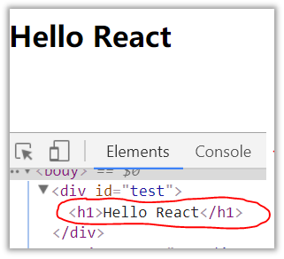
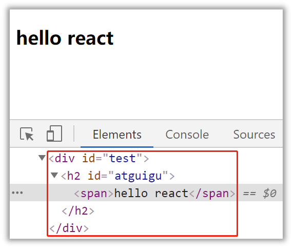

# 1.开始

## 1.1.React简介

[源码gitee](https://gitee.com/bright-boy/technical-notes/tree/master/study-notes/react/%E6%BA%90%E7%A0%81/react_staging)

* #### 1.1.1.官网
   * ###### [1.英文官网: https://reactjs.org/](https://reactjs.org/)

   * ###### [2.中文官网: https://react.docschina.org/](https://react.docschina.org/)

* #### 1.1.2.介绍描述
   * ######  1.用于动态构建用户界面的 JavaScript 库(只关注于视图)
   * ######  2.由Facebook开源

* #### 1.1.3.React的特点

   * ###### 1.声明式编码

     

   * ###### 2.组件化编码

   

   react最核心的思想是将页面中任何一个区域或者元素都可以看做一个组件 component

   

   * ###### 3.React Native 编写原生应用

   

   * ###### 4.高效（优秀的Diffing算法）  

   已经缓存的虚拟dom想上寻找不会在重新渲染真实dom树

* #### 1.1.4.React高效的原因
   * ######  1.React高效的原因
   * ######  2.2.DOM Diffing算法, 最小化页面重绘。


## 1.2.React的基本使用
* #### 1.2.1.效果
  

* #### 1.2.2.相关js库
   * ######  1.react.js：React核心库。
   
   * ######  2.react-dom.js：提供操作DOM的react扩展库

######  

react开发需要引入多个依赖文件：react.js、react-dom.js，分别又有开发版本和生产版本，create-react-app里已经帮我们把这些东西都安装好了。把通过CRA创建的工程目录下的src目录清空，然后在里面重新创建一个index.js. 写入以下代码:

>  **index.js.**   入口文件

```jsx
// 从 react 的包当中引入了 React。只要你要写 React.js 组件就必须引入React, 因为react里有一种语法叫JSX，稍后会讲到JSX，要写JSX，就必须引入React
import React from 'react'
// ReactDOM 可以帮助我们把 React 组件渲染到页面上去，没有其它的作用了。它是从 react-dom 中引入的，而不是从 react 引入。
import ReactDOM from 'react-dom'

// ReactDOM里有一个render方法，功能就是把组件渲染并且构造 DOM 树，然后插入到页面上某个特定的元素上
ReactDOM.render(
// 这里就比较奇怪了，它并不是一个字符串，看起来像是纯 HTML 代码写在 JavaScript 代码里面。语法错误吗？这并不是合法的 JavaScript 代码, “在 JavaScript 写的标签的”语法叫 JSX- JavaScript XML。
  <h1>欢迎进入React的世界</h1>,
// 渲染到哪里
  document.getElementById('root')
)
```

> **App.jsx**  类似app.vue

```jsx
//创建“外壳”组件App
import React,{Component} from 'react'
import Hello from './components/Hello'

//创建并暴露App组件
export default class App extends Component{
	render(){
		return (
			<div>
				<Hello/>
			</div>
		)
	}
}
```


* #### 1.2.4.虚拟DOM与真实DOM
   关于虚拟DOM：

   ​          1.本质是Object类型的对象（一般对象）

   ​          2.虚拟DOM比较“轻”，真实DOM比较“重”，因为虚拟DOM是React内部在用，无需真实DOM上那么多的属性。

   ​          3.虚拟DOM最终会被React转化为真实DOM，呈现在页面上。


## 1.3.React JSX
* #### 1.3.1.效果
  

* #### 1.3.2.JSX
   * ######  1.全称:  JavaScript XML
   
   * ######  2.react定义的一种类似于XML的JS扩展语法: JS + XML本质是React.createElement(component, props, ...children)方法的语法糖
   
   * ######  3.作用: 用来简化创建虚拟DOM 
      * 1)写法：var ele = <h1>Hello JSX!</h1>
      * 2)注意1：它不是字符串, 也不是HTML/XML标签
      * 3)注意2：它最终产生的就是一个JS对象
   
   > 使用react文件创建项目
   
   ```jsx
   <body>
   	<!-- 准备好一个“容器” -->
   	<div id="test"></div>
   
   	<!-- 引入react核心库 -->
   	<script type="text/javascript" src="../js/react.development.js"></script>
   	<!-- 引入react-dom，用于支持react操作DOM -->
   	<script type="text/javascript" src="../js/react-dom.development.js"></script>
   	<!-- 引入babel，用于将jsx转为js -->
   	<script type="text/javascript" src="../js/babel.min.js"></script>
   
   	<script type="text/babel" > /* 此处一定要写babel */
   		//1.创建虚拟DOM
   		const VDOM = (  /* 此处一定不要写引号，因为不是字符串 */
   			<h1 id="title">
   				<span>Hello,React</span>
   			</h1>
   		)
   		//2.渲染虚拟DOM到页面
   		ReactDOM.render(VDOM,document.getElementById('test'))
   	</script>
   </body>
   ```
   
   
   
   html**类名使用className。    样式用{}包裹**
   
   ```jsx
   import React,{Component} from 'react'
   import hello from './index.module.css'
   
   export default class Hello extends Component{
   	render(){
   		return <h2 className={hello.title}>Hello,React!</h2>
   	}
   }
   ```
   
   index.module.css
   
   ```css
   .title{
   	background-color: orange;
   }
   ```
   
   **类名使用className。       样式用{}包裹**
   
   #### 4.标签名任意: HTML标签或其它标签
   
   ```
   style={{color:'white',fontSize:'29px'}}
   ```
   
   
   
* #### 5.标签属性任意: HTML标签属性或其它

* #### 6.基本语法规则
      * 1)遇到 <开头的代码, 以标签的语法解析: html同名标签转换为html同名元素, 其它标签需要特别解析
      * 2)遇到以 { 开头的代码，以JS语法解析: 标签中的js表达式必须用{ }包含

* #### 7.babel.js的作用
      * 1)浏览器不能直接解析JSX代码, 需要babel转译为纯JS的代码才能运行
      * 2)只要用了JSX，都要加上type="text/babel", 声明需要babel来处理

* #### 1.3.3.渲染虚拟DOM(元素)
   * ######  1.语法:  ReactDOM.render(virtualDOM, containerDOM)
   * ######  2.作用: 将虚拟DOM元素渲染到页面中的真实容器DOM中显示
   * ######  3.参数说明
      * 1)参数一: 纯js或jsx创建的虚拟dom对象
      * 2)参数二: 用来包含虚拟DOM元素的真实dom元素对象(一般是一个div)

## 1.4.模块与组件、模块化与组件化的理解
* #### 1.3.1.效果
  

Hello.jsx

```
import React,{Component} from 'react'
import hello from './index.module.css'

export default class Hello extends Component{
  render(){
    return <h2 className={hello.title}>Hello,React!</h2>
  }
}
```

index.module.css

```
.title{
  background-color: orange;
}
```


App.jsx

```jsx
//创建“外壳”组件App
import React,{Component} from 'react'
import Hello from './components/Hello'

//创建并暴露App组件
export default class App extends Component{
	render(){
		return (
			<div>
				<Hello/>
			</div>
		)
	}
}
```


* #### 1.4.1.模块

   * ######  1.理解：向外提供特定功能的js程序, 一般就是一个js文件
   * ######  2.为什么要拆成模块：随着业务逻辑增加，代码越来越多且复杂。
   * ######  3.作用：复用js, 简化js的编写, 提高js运行效率

* #### 1.4.2.组件
   * ######  1.理解：用来实现局部功能效果的代码和资源的集合(html/css/js/image等等)
   * ######  2.为什么要用组件： 一个界面的功能更复杂
   * ######  3.作用：复用编码, 简化项目编码, 提高运行效率

* #### 1.4.3.模块化
   * ######  当应用的js都以模块来编写的, 这个应用就是一个模块化的应用

* #### 1.4.4.组件化
  * ######  当应用是以多组件的方式实现, 这个应用就是一个组件化的应用
  

### 

# 2.基本使用

## 2.1. 基本理解和使用🍎

- ### 2.1.1. 使用React开发者工具调试

  

- 
  ### 2.1.2. 效果


函数式组件：  


```html
<!DOCTYPE html>
<html lang="en">
<head>
	<meta charset="UTF-8">
	<title>函数式组件</title>
</head>
<body>
	<!-- 准备好一个“容器” -->
	<div id="test"></div>
	
	<!-- 引入react核心库 -->
	<script type="text/javascript" src="../js/react.development.js"></script>
	<!-- 引入react-dom，用于支持react操作DOM -->
	<script type="text/javascript" src="../js/react-dom.development.js"></script>
	<!-- 引入babel，用于将jsx转为js -->
	<script type="text/javascript" src="../js/babel.min.js"></script>

	<script type="text/babel">
		//1.创建函数式组件
		function MyComponent(){
			console.log(this); //此处的this是undefined，因为babel编译后开启了严格模式
			return <h2>我是用函数定义的组件(适用于【简单组件】的定义)</h2>
		}
		//2.渲染组件到页面
		ReactDOM.render(<MyComponent/>,document.getElementById('test'))
		/* 
			执行了ReactDOM.render(<MyComponent/>.......之后，发生了什么？
					1.React解析组件标签，找到了MyComponent组件。
					2.发现组件是使用函数定义的，随后调用该函数，将返回的虚拟DOM转为真实DOM，随后呈现在页面中。
		*/
	</script>
</body>
</html>
```

类式组件：

  


```html
<!DOCTYPE html>
<html lang="en">
<head>
	<meta charset="UTF-8">
	<title>类式组件</title>
</head>
<body>
	<!-- 准备好一个“容器” -->
	<div id="test"></div>
	
	<!-- 引入react核心库 -->
	<script type="text/javascript" src="../js/react.development.js"></script>
	<!-- 引入react-dom，用于支持react操作DOM -->
	<script type="text/javascript" src="../js/react-dom.development.js"></script>
	<!-- 引入babel，用于将jsx转为js -->
	<script type="text/javascript" src="../js/babel.min.js"></script>

	<script type="text/babel">
		//1.创建类式组件
		class MyComponent extends React.Component {
			render(){
				//render是放在哪里的？—— MyComponent的原型对象上，供实例使用。
				//render中的this是谁？—— MyComponent的实例对象 <=> MyComponent组件实例对象。
				console.log('render中的this:',this);
				return <h2>我是用类定义的组件(适用于【复杂组件】的定义)</h2>
			}
		}
		//2.渲染组件到页面
		ReactDOM.render(<MyComponent/>,document.getElementById('test'))
		/* 
			执行了ReactDOM.render(<MyComponent/>.......之后，发生了什么？
					1.React解析组件标签，找到了MyComponent组件。
					2.发现组件是使用类定义的，随后new出来该类的实例，并通过该实例调用到原型上的render方法。
					3.将render返回的虚拟DOM转为真实DOM，随后呈现在页面中。
		*/
	</script>
</body>
</html>
```


 * #### 2.1.3. 注意

   * 1.组件名必须首字母大写
   * 2.虚拟DOM元素只能有一个根元素
   * 3.虚拟DOM元素必须有结束标签

 * #### 2.1.4. 渲染类组件标签的基本流程

   * 1.React内部会创建组件实例对象
   * 2.调用render()得到虚拟DOM, 并解析为真实DOM
   * 3.插入到指定的页面元素内部

## 2.2. 组件三大核心属性1: state

 * #### 2.2.1. 效果

   需求: 定义一个展示天气信息的组件

1.默认展示天气炎热 或 凉爽

2.点击文字切换天气

* #### 2.2.2. 理解

  * 1.state是组件对象最重要的属性, 值是对象(可以包含多个key-value的组合)
  * 2.组件被称为"状态机", 通过更新组件的state来更新对应的页面显示(重新渲染组件)

 * #### 2.2.3. 强烈注意

   * 1.组件中render方法中的this为组件实例对象
   * 2.组件自定义的方法中this为undefined，如何解决？
     * a)强制绑定this: 通过函数对象的bind()
     * b)箭头函数
   * 3.状态数据，不能直接修改或更新

### 代码展示

```html
<!DOCTYPE html>
<html lang="en">
<head>
	<meta charset="UTF-8">
	<title>state</title>
</head>
<body>
	<!-- 准备好一个“容器” -->
	<div id="test"></div>
	<!-- 引入react核心库 -->
	<script type="text/javascript" src="../js/react.development.js"></script>
	<!-- 引入react-dom，用于支持react操作DOM -->
	<script type="text/javascript" src="../js/react-dom.development.js"></script>
	<!-- 引入babel，用于将jsx转为js -->
	<script type="text/javascript" src="../js/babel.min.js"></script>
	<script type="text/babel">
		//1.创建组件
		class Weather extends React.Component{
			
			//构造器调用几次？ ———— 1次
			constructor(props){
				console.log('constructor');
				super(props)
				//初始化状态
				this.state = {isHot:false,wind:'微风'}
				//解决changeWeather中this指向问题✨✨✨
				this.changeWeather = this.changeWeather.bind(this)
			}

			//render调用几次？ ———— 1+n次 1是初始化的那次 n是状态更新的次数
			render(){
				console.log('render');
				//读取状态🍎🍎🍎  state里的
				const {isHot,wind} = this.state
				return <h1 onClick={this.changeWeather}>今天天气很{isHot ? '炎热' : '凉爽'}，{wind}</h1>
			}

			//changeWeather调用几次？ ———— 点几次调几次
			changeWeather(){
				//changeWeather放在哪里？ ———— Weather的原型对象上，供实例使用
				//由于changeWeather是作为onClick的回调，所以不是通过实例调用的，是直接调用
				//类中的方法默认开启了局部的严格模式，所以changeWeather中的this为undefined
				
				console.log('changeWeather');
				//获取原来的isHot值
				const isHot = this.state.isHot
				//严重注意：状态必须通过setState进行更新,且更新是一种合并，不是替换。
				this.setState({isHot:!isHot})
				console.log(this);

				//严重注意：状态(state)不可直接更改，下面这行就是直接更改！！！
				//this.state.isHot = !isHot //这是错误的写法
			}
		}
		//2.渲染组件到页面
		ReactDOM.render(<Weather/>,document.getElementById('test'))
				
	</script>
</body>
</html>

```

简写

```html
<!DOCTYPE html>
<html lang="en">
<body>
	<!-- 准备好一个“容器” -->
	<div id="test"></div>
	
	<!-- 引入react核心库 -->
	<script type="text/javascript" src="../js/react.development.js"></script>
	<!-- 引入react-dom，用于支持react操作DOM -->
	<script type="text/javascript" src="../js/react-dom.development.js"></script>
	<!-- 引入babel，用于将jsx转为js -->
	<script type="text/javascript" src="../js/babel.min.js"></script>

	<script type="text/babel">
		//1.创建组件
		class Weather extends React.Component{
		//不用constructor构造函数接受props值然后赋新值
			//初始化状态🍎🍎🍎 
			state = {isHot:false,wind:'微风'}

			render(){
			//读取状态🍎🍎🍎  state里的
				const {isHot,wind} = this.state
				return <h1 onClick={this.changeWeather}>今天天气很{isHot ? '炎热' : '凉爽'}，{wind}</h1>
			}

			//自定义方法————要用赋值语句的形式+🍎箭头函数
			changeWeather = ()=>{
				const isHot = this.state.isHot
				this.setState({isHot:!isHot})
			}
		}
		//2.渲染组件到页面
		ReactDOM.render(<Weather/>,document.getElementById('test'))
				
	</script>
</body>
</html>

```


## 2.3. 组件三大核心属性2: props

- ### 2.3.1. 效果

需求: 自定义用来显示一个人员信息的组件

* 1.姓名必须指定，且为字符串类型；
* 2.性别为字符串类型，如果性别没有指定，默认为男
* 3.年龄为字符串类型，且为数字类型，默认值为18


- ### 2.3.2. 理解

1.每个组件对象都会有props(properties的简写)属性

2.组件标签的所有属性都保存在props中

- #### 2.3.3. 作用


1.通过标签属性从组件外向组件内传递变化的数据

2.注意: 组件内部不要修改props数据

 * #### 2.3.4. 编码操作

   * 1.内部读取某个属性值

   ```
   this.props.name
   ```

   * 2.对props中的属性值进行类型限制和必要性限制
     第一种方式（React v15.5 开始已弃用）：

   ```
   Person.propTypes = {
   name: React.PropTypes.string.isRequired,
   age: React.PropTypes.number
   }
   ```

   第二种方式（新）：使用prop-types库进限制（需要引入prop-types库）

   ```
   Person.propTypes = {
   name: PropTypes.string.isRequired,
   age: PropTypes.number. 
   }
   ```

   * 3.扩展属性: 将对象的所有属性通过props传递

   ```
   <Person {...person}/>
   ```

   * 4.默认属性值：

   ```
   Person.defaultProps = {
       age: 18,
       sex:'男'
   }
   ```

   * 5.组件类的构造函数

   ```
   constructor(props){
       super(props)
       console.log(props)//打印所有属性
   }
   ```


### 代码展示

```html
<!DOCTYPE html>
<html lang="en">
<head>
	<meta charset="UTF-8">
	<title>对props进行限制</title>
</head>
<body>
	<!-- 准备好一个“容器” -->
	<div id="test1"></div>
	<div id="test2"></div>
	<div id="test3"></div>
	
	<!-- 引入react核心库 -->
	<script type="text/javascript" src="../js/react.development.js"></script>
	<!-- 引入react-dom，用于支持react操作DOM -->
	<script type="text/javascript" src="../js/react-dom.development.js"></script>
	<!-- 引入babel，用于将jsx转为js -->
	<script type="text/javascript" src="../js/babel.min.js"></script>
	<!-- 引入prop-types，用于对组件标签属性进行限制 -->
	<script type="text/javascript" src="../js/prop-types.js"></script>

	<script type="text/babel">
		//创建组件
		class Person extends React.Component{
			render(){
				// console.log(this);
				const {name,age,sex} = this.props
				//props是只读的
				//this.props.name = 'jack' //此行代码会报错，因为props是只读的
				return (
					<ul>
						<li>姓名：{name}</li>
						<li>性别：{sex}</li>
						<li>年龄：{age+1}</li>
					</ul>
				)
			}
		}
		//对标签属性进行类型、必要性的限制
		Person.propTypes = {
			name:PropTypes.string.isRequired, //限制name必传，且为字符串
			sex:PropTypes.string,//限制sex为字符串
			age:PropTypes.number,//限制age为数值
			speak:PropTypes.func,//限制speak为函数
		}
		//指定默认标签属性值
		Person.defaultProps = {
			sex:'男',//sex默认值为男
			age:18 //age默认值为18
		}
		//渲染组件到页面
		ReactDOM.render(<Person name={100} speak={speak}/>,document.getElementById('test1'))
		ReactDOM.render(<Person name="tom" age={18} sex="女"/>,document.getElementById('test2'))

		const p = {name:'老刘',age:18,sex:'女'}
		// console.log('@',...p);
		// ReactDOM.render(<Person name={p.name} age={p.age} sex={p.sex}/>,document.getElementById('test3'))
		ReactDOM.render(<Person {...p}/>,document.getElementById('test3'))

		function speak(){
			console.log('我说话了');
		}
	</script>
</body>
</html>
```

简写

```html
<!DOCTYPE html>
<html lang="en">
<head>
	<meta charset="UTF-8">
	<title>对props进行限制</title>
</head>
<body>
	<!-- 准备好一个“容器” -->
	<div id="test1"></div>
	<div id="test2"></div>
	<div id="test3"></div>
	
	<!-- 引入react核心库 -->
	<script type="text/javascript" src="../js/react.development.js"></script>
	<!-- 引入react-dom，用于支持react操作DOM -->
	<script type="text/javascript" src="../js/react-dom.development.js"></script>
	<!-- 引入babel，用于将jsx转为js -->
	<script type="text/javascript" src="../js/babel.min.js"></script>
	<!-- 引入prop-types，用于对组件标签属性进行限制 -->
	<script type="text/javascript" src="../js/prop-types.js"></script>

	<script type="text/babel">
		//创建组件
		class Person extends React.Component{

			constructor(props){
				//构造器是否接收props，是否传递给super，取决于：是否希望在构造器中通过this访问props
				// console.log(props);
				super(props)
				console.log('constructor',this.props);
			}

			//对标签属性进行类型、必要性的限制
			static propTypes = {
				name:PropTypes.string.isRequired, //限制name必传，且为字符串
				sex:PropTypes.string,//限制sex为字符串
				age:PropTypes.number,//限制age为数值
			}

			//指定默认标签属性值
			static defaultProps = {
				sex:'男',//sex默认值为男
				age:18 //age默认值为18
			}
			
			render(){
				// console.log(this);
				const {name,age,sex} = this.props
				//props是只读的
				//this.props.name = 'jack' //此行代码会报错，因为props是只读的
				return (
					<ul>
						<li>姓名：{name}</li>
						<li>性别：{sex}</li>
						<li>年龄：{age+1}</li>
					</ul>
				)
			}
		}

		//渲染组件到页面
		ReactDOM.render(<Person name="jerry"/>,document.getElementById('test1'))
	</script>
</body>
</html>
```


## 2.4. 组件三大核心属性3: refs与事件处理

 * #### 2.4.1. 效果

 * 需求: 自定义组件, 功能说明如下:

   * 1. 点击按钮, 提示第一个输入框中的值
   * 2. 当第2个输入框失去焦点时, 提示这个输入框中的值

  


 * #### 2.4.2. 理解

   组件内的标签可以定义ref属性来标识自己


 * #### 2.4.3. 编码

   * 1.字符串形式的ref

```
<input ref="input1"/>
```

    * 2.回调形式的ref

```
<input ref={(c)=>{this.input1 = c}}/>
```

    * 3.createRef创建ref容器·

```
myRef = React.createRef() 
<input ref={this.myRef}/>
```

 * #### 2.4.4. 事件处理

* 1.通过onXxx属性指定事件处理函数(注意大小写)

  * 1)React使用的是自定义(合成)事件, 而不是使用的原生DOM事件
  * 2)React中的事件是通过事件委托方式处理的(委托给组件最外层的元素)

* 2.通过event.target得到发生事件的DOM元素对象


### 代码展示

```html
<!--
 * @Author: your name
 * @Date: 2021-12-17 10:20:46
 * @LastEditTime: 2021-12-20 12:39:49
 * @LastEditors: Please set LastEditors
 * @Description: 打开koroFileHeader查看配置 进行设置: https://github.com/OBKoro1/koro1FileHeader/wiki/%E9%85%8D%E7%BD%AE
 * @FilePath: /06、React/源码/react_basic/08_组件实例三大属性3_refs/2_回调函数形式的ref.html
-->
<!DOCTYPE html>
<html lang="en">
<head>
	<meta charset="UTF-8">
	<title>1_字符串形式的ref</title>
</head>
<body>
	<!-- 准备好一个“容器” -->
	<div id="test"></div>
	
	<!-- 引入react核心库 -->
	<script type="text/javascript" src="../js/react.development.js"></script>
	<!-- 引入react-dom，用于支持react操作DOM -->
	<script type="text/javascript" src="../js/react-dom.development.js"></script>
	<!-- 引入babel，用于将jsx转为js -->
	<script type="text/javascript" src="../js/babel.min.js"></script>

	<script type="text/babel">
		//创建组件
		class Demo extends React.Component{
			//展示左侧输入框的数据
			showData = ()=>{
				const {input1} = this
				console.log(input1);
				alert(input1.value)
				console.log(this);
			}
			//展示右侧输入框的数据
			showData2 = ()=>{
				const {input2} = this
				alert(input2.value)
			}
			render(){
				return(
					<div>
					//🍎🍎🍎c为原字符串方法值，通过箭头函数使用回调方式赋值
						<input ref={c => this.input1 = c } type="text" placeholder="点击按钮提示数据"/>&nbsp;
						<button onClick={this.showData}>点我提示左侧的数据</button>&nbsp;
						<input onBlur={this.showData2} ref={c => this.input2 = c } type="text" placeholder="失去焦点提示数据"/>&nbsp;
					</div>
				)
			}
		}
		//渲染组件到页面
		ReactDOM.render(<Demo a="1" b="2"/>,document.getElementById('test'))
	</script>
</body>
</html>

```

createRef方法

```html
<!DOCTYPE html>
<html lang="en">
<head>
	<meta charset="UTF-8">
	<title>4_createRef</title>
</head>
<body>
	<!-- 准备好一个“容器” -->
	<div id="test"></div>
	
	<!-- 引入react核心库 -->
	<script type="text/javascript" src="../js/react.development.js"></script>
	<!-- 引入react-dom，用于支持react操作DOM -->
	<script type="text/javascript" src="../js/react-dom.development.js"></script>
	<!-- 引入babel，用于将jsx转为js -->
	<script type="text/javascript" src="../js/babel.min.js"></script>

	<script type="text/babel">
		//创建组件
		class Demo extends React.Component{
			/* 
				React.createRef调用后可以返回一个容器，该容器可以存储被ref所标识的节点,该容器是“专人专用”的
				🍎🍎🍎
			 */
			myRef = React.createRef()
			myRef2 = React.createRef()
			//展示左侧输入框的数据
			showData = ()=>{
				alert(this.myRef.current.value);
			}
			//展示右侧输入框的数据
			showData2 = ()=>{
				alert(this.myRef2.current.value);
			}
			render(){
				return(
					<div>
						<input ref={this.myRef} type="text" placeholder="点击按钮提示数据"/>&nbsp;
						<button onClick={this.showData}>点我提示左侧的数据</button>&nbsp;
						<input onBlur={this.showData2} ref={this.myRef2} type="text" placeholder="失去焦点提示数据"/>&nbsp;
					</div>
				)
			}
		}
		//渲染组件到页面
		ReactDOM.render(<Demo a="1" b="2"/>,document.getElementById('test'))
	</script>
</body>
</html>
```

## 2.5组件通信

**父组件与子组件通信**

- 父组件将自己的状态传递给子组件，子组件当做属性来接收，当父组件更改自己状态的时候，子组件接收到的属性就会发生改变

- 父组件利用`ref`对子组件做标记，通过调用子组件的方法以更改子组件的状态,也可以调用子组件的方法..

**子组件与父组件通信**

- 父组件将自己的某个方法传递给子组件，在方法里可以做任意操作，比如可以更改状态，子组件通过`this.props`接收到父组件的方法后调用。

**跨组件通信**

在react没有类似vue中的事件总线来解决这个问题，我们只能借助它们共同的父级组件来实现，将非父子关系装换成多维度的父子关系。react提供了`context` api来实现跨组件通信, React 16.3之后的`context`api较之前的好用。

实例，使用`context` 实现购物车中的加减功能

```jsx
// counterContext.js
import React, { Component, createContext } from 'react'

const {
  Provider,
  Consumer: CountConsumer
} = createContext()

class CountProvider extends Component {
  constructor () {
    super()
    this.state = {
      count: 1
    }
  }
  increaseCount = () => {
    this.setState({
      count: this.state.count + 1
    })
  }
  decreaseCount = () => {
    this.setState({
      count: this.state.count - 1
    })
  }
  render() {
    return (
      <Provider value={{
        count: this.state.count,
        increaseCount: this.increaseCount,
        decreaseCount: this.decreaseCount
      }}
      >
        {this.props.children}
      </Provider>
    )
  }
}

export {
  CountProvider,
  CountConsumer
}
```

```jsx
// 定义CountButton组件
const CountButton = (props) => {
  return (
    <CountConsumer>
      // consumer的children必须是一个方法
      {
        ({ increaseCount, decreaseCount }) => {
          const { type } = props
          const handleClick = type === 'increase' ? increaseCount : decreaseCount
          const btnText = type === 'increase' ? '+' : '-'
          return <button onClick={handleClick}>{btnText}</button>
        }
      }
    </CountConsumer>
  )
}
```

```jsx
// 定义count组件，用于显示数量
const Count = (prop) => {
  return (
    <CountConsumer>
      {
        ({ count }) => {
          return <span>{count}</span>
        }
      }
    </CountConsumer>
  )
}
```

```jsx
// 组合
class App extends Component {
  render () {
    return (
  		<CountProvider>
        <CountButton type='decrease' />
        <Count />
        <CountButton type='increase' />
      </CountProvider>
  	)
  }
}
```

> 复杂的非父子组件通信在react中很难处理，多组件间的数据共享也不好处理，在实际的工作中我们会使用flux、redux、mobx来实现


## 2.6. 收集表单数据

 * #### 2.6.1. 效果

   需求: 定义一个包含表单的组件
     输入用户名密码后, 点击登录提示输入信息

  

 * #### 2.6.2. 理解

   包含表单的组件分类

   * 1.受控组件
   * 2.非受控组件

[(25条消息) react学习10-React 表单受控和非受控组件的基本使用_jyn15159的博客-CSDN博客](https://blog.csdn.net/jyn15159/article/details/115536950?utm_medium=distribute.pc_relevant.none-task-blog-2~default~baidujs_title~default-0.no_search_link&spm=1001.2101.3001.4242.1)

### 非受控组件

使用ref处理事件 e.target.value.   e.target.key等等

1. 创建ref实例对象
2. 把ref对象关联到标签上
3. 通过ref对象的current属性可以得到原生DOM对象

```html
<!DOCTYPE html>
<html lang="en">
<head>
	<meta charset="UTF-8">
	<title>1_非受控组件</title>
</head>
<body>
	<!-- 准备好一个“容器” -->
	<div id="test"></div>
	
	<!-- 引入react核心库 -->
	<script type="text/javascript" src="../js/react.development.js"></script>
	<!-- 引入react-dom，用于支持react操作DOM -->
	<script type="text/javascript" src="../js/react-dom.development.js"></script>
	<!-- 引入babel，用于将jsx转为js -->
	<script type="text/javascript" src="../js/babel.min.js"></script>

	<script type="text/babel">
		//创建组件
		class Login extends React.Component{
			handleSubmit = (event)=>{
				event.preventDefault() //阻止表单提交
				const {username,password} = this
				alert(`你输入的用户名是：${username.value},你输入的密码是：${password.value}`)
			}
			render(){
				return(
					<form onSubmit={this.handleSubmit}>
						用户名：<input ref={c => this.username = c} type="text" name="username"/>
						密码：<input ref={c => this.password = c} type="password" name="password"/>
						<button>登录</button>
					</form>
				)
			}
		}
		//渲染组件
		ReactDOM.render(<Login/>,document.getElementById('test'))
	</script>
</body>
</html>
```

### 受控组件

渲染表单的 React 组件还控制着用户输入过程中表单发生的操作。

被 React 以这种方式控制取值的表单输入元素就叫做“受控组件”。

对于受控组件来说，输入的值始终由 React 的 state 驱动。

不同的表单项数据处理（受控组件）：

input、select和textarea处理方式一样
将state值绑定到表单输入域value属性上
监听表单输入域onChange事件，事件函数中动态更新状态值

```html
<!DOCTYPE html>
<html lang="en">
<head>
	<meta charset="UTF-8">
	<title>2_受控组件</title>
</head>
<body>
	<!-- 准备好一个“容器” -->
	<div id="test"></div>
	
	<!-- 引入react核心库 -->
	<script type="text/javascript" src="../js/react.development.js"></script>
	<!-- 引入react-dom，用于支持react操作DOM -->
	<script type="text/javascript" src="../js/react-dom.development.js"></script>
	<!-- 引入babel，用于将jsx转为js -->
	<script type="text/javascript" src="../js/babel.min.js"></script>

	<script type="text/babel">
		//创建组件
		class Login extends React.Component{

			//初始化状态
			state = {
				username:'', //用户名
				password:'' //密码
			}

			//保存用户名到状态中
			saveUsername = (event)=>{
				this.setState({username:event.target.value})
			}

			//保存密码到状态中
			savePassword = (event)=>{
				this.setState({password:event.target.value})
			}

			//表单提交的回调
			handleSubmit = (event)=>{
				event.preventDefault() //阻止表单提交
				const {username,password} = this.state
				alert(`你输入的用户名是：${username},你输入的密码是：${password}`)
			}

			render(){
				return(
					<form onSubmit={this.handleSubmit}>
						用户名：<input onChange={this.saveUsername} type="text" name="username"/>
						密码：<input onChange={this.savePassword} type="password" name="password"/>
						<button>登录</button>
					</form>
				)
			}
		}
		//渲染组件
		ReactDOM.render(<Login/>,document.getElementById('test'))
	</script>
</body>
</html>
```


#### textarea 标签

在 HTML 中, `<textarea>` 元素通过其子元素定义其文本:

```
<textarea>
  你好， 这是在 text area 里的文本
</textarea>
```

而在 React 中，`<textarea>` 使用 `value` 属性代替。这样，可以使得使用 `<textarea>` 的表单和使用单行 input 的表单非常类似：

```javascript
class EssayForm extends React.Component {
  constructor(props) {
    super(props);
    this.state = {
      value: '请撰写一篇关于你喜欢的 DOM 元素的文章.'
    };

    this.handleChange = this.handleChange.bind(this);
    this.handleSubmit = this.handleSubmit.bind(this);
  }

  handleChange(event) {
    this.setState({value: event.target.value});
  }

  handleSubmit(event) {
    alert('提交的文章: ' + this.state.value);
    event.preventDefault();
  }

  render() {
    return (
      <form onSubmit={this.handleSubmit}>
        <label>
          文章:
          <textarea value={this.state.value} onChange={this.handleChange} />
        </label>
        <input type="submit" value="提交" />
      </form>
    );
  }
}
```

请注意，`this.state.value` 初始化于构造函数中，因此文本区域默认有初值。


#### select 标签

在 HTML 中，`<select>` 创建下拉列表标签。例如，如下 HTML 创建了水果相关的下拉列表：

```
<select>
  <option value="grapefruit">葡萄柚</option>
  <option value="lime">酸橙</option>
  <option selected value="coconut">椰子</option>
  <option value="mango">芒果</option>
</select>
```

请注意，由于 `selected` 属性的缘故，椰子选项默认被选中。React 并不会使用 `selected` 属性，而是在根 `select` 标签上使用 `value` 属性。这在受控组件中更便捷，因为您只需要在根标签中更新它。例如：

```javascript
class FlavorForm extends React.Component {
  constructor(props) {
    super(props);
    this.state = {value: 'coconut'};

    this.handleChange = this.handleChange.bind(this);
    this.handleSubmit = this.handleSubmit.bind(this);
  }

  handleChange(event) {
    this.setState({value: event.target.value});
  }

  handleSubmit(event) {
    alert('你喜欢的风味是: ' + this.state.value);
    event.preventDefault();
  }

  render() {
    return (
      <form onSubmit={this.handleSubmit}>
        <label>
          选择你喜欢的风味:
          <select value={this.state.value} onChange={this.handleChange}>
            <option value="grapefruit">葡萄柚</option>
            <option value="lime">酸橙</option>
            <option value="coconut">椰子</option>
            <option value="mango">芒果</option>
          </select>
        </label>
        <input type="submit" value="提交" />
      </form>
    );
  }
}
```

总的来说，这使得, `<input type="text">`, `<textarea>` 和 `<select>`之类的标签都非常相似—它们都接受一个 `value` 属性，你可以使用它来实现受控组件。

> 注意
>
> 你可以将数组传递到 `value` 属性中，以支持在 `select` 标签中选择多个选项：
>
> ```
> <select multiple={true} value={['B', 'C']}>
> ```

```javascript
class MulFlavorForm extends React.Component {
  constructor(props) {
    super(props);
    this.state = {
      value: "coconut",
      arr: [],
      options: [
        { value: "grapefruit", label: "葡萄柚" },
        { value: "lime", label: "酸橙" },
        { value: "coconut", label: "椰子" },
        { value: "mango", label: "芒果" }
      ]
    };

    this.handleChange = this.handleChange.bind(this);
  }

  handleChange(e){
    let idx = this.state.arr.findIndex(item=>{
      return item === e.target.value
    })
    if (idx >= 0) {
      this.state.arr.splice(idx,1);
    } else {
      this.state.arr.push(e.target.value);
    }
    let arr = this.state.arr;
    this.setState({arr});
  }

  render() {
    return (
      <div>
        <select multiple={true} value={this.state.arr} onChange={this.handleChange}>
          {this.state.options.map((item,index) => {
            return <option value={item.value} key={index}>{item.label}</option>;
          })}
        </select>
      </div>
    );
  }
}

export default Test4;
```


#### 处理多个输入

当需要处理多个 `input` 元素时，我们可以给每个元素添加 `name` 属性，并让处理函数根据 `event.target.name` 的值选择要执行的操作。

```javascript
class Reservation extends React.Component {
  constructor(props) {
    super(props);
    this.state = {
      isGoing: true,
      numberOfGuests: 2
    };

    this.handleInputChange = this.handleInputChange.bind(this);
  }

  handleInputChange(event) {
    const target = event.target;
    const value = target.type === 'checkbox' ? target.checked : target.value;
    const name = target.name;

    this.setState({
      [name]: value
    });
  }

  render() {
    return (
      <form>
        <label>
          参与:
          <input
            name="isGoing"
            type="checkbox"
            checked={this.state.isGoing}
            onChange={this.handleInputChange} />
        </label>
        <br />
        <label>
          来宾人数:
          <input
            name="numberOfGuests"
            type="number"
            value={this.state.numberOfGuests}
            onChange={this.handleInputChange} />
        </label>
      </form>
    );
  }
}
```


#### 文件 input 标签

在 HTML 中，`<input type="file">` 允许用户从存储设备中选择一个或多个文件，将其上传到服务器，或通过使用 JavaScript 的 File API 进行控制。

```html
<input type="file" />
```

因为它的 value 只读，所以它是 React 中的一个非受控组件。将与其他非受控组件在后续文档中一起讨论。


#### 受控输入空值

在受控组件上指定 value 的 prop 会阻止用户更改输入。如果你指定了 value，但输入仍可编辑，则可能是你意外地将value 设置为 undefined 或 null。

下面的代码演示了这一点。（输入最初被锁定，但在短时间延迟后变为可编辑。）

```javascript
ReactDOM.render(<input value="hi" />, mountNode);

setTimeout(function() {
  ReactDOM.render(<input value={null} />, mountNode);
}, 1000);
```


## 2.6. 组件的生命周期

 * #### 2.6.1. 效果

   需求:定义组件实现以下功能：

  * 1. 让指定的文本做显示 / 隐藏的渐变动画

  * 2. 从完全可见，到彻底消失，耗时2S

  * 3. 点击“不活了”按钮从界面中卸载组件

  

 * #### 2.6.2. 理解

   * 1.组件从创建到死亡它会经历一些特定的阶段。
   * 2.React组件中包含一系列勾子函数(生命周期回调函数), 会在特定的时刻调用。
   * 3.我们在定义组件时，会在特定的生命周期回调函数中，做特定的工作。

 * #### 2.6.3. 生命周期流程图(旧)

   

* 生命周期的三个阶段（旧）

  * 1. 初始化阶段: 由ReactDOM.render()触发---初次渲染
       * 1.constructor()
       * 2.componentWillMount()
       * 3.render()
       * 4.componentDidMount()

  * 2. 更新阶段: 由组件内部this.setSate()或父组件重新render触发
       * 1.shouldComponentUpdate()
       * 2.componentWillUpdate()
       * 3.render()
       * 4.componentDidUpdate()

  * 3. 卸载组件: 由ReactDOM.unmountComponentAtNode()触发
       * 1.componentWillUnmount()

     * #### 2.6.4. 生命周期流程图(新)

       

* 生命周期的三个阶段（新）

  * 1. 初始化阶段: 由ReactDOM.render()触发---初次渲染

      * 1.constructor()
      * 2.getDerivedStateFromProps 
      * 3.render()
      * 4.componentDidMount()

  * 2. 更新阶段: 由组件内部this.setSate()或父组件重新render触发

      * 1.getDerivedStateFromProps
      * 2.shouldComponentUpdate()
      * 3.render()
      * 4.getSnapshotBeforeUpdate
      * 5.componentDidUpdate()

  * 3. 卸载组件: 由ReactDOM.unmountComponentAtNode()触发

      * 1.componentWillUnmount()

 * #### 2.6.5. 重要的勾子

   * 1.render：初始化渲染或更新渲染调用
   * 2.componentDidMount：开启监听, 发送ajax请求
   * 3.componentWillUnmount：做一些收尾工作, 如: 清理定时器

 * #### 2.6.6. 即将废弃的勾子

   * 1.componentWillMount
   * 2.componentWillReceiveProps
   * 3.componentWillUpdate

现在使用会出现警告，下一个大版本需要加上UNSAFE_前缀才能使用，以后可能会被彻底废弃，不建议使用。

## 2.7 虚拟DOM与DOM Diffing算法

 * #### 2.7.1. 效果

   需求：验证虚拟DOM Diffing算法的存在
   

 * #### 2.7.2. 基本原理图

   

```
 1). react/vue中的key有什么作用？（key的内部原理是什么？）
      2). 为什么遍历列表时，key最好不要用index?
      
			1. 虚拟DOM中key的作用：
					1). 简单的说: key是虚拟DOM对象的标识, 在更新显示时key起着极其重要的作用。

					2). 详细的说: 当状态中的数据发生变化时，react会根据【新数据】生成【新的虚拟DOM】, 
												随后React进行【新虚拟DOM】与【旧虚拟DOM】的diff比较，比较规则如下：

									a. 旧虚拟DOM中找到了与新虚拟DOM相同的key：
												(1).若虚拟DOM中内容没变, 直接使用之前的真实DOM
												(2).若虚拟DOM中内容变了, 则生成新的真实DOM，随后替换掉页面中之前的真实DOM

									b. 旧虚拟DOM中未找到与新虚拟DOM相同的key
												根据数据创建新的真实DOM，随后渲染到到页面
									
			2. 用index作为key可能会引发的问题：
								1. 若对数据进行：逆序添加、逆序删除等破坏顺序操作:
												会产生没有必要的真实DOM更新 ==> 界面效果没问题, 但效率低。

								2. 如果结构中还包含输入类的DOM：
												会产生错误DOM更新 ==> 界面有问题。
												
								3. 注意！如果不存在对数据的逆序添加、逆序删除等破坏顺序操作，
									仅用于渲染列表用于展示，使用index作为key是没有问题的。
					
			3. 开发中如何选择key?:
								1.最好使用每条数据的唯一标识作为key, 比如id、手机号、身份证号、学号等唯一值。
								2.如果确定只是简单的展示数据，用index也是可以的。
```


# 3.开始脚手架创建

### 3.1. 使用create-react-app创建react应用

#### 3.1.1. react脚手架

 * ##### 1.xxx脚手架: 用来帮助程序员快速创建一个基于xxx库的模板项目

   * 1.包含了所有需要的配置（语法检查、jsx编译、devServer…）
   * 2.下载好了所有相关的依赖
   * 3.可以直接运行一个简单效果

 * ##### 2.react提供了一个用于创建react项目的脚手架库: create-react-app

 * ##### 3.项目的整体技术架构为:  react + webpack + es6 + eslint

 * ##### 4.使用脚手架开发的项目的特点: 模块化, 组件化, 工程化

   

#### 3.1.2. 创建项目并启动

> 第一步，全局安装：

```shell
npm i -g create-react-app
```

> 第二步，切换到想创项目的目录，使用命令：

```shell
create-react-app 项目名
```

这需要等待一段时间，这个过程实际上会安装三个东西

- react:  react的顶级库

- react-dom: 因为react有很多的运行环境，比如app端的react-native, 我们要在web上运行就使用react-dom

- react-scripts: 包含运行和打包react应用程序的所有脚本及配置

  

> 第三步，进入项目文件夹：


```
cd hello-react
```


> 第四步，启动项目：


```
npm start
```


常见问题：

- npm安装失败
  - 切换为npm镜像为淘宝镜像
  - 使用yarn，如果本来使用yarn还要失败，还得把yarn的源切换到国内
  - 如果还没有办法解决，请删除node_modules及package-lock.json然后重新执行`npm install命令`
  - 再不能解决就删除node_modules及package-lock.json的同时清除npm缓存`npm cache clean --force`之后再执行`npm install`命令


#### 3.1.3. react脚手架项目结构

 > ```js
 > public ---- 静态资源文件夹
 > 	favicon.icon ------ 网站页签图标
 > 	index.html -------- 主页面
 > 	logo192.png ------- logo图
 > 	logo512.png ------- logo图
 > 	manifest.json ----- 应用加壳的配置文件
 > 	robots.txt -------- 爬虫协议文件
 > src ---- 源码文件夹
 > 	App.css -------- App组件的样式
 > 	App.js --------- App组件
 > 	App.test.js ---- 用于给App做测试
 > 	index.css ------ 样式
 > 	index.js ------- 入口文件
 > 	logo.svg ------- logo图
 > 	reportWebVitals.js
 > 		--- 页面性能分析文件(需要web-vitals库的支持)
 > 	setupTests.js
 > 		---- 组件单元测试的文件(需要jest-dom库的支持)
 > ```


#### 3.1.4. 功能界面的组件化编码流程（通用）


* 1. 拆分组件: 拆分界面,抽取组件

* 2. 实现静态组件: 使用组件实现静态页面效果 

* 3. 实现动态组件
    * 3.1 动态显示初始化数据
        * 3.1.1 数据类型
        * 3.1.2 数据名称
        * 3.1.2 保存在哪个组件?
    * 3.2 交互(从绑定事件监听开始)

# 组件的组合使用-TodoList ✨🪐✨

功能: 组件化实现此功能
  1. 显示所有todo列表
  2. 输入文本, 点击按钮显示到列表的首位, 并清除输入的文本


##  todoList案例相关知识点

​    1.拆分组件、实现静态组件，注意：className、style的写法

​    2.动态初始化列表，如何确定将数据放在哪个组件的state中？

​          ——某个组件使用：放在其自身的state中

​          ——某些组件使用：放在他们共同的父组件state中（官方称此操作为：状态提升）

​    3.关于父子之间通信：

​        1.【父组件】给【子组件】传递数据：通过props传递

​        2.【子组件】给【父组件】传递数据：通过props传递，要求父提前给子传递一个函数

​    4.注意defaultChecked 和 checked的区别，类似的还有：defaultValue 和 value

​    5.状态在哪里，操作状态的方法就在哪里


## 代码

App.js

解析：

addTodo：通过接受子组件Header通过受控组件事件生成新对象传递过来，来添加进本组件state状态值中。生成新state。散步🍎

updateTodo:🐒

```jsx
import React, { Component } from 'react'
import Header from './components/Header'
import List from './components/List'
import Footer from './components/Footer'
import './App.css'

export default class App extends Component {
	//状态在哪里，操作状态的方法就在哪里

	//初始化状态❤️
	state = {todos:[
		{id:'001',name:'吃饭',done:true},
		{id:'002',name:'睡觉',done:true},
		{id:'003',name:'打代码',done:false},
		{id:'004',name:'逛街',done:false}
	]}

	//addTodo用于添加一个todo，接收的参数是todo对象。处理 （父组件给子组件传函数  子组件调用函数）🍎
	addTodo = (todoObj)=>{
		//获取原todos
		const {todos} = this.state
		//追加一个todo
		const newTodos = [todoObj,...todos]
		//更新状态
		this.setState({todos:newTodos})
	}

	//updateTodo用于更新一个todo对象  传item组件，当进行选中操作时🐒 done为是否勾选状态值
	updateTodo = (id,done)=>{
		//获取状态中的todos
		const {todos} = this.state
		//匹配处理数据   如果id一致将相应done值转为传过来的done值 这里简写应为done:done.(差点以为合并操作，具体看addTodo事件方法)
		const newTodos = todos.map((todoObj)=>{
			if(todoObj.id === id) return {...todoObj,done}
			else return todoObj
		})
		this.setState({todos:newTodos})
	}

	//deleteTodo用于删除一个todo对象🍑
	deleteTodo = (id)=>{
		//获取原来的todos
		const {todos} = this.state
		//删除指定id的todo对象
		const newTodos = todos.filter((todoObj)=>{
			return todoObj.id !== id
		})
		//更新状态
		this.setState({todos:newTodos})
	}

	//checkAllTodo用于全选🐟 把每一项改成统一状态done值
	checkAllTodo = (done)=>{
		//获取原来的todos
		const {todos} = this.state
		//加工数据
		const newTodos = todos.map((todoObj)=>{
			return {...todoObj,done}
		})
		//更新状态
		this.setState({todos:newTodos})
	}

	//clearAllDone用于清除所有已完成的
	clearAllDone = ()=>{🐶
		//获取原来的todos
		const {todos} = this.state
		//过滤数据
		const newTodos = todos.filter((todoObj)=>{
			return !todoObj.done
		})
		//更新状态
		this.setState({todos:newTodos})
	}

	render() {
		// this.state解构自身组件传过来的值
		const {❤️todos} = this.state
		return (
			<div className="todo-container">
				<div className="todo-wrap">
					<Header 🍎addTodo={this.addTodo}/>
					{/* todos传list组件做渲染以及状态显示 */}
					<List ❤️todos={todos} 🐒updateTodo={this.updateTodo} 🍑deleteTodo={this.deleteTodo}/>
					{/* todos传footer组件做数据展示统计 */}
					<Footer ❤️todos={todos} 🐟checkAllTodo={this.checkAllTodo} 🐶clearAllDone={this.clearAllDone}/>
				</div>
			</div>
		)
	}
}

```

Header.jsx

解析：

通过受控组件事件来进行行为判断，将输入的内容与id与状态done生成新的对象，通过子传父使用事件调用父组件函数addTodo方法来传入新数组。随后完成操作，清空输入框。

将接收过来的父组件事件进行规则验证 func  isrequired

```jsx
import React, { Component } from 'react'
// 需要npm i prop-types  类型验证
import PropTypes from 'prop-types'
//nanoid库 随机生成id
import {nanoid} from 'nanoid'
import './index.css'

export default class Header extends Component {

	//对接收的props进行：类型、必要性的限制
	static propTypes = {
		addTodo:PropTypes.func.isRequired
	}

	//键盘事件的回调🌰
	handleKeyUp = (event)=>{
		//解构赋值获取keyCode,target
		const {keyCode,target} = event
		//判断是否是回车按键
		if(keyCode !== 13) return
		//添加的todo名字不能为空
		if(target.value.trim() === ''){
			alert('输入不能为空')
			return
		}
		//准备好一个todo对象（nanoid随机生成id  使用npm安装）
		const todoObj = {id:nanoid(),name:target.value,done:false}
		//将todoObj传递给App🍎
		this.props.addToo(todoObj)
		//清空输入d
		target.value = ''
	}

	render() {
		return (
			<div className="todo-header">
				<input onKeyUp={this.handleKeyUp🌰} type="text" placeholder="请输入你的任务名称，按回车键确认"/>
			</div>
		)
	}
}

```

List.jsx

解析：对传过来的todos数据、方法进行类型限制

将父组件传过来的todos数据渲染map。将方法继续往下传

```jsx
import React, { Component } from 'react'
import PropTypes from 'prop-types'
import Item from '../Item'
import './index.css'

export default class List extends Component {

	//对接收的props进行：类型、必要性的限制
	static propTypes = {
		todos:PropTypes.array.isRequired,❤️
		updateTodo:PropTypes.func.isRequired,🐒
		deleteTodo:PropTypes.func.isRequired,
	}

	render() {
		// this.props获取父组件app传过来的值解构
		const {❤️todos,🐒updateTodo,deleteTodo} = this.props
		return (
			<ul className="todo-main">
				{
					todos.map( todo =>{
						return <Item key={todo.id} {...todo} 🐒updateTodo={updateTodo} 🍑deleteTodo={deleteTodo}/>
					})
				}
			</ul>
		)
	}
}

```

Item.js

解析：

本组件自定义状态值mouse，onMouseEnter来判断组件是true否false被鼠标移入移出，从而做相应处理

onchange受控组件 勾选来传入当前checked状态以及所属id，并通过uodateTodo传入id以及是否勾选状态值给父组件进行相应处理。

handleDelete 通过点击删除按钮触发。并使用api confirm方法获取用户是否同意删除。同意则将父组件传过来的该方法传入当前点击的id，从而触发App.jsx里的删除事件。

```jsx
import React, { Component } from 'react'
import './index.css'

export default class Item extends Component {

	state = {mouse:false} //标识鼠标移入、移出

	//鼠标移入、移出的回调
	handleMouse = (flag)=>{
		return ()=>{
			this.setState({mouse:flag})
		}
	}

	//勾选、取消勾选某一个todo的回调
	handleCheck = (id)=>{
		return (event)=>{🐒   event.target.checked是否勾选状态值
			this.props.updateTodo(id,event.target.checked)
		}
	}

	//删除一个todo的回调🍑
	handleDelete = (id)=>{
		if(window.confirm('确定删除吗？')){
			this.props.deleteTodo(id)
		}
	}


	render() {
    //this.props 解构父组件List穿过来的todo
		const {id,name,done} = this.props
		// 从本组件解析mouse自定义状态值
		const {mouse} = this.state
		return (
			<li style={{backgroundColor:mouse ? '#ddd' : 'white'}} onMouseEnter={this.handleMouse(true)} onMouseLeave={this.handleMouse(false)}>
				<label>
					<input type="checkbox" checked={done} onChange={this.handleCheck(id)}/>
					<span>{name}</span>
				</label>
				<button 🍑onClick={()=> this.handleDelete(id) } className="btn btn-danger" style={{display:mouse?'block':'none'}}>删除</button>
			</li>
		)
	}
}

```

Footer.js

解析：

通过不同点击事件调用父组件不同方法。

```jsx
import React, { Component } from 'react'
import './index.css'

export default class Footer extends Component {

	//全选checkbox的回调
	handleCheckAll = (event)=>{
		this.props.checkAllTodo(event.target.checked)🐟
	}

	//清除已完成任务的回调
	handleClearAllDone = ()=>{
		this.props.clearAllDone()🐶
	}

	render() {❤️
		const {todos} = this.props
		//已完成的个数
		const doneCount = todos.reduce((pre,todo)=> pre + (todo.done ? 1 : 0),0)
		//总数
		const total = todos.length
		return (
			<div className="todo-footer">
				<label>
					<input type="checkbox" onChange={this.handleCheckAll} checked={doneCount === total && total !== 0 ? true : false}/>
				</label>
				<span>
					<span>已完成{doneCount}</span> / 全部{total}
				</span>
				<button onClick={this.handleClearAllDone} className="btn btn-danger">清除已完成任务</button>
			</div>
		)
	}
}

```


# 4.脚手架配置以及axios封装

第一种：
在package.json中追加如下配置 

```javascript
"proxy":"http://localhost:5000" 
```

意思就是你本地直接请求3000端口会自动转发到5000端口（3000端口没有的资源找5000，类似向上查找）
第二种：(多端口资源)
在src下创建配置文件：src/setupProxy.js

```javascript
 const proxy = require('http-proxy-middleware')

   module.exports = function(app) {
     app.use(
       proxy('/api1', {  //api1是需要转发的请求(所有带有/api1前缀的请求都会转发给5000)
         target: 'http://localhost:5000', //配置转发目标地址(能返回数据的服务器地址)
         changeOrigin: true, //控制服务器接收到的请求头中host字段的值
         /*
         	changeOrigin设置为true时，服务器收到的请求头中的host为：localhost:5000
         	changeOrigin设置为false时，服务器收到的请求头中的host为：localhost:3000
         	changeOrigin默认值为false，但我们一般将changeOrigin值设为true
         */
         pathRewrite: {'^/api1': ''} //去除请求前缀，保证交给后台服务器的是正常请求地址(必须配置)
       }),
       proxy('/api2', { 
         target: 'http://localhost:5001',
         changeOrigin: true,
         pathRewrite: {'^/api2': ''}
       })
     )
   }
```

>  例子调用

	getStudentData = ()=>{
		axios.get('http://localhost:3000/api1/students').then(
			response => {console.log('成功了',response.data);},
			error => {console.log('失败了',error);}
		)
	}

**api1是用来识别你要哪个，请求资源时在js会自动去除api1**


### 4.1.1. 前置说明

* 1.React本身只关注于界面, 并不包含发送ajax请求的代码
* 2.前端应用需要通过ajax请求与后台进行交互(json数据)
* 3.react应用中需要集成第三方ajax库(或自己封装)


### 4.1.2. 常用的ajax请求库

* 1.jQuery: 比较重, 如果需要另外引入不建议使用
* 2.axios: 轻量级, 建议使用
  * 1)封装XmlHttpRequest对象的ajax
  * 2) promise风格
  * 3)可以用在浏览器端和node服务器端

## 4.2. axios

### 4.2.1. 文档

https://github.com/axios/axios

### 4.2.2. 相关API

1)GET请求

```
axios.get('/user?ID=12345')
  .then(function (response) {
    console.log(response.data);
  })
  .catch(function (error) {
    console.log(error);
  });

axios.get('/user', {
    params: {
      ID: 12345
    }
  })
  .then(function (response) {
    console.log(response);
  })
  .catch(function (error) {
    console.log(error);
  });
```

2)POST请求

```
axios.post('/user', {
  firstName: 'Fred',
  lastName: 'Flintstone'
})
.then(function (response) {
console.log(response);
})
.catch(function (error) {
console.log(error);
});
```

## 4.3. 案例—github用户搜索

### 4.3.1. 效果

  

请求地址: https://api.github.com/search/users?q=xxxxxx

### github搜索案例相关知识点

​    1.设计状态时要考虑全面，例如带有网络请求的组件，要考虑请求失败怎么办。

​    2.ES6小知识点：解构赋值+重命名

​          let obj = {a:{b:1}}

​          const {a} = obj; //传统解构赋值

​          const {a:{b}} = obj; //连续解构赋值

​          const {a:{b:value}} = obj; //连续解构赋值+重命名

​    3.消息订阅与发布机制

​          1.先订阅，再发布（理解：有一种隔空对话的感觉）

​          2.适用于任意组件间通信

​          3.要在组件的componentWillUnmount中取消订阅

​    4.fetch发送请求（关注分离的设计思想）

​          try {

​            const response= await fetch(`/api1/search/users2?q=${keyWord}`)

​            const data = await response.json()

​            console.log(data);

​          } catch (error) {

​            console.log('请求出错',error);

​          }

### 代码

App.jsx

解析：state内存不同状态值以及users数据


```jsx
import React, { Component } from 'react'
import Search from './components/Search'
import List from './components/List'

export default class App extends Component {

	state = { //初始化状态
		users:[], //users初始值为数组
		isFirst:true, //是否为第一次打开页面
		isLoading:false,//标识是否处于加载中
		err:'',//存储请求相关的错误信息
	} 

	//更新App的state
	updateAppState = (stateObj)=>{
		this.setState(stateObj)
	}

	render() {
		return (
			<div className="container">
				<Search updateAppState={this.updateAppState}/>
				<List {...this.state}/>
			</div>
		)
	}
}

```

Search.jsx

解析：

使用非受控组件方式触发使用回调函数式调用ref  

将输入内容收集保存并重新命名使用。

在发送前、中、失败三种状态中分别定义不同父组件定义的状态值来传给父组件，父组件传给List组件进行三元展现

使用父组件茶u你过来方法进行传值或自定义传值

```jsx
import React, { Component } from 'react'
import axios from 'axios'

export default class Search extends Component {

	search = ()=>{
		//获取用户的输入(连续解构赋值+重命名)
		const {keyWordElement:{value:keyWord}} = this
		//发送请求前通知App更新状态
		this.props.updateAppState({isFirst:false,isLoading:true})
		//发送网络请求
		axios.get(`/api1/search/users?q=${keyWord}`).then(
			response => {
				//请求成功后通知App更新状态
				this.props.updateAppState({isLoading:false,users:response.data.items})
			},
			error => {
				//请求失败后通知App更新状态
				this.props.updateAppState({isLoading:false,err:error.message})
			}
		)
	}

	render() {
		return (
			<section className="jumbotron">
				<h3 className="jumbotron-heading">搜索github用户</h3>
				<div>
					<input ref={c => this.keyWordElement = c} type="text" placeholder="输入关键词点击搜索"/>&nbsp;
					<button onClick={this.search}>搜索</button>
				</div>
			</section>
		)
	}
}

```

List.jsx

解析：接收父组件传过来不同状态值进行不同展示。

```jsx
import React, { Component } from 'react'
import './index.css'

export default class List extends Component {
	render() {
		const {users,isFirst,isLoading,err} = this.props
		return (
			<div className="row">
				{
					isFirst ? <h2>欢迎使用，输入关键字，随后点击搜索</h2> :
					isLoading ? <h2>Loading......</h2> :
					err ? <h2 style={{color:'red'}}>{err}</h2> :
					users.map((userObj)=>{
						return (
							<div key={userObj.id} className="card">
								<a rel="noreferrer" href={userObj.html_url} target="_blank">
									
								</a>
								<p className="card-text">{userObj.login}</p>
							</div>
						)
					})
				}
			</div>
		)
	}
}

```


## 4.4. 消息订阅-发布机制

* 1.工具库: PubSubJS
* 2.下载: npm install pubsub-js --save
* 3.使用: 
  * 1)import PubSub from 'pubsub-js' //引入
  * 2)var token =PubSub.subscribe('delete', function(_,data){ }); //订阅
  * 3)PubSub.publish('delete', data) //发布消息
  * 4)PubSub.unsubscribe(token); //取消订阅

**让App,jsx做应该做的事情**

### 代码展示

Search.jsx    **发布**

```jsx
import React, { Component } from 'react'
import PubSub from 'pubsub-js'🍎
import axios from 'axios'

export default class Search extends Component {

	search = ()=>{
		//获取用户的输入(连续解构赋值+重命名)
		const {keyWordElement:{value:keyWord}} = this
		//发送请求前通知List更新状态🍎
		PubSub.publish('atguigu',{isFirst:false,isLoading:true})
		//发送网络请求
		axios.get(`/api1/search/users?q=${keyWord}`).then(
			response => {
				//请求成功后通知List更新状态🍎
				PubSub.publish('atguigu',{isLoading:false,users:response.data.items})
			},
			error => {
				//请求失败后通知App更新状态🍎
				PubSub.publish('atguigu',{isLoading:false,err:error.message})
			}
		)
	}

	render() {
		return (
			<section className="jumbotron">
				<h3 className="jumbotron-heading">搜索github用户</h3>
				<div>
					<input ref={c => this.keyWordElement = c} type="text" placeholder="输入关键词点击搜索"/>&nbsp;
					<button onClick={this.search}>搜索</button>
				</div>
			</section>
		)
	}
}

```


List.jsx    **订阅**

```jsx
import React, { Component } from 'react'
import PubSub from 'pubsub-js'
import './index.css'

export default class List extends Component {

	state = { //初始化状态
		users:[], //users初始值为数组
		isFirst:true, //是否为第一次打开页面
		isLoading:false,//标识是否处于加载中
		err:'',//存储请求相关的错误信息
	} 

	componentDidMount(){
    //🍎 订阅
		this.token = PubSub.subscribe('atguigu',(_,stateObj)=>{
			this.setState(stateObj)
		})
	}

	componentWillUnmount(){
    //🍎取消订阅
		PubSub.unsubscribe(this.token)
	}

	render() {
		const {users,isFirst,isLoading,err} = this.state
		return (
			<div className="row">
				{
					isFirst ? <h2>欢迎使用，输入关键字，随后点击搜索</h2> :
					isLoading ? <h2>Loading......</h2> :
					err ? <h2 style={{color:'red'}}>{err}</h2> :
					users.map((userObj)=>{
						return (
							<div key={userObj.id} className="card">
								<a rel="noreferrer" href={userObj.html_url} target="_blank">
									
								</a>
								<p className="card-text">{userObj.login}</p>
							</div>
						)
					})
				}
			</div>
		)
	}
}

```


## 4.5. 扩展：Fetch（和xhr并列）

#### 4.5.1. 文档

* 1.https://github.github.io/fetch/
* 2.https://segmentfault.com/a/1190000003810652

#### 4.5.2. 特点

* 1.fetch: 原生函数，不再使用XmlHttpRequest对象提交ajax请求
* 2.老版本浏览器可能不支持

#### 4.5.3. 相关API

1)GET请求

```
fetch(url).then(function(response) {
    return response.json()
  }).then(function(data) {
    console.log(data)
  }).catch(function(e) {
    console.log(e)
  });
```

2)POST请求

```
  fetch(url, {
    method: "POST",
    body: JSON.stringify(data),
  }).then(function(data) {
    console.log(data)
  }).catch(function(e) {
    console.log(e)
  })
```

## 4.6. 代码示例

有兼容问题，老版本不支持

```jsx
	search = async()=>{
		//获取用户的输入(连续解构赋值+重命名)
		const {keyWordElement:{value:keyWord}} = this
		//发送请求前通知List更新状态
		PubSub.publish('atguigu',{isFirst:false,isLoading:true})

		//发送网络请求---使用fetch发送（优化）
		try {
			const response= await fetch(`/api1/search/users2?q=${keyWord}`)
			const data = await response.json()
			console.log(data);
			PubSub.publish('atguigu',{isLoading:false,users:data.items})
		} catch (error) {
			console.log('请求出错',error);
			PubSub.publish('atguigu',{isLoading:false,err:error.message})
		}
	}

```


# 5 路由

### 5.1.1. SPA的理解

* 1. 单页Web应用（single page web application，SPA）。
* 2. 整个应用只有 **一个完整的页面** 。
* 3. 点击页面中的链接 **不会刷新** 页面，只会做页面的 **局部更新。**
* 4. 数据都需要通过ajax请求获取, 并在前端异步展现。

### 5.1.2. 路由的理解

* #### 1. **什么是路由**?

  * 1. 一个路由就是一个映射关系(key:value)
  * 2. key为路径, value可能是function或component

* #### 1. **路由分类**

  * #### 1. 后端路由：

    * 1. 理解： value是function, 用来处理客户端提交的请求。
    * 2. 注册路由： router.get(path, function(req, res))
    * 3. 工作过程：当node接收到一个请求时, 根据请求路径找到匹配的路由, 调用路由中的函数来处理请求, 返回响应数据

  * #### 1. 前端路由：

    * 1. 浏览器端路由，value是component，用于展示页面内容。
    * 2. 注册路由: \&lt;Route path=&quot;/test&quot; component={Test}\&gt;
    * 3. 工作过程：当浏览器的path变为/test时, 当前路由组件就会变为Test组件

### 5.1.3. react-router-dom的理解

* 1. react的一个插件库。
* 2. 专门用来实现一个SPA应用。
* 3. 基于react的项目基本都会用到此库。

## 5.2. react-router-dom相关API

### 5.2.1. 内置组件

* 1. &lt;BrowserRouter&gt;

Index.jsx

```jsx
//引入react核心库
import React from 'react'
//引入ReactDOM
import ReactDOM from 'react-dom'
//
import {BrowserRouter} from 'react-router-dom'
//引入App
import App from './App'

ReactDOM.render(
	<BrowserRouter>❤️
		<App/>
	</BrowserRouter>,
	document.getElementById('root')
)
```

App.jsx

```jsx
import React, { Component } from 'react'
import {Link,Route} from 'react-router-dom'❤️
import Home from './components/Home'❤️
import About from './components/About'❤️

export default class App extends Component {
	render() {
		return (
			<div>
				<div className="row">
					<div className="col-xs-offset-2 col-xs-8">
						<div className="page-header"><h2>React Router Demo</h2></div>
					</div>
				</div>
				<div className="row">
					<div className="col-xs-2 col-xs-offset-2">
						<div className="list-group">

							{/* 在React中靠路由链接实现切换组件--编写路由链接 ❤️*/}
							<Link className="list-group-item" to="/about">About</Link>
							<Link className="list-group-item" to="/home">Home</Link>
						</div>
					</div>
					<div className="col-xs-6">
						<div className="panel">
							<div className="panel-body">
								{/* 注册路由❤️ */}
								<Route path="/about" component={About}/>
								<Route path="/home" component={Home}/>
							</div>
						</div>
					</div>
				</div>
			</div>
		)
	}
}


```


* 2. &lt;HashRouter&gt;
* 3. &lt;Route&gt;
* 4. &lt;Redirect&gt;

当所有路由无法匹配时用于重定向。6.0好像改为navigator

必须放最下面才生效

​        1.一般写在所有路由注册的最下方，当所有路由都无法匹配时，跳转到Redirect指定的路由

​        2.具体编码：

​            <Switch>

​              <Route path="/about" component={About}/>

​              <Route path="/home" component={Home}/>

​              <Redirect to="/about"/>

​            </Switch>


* 5. &lt;Link&gt;
* 6. &lt;NavLink&gt;

自动添加navlink类名

#### 封装NavLink

​        1.NavLink可以实现路由链接的高亮，通过activeClassName指定样式名

MyNavLink.jsx

直接通过...this.props解构传过来的参数

```jsx
import React, { Component } from 'react'
import {NavLink} from 'react-router-dom'❤️

export default class MyNavLink extends Component {
	render() {
		// console.log(this.props);
		return ( ❤️
			<NavLink activeClassName="atguigu" className="list-group-item" {...this.props}/>
		)
	}
}

```

App.jsx

```jsx
import React, { Component } from 'react'
import {Route} from 'react-router-dom'
import Home from './pages/Home' //Home是路由组件
import About from './pages/About' //About是路由组件
import Header from './components/Header' //Header是一般组件
import MyNavLink from './components/MyNavLink'

export default class App extends Component {
	render() {
		return (
			<div>
				<div className="row">
					<div className="col-xs-offset-2 col-xs-8">
						<Header/>
					</div>
				</div>
				<div className="row">
					<div className="col-xs-2 col-xs-offset-2">
						<div className="list-group">

							{/* 在React中靠路由链接实现切换组件--编写路由链接 ❤️*/}
							<MyNavLink to="/about">About</MyNavLink>
							<MyNavLink to="/home">Home</MyNavLink>
						</div>
					</div>
					<div className="col-xs-6">
						<div className="panel">
							<div className="panel-body">
								{/* 注册路由 */}
								<Route path="/about" component={About}/>
								<Route path="/home" component={Home}/>
							</div>
						</div>
					</div>
				</div>
			</div>
		)
	}
}

```


* 7. &lt;Switch&gt;

​        1.通常情况下，path和component是一一对应的关系。

​        2.Switch可以提高路由匹配效率(单一匹配)。

### 5.2.2. 其它

* 1. history对象

* 2. match对象

* 3. withRouter函数

  一般组件没有history属性  将一般组件包装成路由组件 

```jsx
import React, { Component } from 'react'
import {withRouter} from 'react-router-dom'❤️

class Header extends Component {

	back = ()=>{
		this.props.history.goBack()
	}

	forward = ()=>{
		this.props.history.goForward()
	}

	go = ()=>{
		this.props.history.go(-2)
	}

	render() {
		console.log('Header组件收到的props是',this.props);
		return (
			<div className="page-header">
				<h2>React Router Demo</h2>
				<button onClick={this.back}>回退</button>&nbsp;
				<button onClick={this.forward}>前进</button>&nbsp;
				<button onClick={this.go}>go</button>
			</div>
		)
	}
}

export default withRouter(Header)❤️

//withRouter可以加工一般组件，让一般组件具备路由组件所特有的API
//withRouter的返回值是一个新组件

```

## 路由组件与一般组件

​      1.写法不同：

​            一般组件：<Demo/>

​            路由组件：<Route path="/demo" component={Demo}/>

​      2.存放位置不同：

​            一般组件：components

​            路由组件：pages

​      3.接收到的props不同：

​            一般组件：写组件标签时传递了什么，就能收到什么

​            路由组件：接收到三个固定的属性

​                      history:

​                            go: ƒ go(n)

​                            goBack: ƒ goBack()

​                            goForward: ƒ goForward()

​                            push: ƒ push(path, state)

​                            replace: ƒ replace(path, state)

​                      location:

​                            pathname: "/about"

​                            search: ""

​                            state: undefined

​                      match:

​                            params: {}

​                            path: "/about"

​                            url: "/about"


## 5.3. 基本路由使用

### 5.3.1. 效果

  

####  路由的基本使用知识点

​      1.明确好界面中的导航区、展示区

​      2.导航区的a标签改为Link标签

​            <Link to="/xxxxx">Demo</Link>

​      3.展示区写Route标签进行路径的匹配

​            <Route path='/xxxx' component={Demo}/>

​      4.<App>的最外侧包裹了一个<BrowserRouter>或<HashRouter>

#### 代码展示：❤️

App.jsx

```jsx
import React, { Component } from 'react'
import {Link,Route} from 'react-router-dom'❤️
import Home from './components/Home'❤️
import About from './components/About'❤️

export default class App extends Component {
	render() {
		return (
			<div>
				<div className="row">
					<div className="col-xs-offset-2 col-xs-8">
						<div className="page-header"><h2>React Router Demo</h2></div>
					</div>
				</div>
				<div className="row">
					<div className="col-xs-2 col-xs-offset-2">
						<div className="list-group">

							{/* 在React中靠路由链接实现切换组件--编写路由链接 ❤️*/}
							<Link className="list-group-item" to="/about">About</Link>
							<Link className="list-group-item" to="/home">Home</Link>
						</div>
					</div>
					<div className="col-xs-6">
						<div className="panel">
							<div className="panel-body">
								{/* 注册路由❤️ */}
								<Route path="/about" component={About}/>
								<Route path="/home" component={Home}/>
							</div>
						</div>
					</div>
				</div>
			</div>
		)
	}
}


```

index.js

```jsx
//引入react核心库
import React from 'react'
//引入ReactDOM
import ReactDOM from 'react-dom'
//
import {BrowserRouter} from 'react-router-dom'
//引入App
import App from './App'

ReactDOM.render(❤️
	<BrowserRouter>
		<App/>
	</BrowserRouter>,
	document.getElementById('root')
)
```


### 5.3.2. 准备

1. 下载react-router-dom: 

```shell
npm install --save react-router-dom
```

2. 引入bootstrap.css: 

```html
<link rel="stylesheet" href="/css/bootstrap.css">
```

## 5.4. 嵌套路由使用

### 效果

  


### 代码展示

就是套娃

1.注册子路由时要写上父路由的path值

​        2.路由的匹配是按照注册路由的顺序进行的

App.jsx

```jsx
import React, { Component } from 'react'
import {Route,Switch,Redirect} from 'react-router-dom'❤️
import Home from './pages/Home' //Home是路由组件
import About from './pages/About' //About是路由组件
import Header from './components/Header' //Header是一般组件
import MyNavLink from './components/MyNavLink'

export default class App extends Component {
	render() {
		return (
			<div>
				<div className="row">
					<div className="col-xs-offset-2 col-xs-8">
						<Header/>
					</div>
				</div>
				<div className="row">
					<div className="col-xs-2 col-xs-offset-2">
						<div className="list-group">

							{/* 在React中靠路由链接实现切换组件--编写路由链接❤️ */}
							<MyNavLink to="/about">About</MyNavLink>
							<MyNavLink to="/home">Home</MyNavLink>
						</div>
					</div>
					<div className="col-xs-6">
						<div className="panel">
							<div className="panel-body">
								{/* 注册路由 ❤️*/}
								<Switch>
									<Route path="/about" component={About}/>
									<Route path="/home" component={Home}/>
									<Redirect to="/about"/>
								</Switch>
							</div>
						</div>
					</div>
				</div>
			</div>
		)
	}
}

```

Home文件夹下的index.jsx

```jsx
import React, { Component } from 'react'
import MyNavLink from '../../components/MyNavLink'
import {Route,Switch,Redirect} from 'react-router-dom'
import News from './News'
import Message from './Message'

export default class Home extends Component {
	render() {
		return (
				<div>
					<h3>我是Home的内容</h3>
					<div>
						<ul className="nav nav-tabs">
							<li>
                {/* 上文封装的navlink组件使用*/}
								<MyNavLink to="/home/news">News</MyNavLink>
							</li>
							<li>
								<MyNavLink to="/home/message">Message</MyNavLink>
							</li>
						</ul>
						{/* 注册路由 两个子组件❤️*/}
						<Switch>
							<Route path="/home/news" component={News}/>
							<Route path="/home/message" component={Message}/>
							<Redirect to="/home/news"/>
						</Switch>
					</div>
				</div>
			)
	}
}

```


Home文件夹下放该组件下的子组件


## 5.5. 向路由组件传递参数数据

### 效果

  

### 向路由组件传递参数

​        1.params参数

​              路由链接(携带参数)：<Link to='/demo/test/tom/18'}>详情</Link>

​              注册路由(声明接收)：<Route path="/demo/test/:name/:age" component={Test}/>

​              接收参数：this.props.match.params

​        2.**search参数**

​              路由链接(携带参数)：<Link to='/demo/test?name=tom&age=18'}>详情</Link>

​              注册路由(无需声明，正常注册即可)：<Route path="/demo/test" component={Test}/>

​              接收参数：this.props.location.search

​              备注：获取到的search是urlencoded编码字符串，需要借助querystring解析

​        3.state参数

​              路由链接(携带参数)：<Link to={{pathname:'/demo/test',state:{name:'tom',age:18}}}>详情</Link>

​              注册路由(无需声明，正常注册即可)：<Route path="/demo/test" component={Test}/>

​              接收参数：this.props.location.state

​              备注：刷新也可以保留住参数

### 代码展示

#### params

延续上文嵌套组件代码，直接在Meissage组件使用for循环渲染出该组件自定义状态值state，然后找展示数据位置渲染detail组件信息展示。

```jsx
import React, { Component } from 'react'
import {Link,Route} from 'react-router-dom'
import Detail from './Detail'

export default class Message extends Component {
	state = {
		messageArr:[
			{id:'01',title:'消息1'},
			{id:'02',title:'消息2'},
			{id:'03',title:'消息3'},
		]
	}
	render() {
		const {messageArr} = this.state
		return (
			<div>
				<ul>
					{
						messageArr.map((msgObj)=>{
							return (
								<li key={msgObj.id}>
									{/* 向路由组件传递params参数❤️ */}
									<Link to={`/home/message/detail/${msgObj.id}/${msgObj.title}`}>{msgObj.title}</Link>
								</li>
							)
						})
					}
				</ul>
				<hr/>
				{/* 声明接收params参数❤️ */}
				<Route path="/home/message/detail/:id/:title" component={Detail}/>
			</div>
		)
	}
}

```

Message/Detail文件夹下index.jsx

```jsx
import React, { Component } from 'react'

const DetailData = [
	{id:'01',content:'你好，中国'},
	{id:'02',content:'你好，尚硅谷'},
	{id:'03',content:'你好，未来的自己'}
]
export default class Detail extends Component {
	render() {
		console.log(this.props);
		// 接收params参数❤️
		const {id,title} = this.props.match.params
		const findResult = DetailData.find((detailObj)=>{
			return detailObj.id === id
		})
		return (
			<ul>
				<li>ID:{id}</li>
				<li>TITLE:{title}</li>
				<li>CONTENT:{findResult.content}</li>
			</ul>
		)
	}
}
```

#### search

Message/index.jsx

```jsx
import React, { Component } from 'react'
import {Link,Route} from 'react-router-dom'
import Detail from './Detail'

export default class Message extends Component {
	state = {
		messageArr:[
			{id:'01',title:'消息1'},
			{id:'02',title:'消息2'},
			{id:'03',title:'消息3'},
		]
	}
	render() {
		const {messageArr} = this.state
		return (
			<div>
				<ul>
					{
						messageArr.map((msgObj)=>{
							return (
								<li key={msgObj.id}>

									{/* 向路由组件传递search参数 ❤️*/}
									<Link to={`/home/message/detail/?id=${msgObj.id}&title=${msgObj.title}`}>{msgObj.title}</Link>

								</li>
							)
						})
					}
				</ul>
				<hr/>
				{/* search参数无需声明接收，正常注册路由即可 ❤️*/}
				<Route path="/home/message/detail" component={Detail}/>

			</div>
		)
	}
}
```

Message/Detail/index.jsx

```jsx
import React, { Component } from 'react'
import qs from 'querystring'❤️

const DetailData = [
	{id:'01',content:'你好，中国'},
	{id:'02',content:'你好，尚硅谷'},
	{id:'03',content:'你好，未来的自己'}
]
export default class Detail extends Component {
	render() {
		console.log(this.props);

		// 接收search参数❤️
		const {search} = this.props.location
		const {id,title} = qs.parse(search.slice(1))

		const findResult = DetailData.find((detailObj)=>{
			return detailObj.id === id
		})
		return (
			<ul>
				<li>ID:{id}</li>
				<li>TITLE:{title}</li>
				<li>CONTENT:{findResult.content}</li>
			</ul>
		)
	}
}
```

#### state

Message/index.jsx

```jsx
import React, { Component } from 'react'
import {Link,Route} from 'react-router-dom'
import Detail from './Detail'

export default class Message extends Component {
	state = {
		messageArr:[
			{id:'01',title:'消息1'},
			{id:'02',title:'消息2'},
			{id:'03',title:'消息3'},
		]
	}
	render() {
		const {messageArr} = this.state
		return (
			<div>
				<ul>
					{
						messageArr.map((msgObj)=>{
							return (
								<li key={msgObj.id}>
									{/* 向路由组件传递state参数 */}
									<Link to={{pathname:'/home/message/detail',state:{id:msgObj.id,title:msgObj.title}}}>{msgObj.title}</Link>

								</li>
							)
						})
					}
				</ul>
				<hr/>

				{/* state参数无需声明接收，正常注册路由即可 */}
				<Route path="/home/message/detail" component={Detail}/>

			</div>
		)
	}
}

```

Message/Detail/index.jsx

```jsx
import React, { Component } from 'react'
// import qs from 'querystring'

const DetailData = [
	{id:'01',content:'你好，中国'},
	{id:'02',content:'你好，尚硅谷'},
	{id:'03',content:'你好，未来的自己'}
]
export default class Detail extends Component {
	render() {
		console.log(this.props);
		// 接收state参数
		const {id,title} = this.props.location.state || {}

		const findResult = DetailData.find((detailObj)=>{
			return detailObj.id === id
		}) || {}
		return (
			<ul>
				<li>ID:{id}</li>
				<li>TITLE:{title}</li>
				<li>CONTENT:{findResult.content}</li>
			</ul>
		)
	}
}

```


## 5.6. 多种路由跳转方式

### 效果

  

push会留下记录可以按步回退

replace是直接退换，如果每个组件跳转replace为true则点击浏览器回退，不会成功。

## 5.7 编程式导航

​          借助this.prosp.history对象上的API对操作路由跳转、前进、后退

​              -this.prosp.history.push()

​              -this.prosp.history.replace()

​              -this.prosp.history.goBack()

​              -this.prosp.history.goForward()

​              -this.prosp.history.go()


Message/index.jsx

```jsx
import React, { Component } from 'react'
import {Link,Route} from 'react-router-dom'
import Detail from './Detail'

export default class Message extends Component {
	state = {
		messageArr:[
			{id:'01',title:'消息1'},
			{id:'02',title:'消息2'},
			{id:'03',title:'消息3'},
		]
	}

	replaceShow = (id,title)=>{
		//replace跳转+携带params参数
		//this.props.history.replace(`/home/message/detail/${id}/${title}`)

		//replace跳转+携带search参数
		// this.props.history.replace(`/home/message/detail?id=${id}&title=${title}`)

		//replace跳转+携带state参数
		this.props.history.replace(`/home/message/detail`,{id,title})
	}

	pushShow = (id,title)=>{
		//push跳转+携带params参数
		// this.props.history.push(`/home/message/detail/${id}/${title}`)

		//push跳转+携带search参数
		// this.props.history.push(`/home/message/detail?id=${id}&title=${title}`)

		//push跳转+携带state参数
		this.props.history.push(`/home/message/detail`,{id,title})
		
	}

	back = ()=>{
		this.props.history.goBack()
	}

	forward = ()=>{
		this.props.history.goForward()
	}

	go = ()=>{
		this.props.history.go(-2)
	}

	render() {
		const {messageArr} = this.state
		return (
			<div>
				<ul>
					{
						messageArr.map((msgObj)=>{
							return (
								<li key={msgObj.id}>

									{/* 向路由组件传递params参数 */}
									{/* <Link to={`/home/message/detail/${msgObj.id}/${msgObj.title}`}>{msgObj.title}</Link> */}

									{/* 向路由组件传递search参数 */}
									{/* <Link to={`/home/message/detail/?id=${msgObj.id}&title=${msgObj.title}`}>{msgObj.title}</Link> */}

									{/* 向路由组件传递state参数 */}
									<Link to={{pathname:'/home/message/detail',state:{id:msgObj.id,title:msgObj.title}}}>{msgObj.title}</Link>

									&nbsp;<button onClick={()=> this.pushShow(msgObj.id,msgObj.title)}>push查看</button>
									&nbsp;<button onClick={()=> this.replaceShow(msgObj.id,msgObj.title)}>replace查看</button>
								</li>
							)
						})
					}
				</ul>
				<hr/>
				{/* 声明接收params参数 */}
				{/* <Route path="/home/message/detail/:id/:title" component={Detail}/> */}

				{/* search参数无需声明接收，正常注册路由即可 */}
				{/* <Route path="/home/message/detail" component={Detail}/> */}

				{/* state参数无需声明接收，正常注册路由即可 */}
				<Route path="/home/message/detail" component={Detail}/>

				<button onClick={this.back}>回退</button>&nbsp;
				<button onClick={this.forward}>前进</button>&nbsp;
				<button onClick={this.go}>go</button>

			</div>
		)
	}
}

```


/Message/Details/index.jsx

```jsx
import React, { Component } from 'react'
// import qs from 'querystring'

const DetailData = [
	{id:'01',content:'你好，中国'},
	{id:'02',content:'你好，尚硅谷'},
	{id:'03',content:'你好，未来的自己'}
]
export default class Detail extends Component {
	render() {
		console.log(this.props);

		// 接收params参数
		// const {id,title} = this.props.match.params 

		// 接收search参数
		// const {search} = this.props.location
		// const {id,title} = qs.parse(search.slice(1))

		// 接收state参数
		const {id,title} = this.props.location.state || {}

		const findResult = DetailData.find((detailObj)=>{
			return detailObj.id === id
		}) || {}
		return (
			<ul>
				<li>ID:{id}</li>
				<li>TITLE:{title}</li>
				<li>CONTENT:{findResult.content}</li>
			</ul>
		)
	}
}

```


# 6 流行的开源React UI组件库

### 6.1.1. material-ui(国外)

* 1. 官网: [http://www.material-ui.com/#/](http://www.material-ui.com/#/)
* 2. github: [https://github.com/callemall/material-ui](https://github.com/callemall/material-ui)

### 6.1.2. ant-design(国内蚂蚁金服)

* 1. 官网: [https://ant.design/index-cn](https://ant.design/index-cn)
* 2. Github: [https://github.com/ant-design/ant-design/](https://github.com/ant-design/ant-design/)


#### antd的按需引入+自定主题

进入antd官网。查看文档

​      1.安装依赖：yarn add react-app-rewired customize-cra babel-plugin-import less less-loader

​      2.修改package.json

​          ....

​            "scripts": {

​              "start": "react-app-rewired start",

​              "build": "react-app-rewired build",

​              "test": "react-app-rewired test",

​              "eject": "react-scripts eject"

​            },

​          ....

​      3.根目录下创建config-overrides.js

​          //配置具体的修改规则

​          const { override, fixBabelImports,addLessLoader} = require('customize-cra');

​          module.exports = override(

​            fixBabelImports('import', {

​              libraryName: 'antd',

​              libraryDirectory: 'es',

​              style: true,

​            }),

​            addLessLoader({

​              lessOptions:{

​                javascriptEnabled: true,

​                modifyVars: { '@primary-color': 'green' },

​              }

​            }),

​          );

​        4.备注：不用在组件里亲自引入样式了，即：import 'antd/dist/antd.css'应该删掉


# 7 redux

### 7.1.1. 学习文档

* 1. 英文文档: [https://redux.js.org/](https://redux.js.org/)
* 2. 中文文档: [http://www.redux.org.cn/](http://www.redux.org.cn/)
* 3. Github: [https://github.com/reactjs/redux](https://github.com/reactjs/redux)

### 7.1.2. redux是什么

* 1. redux是一个专门用于做 **状态管理** 的JS库(不是react插件库)。
* 2. 它可以用在react, angular, vue等项目中, 但基本与react配合使用。
* 3. 作用: 集中式管理react应用中多个组件 **共享** 的状态。

### 7.1.3. 什么情况下需要使用redux

* 1. 某个组件的状态，需要让其他组件可以随时拿到（共享）。
* 2. 一个组件需要改变另一个组件的状态（通信）。
* 3. 总体原则：能不用就不用, 如果不用比较吃力才考虑使用。

### 7.1.4. redux工作流程

  

## 7.2. redux❤️的三个核心概念

### 7.2.1. action

* 1. 动作的对象

* 2. 包含2个属性

    * type：标识属性, 值为字符串, 唯一, 必要属性
    * data：数据属性, 值类型任意, 可选属性

* 3.例子：{ type: 'ADD_STUDENT',data:{name: 'tom',age:18} }

### 7.2.2. reducer

* 1. 用于初始化状态、加工状态。
* 2. 加工时，根据旧的state和action， 产生新的state的 **纯函数**** 。**

### 7.2.3. store

* 1. 将state、action、reducer联系在一起的对象
* 2. 如何得到此对象?
     * 1. import {createStore} from &#39;redux&#39;
     * 2. import reducer from &#39;./reducers&#39;
     * 3. const store = createStore(reducer)

* 3. 此对象的功能?
     * 1. getState(): 得到state
     * 2. dispatch(action): 分发action, 触发reducer调用, 产生新的state
     * 3. subscribe(listener): 注册监听, 当产生了新的state时, 自动调用

## 7.3. redux的核心API

### 7.3.1. createstore()

作用：创建包含指定reducer的store对象

### 7.3.2. store对象

* 1. 作用: redux库最核心的管理对象
* 2. 它内部维护着:
         * 1. state
         * 2. reducer
* 3. 核心方法:
     * 1. getState()
     * 2. dispatch(action)
     * 3. subscribe(listener)

* 4. 具体编码:
     * 1. store.getState()
     * 2. store.dispatch({type:&#39;INCREMENT&#39;, number})
     * 3. store.subscribe(render)

### 7.3.3. applyMiddleware()

作用：应用上基于redux的中间件(插件库)

### 7.3.4. combineReducers()

作用：合并多个reducer函数

## 7.4. 使用redux编写应用

**效果**

  

## 7.5. redux异步编程

### 7.5.1理解：

* 1. redux默认是不能进行异步处理的,
* 2. 某些时候应用中需要在 **redux**** 中执行异步任务**(ajax, 定时器)

### 7.5.2. 使用异步中间件

```
npm install --save redux-thunk
```

## 7.6. react-redux

### 7.6.1. 理解

* 1. 一个react插件库
* 2. 专门用来简化react应用中使用redux

### 7.6.2. react-Redux将所有组件分成两大类

* 1. UI组件

    * 1. 只负责 UI 的呈现，不带有任何业务逻辑
    * 2. 通过props接收数据(一般数据和函数)
    * 3. 不使用任何 Redux 的 API
    * 4. 一般保存在components文件夹下

* 2. 容器组件

    * 1. 负责管理数据和业务逻辑，不负责UI的呈现
    * 2. 使用 Redux 的 API
    * 3. 一般保存在containers文件夹下

### 7.6.3. 相关API

1. Provider：让所有组件都可以得到state数据

```
<Provider store={store}>
  <App />
</Provider>
```

2. connect：用于包装 UI 组件生成容器组件

```
import { connect } from 'react-redux'
  connect(
    mapStateToprops,
    mapDispatchToProps
  )(Counter)
```

3. mapStateToprops：将外部的数据（即state对象）转换为UI组件的标签属性

```
const mapStateToprops = function (state) {
  return {
    value: state
  }
}
```

4. mapDispatchToProps：将分发action的函数转换为UI组件的标签属性

## 7.7. 使用上redux调试工具

### 7.7.1. 安装chrome浏览器插件

  

### 7.7.2. 下载工具依赖包

```
npm install --save-dev redux-devtools-extension
```

## 7.8. 纯函数和高阶函数

### 7.8.1. 纯函数

* 1. 一类特别的函数: 只要是同样的输入(实参)，必定得到同样的输出(返回)

* 2. 必须遵守以下一些约束

    * 1. 不得改写参数数据
    * 2. 不会产生任何副作用，例如网络请求，输入和输出设备
    * 3. 不能调用Date.now()或者Math.random()等不纯的方法

* 3. redux的reducer函数必须是一个纯函数

### 7.8.2. 高阶函数

* 1. 理解: 一类特别的函数

    * 1. 情况1: 参数是函数
    * 2. 情况2: 返回是函数

* 2. 常见的高阶函数:

    * 1. 定时器设置函数
    * 2. 数组的forEach()/map()/filter()/reduce()/find()/bind()
    * 3. promise
    * 4. react-redux中的connect函数

* 3. 作用: 能实现更加动态, 更加可扩展的功能

# 代码案例解析知识点

## 1、纯净react版本

Count.jsx

```jsx
import React, { Component } from 'react'
export default class Count extends Component {
	state = {count:0}
	//加法❤️
	increment = ()=>{
   //获取下拉框选择数据 
		const {value} = this.selectNumber
		const {count} = this.state
		this.setState({count:count+value*1})
	}
	//减法❤️
	decrement = ()=>{
		const {value} = this.selectNumber
		const {count} = this.state
		this.setState({count:count-value*1})
	}
	//奇数再加❤️
	incrementIfOdd = ()=>{
		const {value} = this.selectNumber
		const {count} = this.state
		if(count % 2 !== 0){
			this.setState({count:count+value*1})
		}
	}
	//异步加❤️
	incrementAsync = ()=>{
		const {value} = this.selectNumber
		const {count} = this.state
		setTimeout(()=>{
			this.setState({count:count+value*1})
		},500)
	}
	render() {
		return (
			<div>
				<h1>当前求和为：{this.state.count}</h1>
				<select ref={c => this.selectNumber = c}>
					<option value="1">1</option>
					<option value="2">2</option>
					<option value="3">3</option>
				</select>&nbsp;
				<button onClick={this.increment}>+</button>&nbsp;
				<button onClick={this.decrement}>-</button>&nbsp;
				<button onClick={this.incrementIfOdd}>当前求和为奇数再加</button>&nbsp;
				<button onClick={this.incrementAsync}>异步加</button>&nbsp;
			</div>
		)
	}
}
```

## 2、求和案例_redux精简版

​    (1).去除Count组件自身的状态
​    (2).src下建立:
​            -redux
​              -store.js
​              -count_reducer.js

​    (3).store.js：
​          1).引入redux中的createStore函数，创建一个store
​          2).createStore调用时要传入一个为其服务的reducer
​          3).记得暴露store对象

​    (4).count_reducer.js：
​          1).reducer的本质是一个函数，接收：preState,action，返回加工后的状态
​          2).reducer有两个作用：初始化状态，加工状态
​          3).reducer被第一次调用时，是store自动触发的，
​                  传递的preState是undefined,
​                  传递的action是:{type:'@@REDUX/INIT_a.2.b.4}

​    (5).在index.js中监测store中状态的改变，一旦发生改变重新渲染<App/>
​        备注：redux只负责管理状态，至于状态的改变驱动着页面的展示，要靠我们自己写。

### 代码

#### index.js.  

在这里直接**检测**。app重新调render，那么app下子组件也重新调

```jsx
import React from 'react'
import ReactDOM from 'react-dom'
import App from './App'
import store from './redux/store'

ReactDOM.render(<App/>,document.getElementById('root'))

//监测redux中状态的改变，如redux的状态发生了改变，那么重新渲染App组件
store.subscribe(()=>{
	ReactDOM.render(<App/>,document.getElementById('root'))
})
```

或在/components/Count/index.js加入这段代码 生命周期监听

```jsx
componentDidMount(){
		//检测redux中状态的变化，只要变化，就调用render
		store.subscribe(()=>{
			this.setState({})
		})
	} 
```

#### **/redux/store.js**❤️

```jsx
/* 
	该文件专门用于暴露一个store对象，整个应用只有一个store对象
*/

//引入createStore，专门用于创建redux中最为核心的store对象
import {createStore} from 'redux'
//引入为Count组件服务的reducer
import countReducer from './count_reducer'
//暴露store
export default createStore(countReducer)
```

#### **/redux/count_reducer.js**❤️。

 初始化状态。加工状态

```jsx
/* 
	1.该文件是用于创建一个为Count组件服务的reducer，reducer的本质就是一个函数
	2.reducer函数会接到两个参数，分别为：之前的状态(preState)，动作对象(action)
*/
const initState = 0 //初始化状态
export default function countReducer(preState=initState,action){
	// console.log(preState);
	//从action对象中获取：type、data
	const {type,data} = action
	//根据type决定如何加工数据
	switch (type) {
		case 'increment': //如果是加
			return preState + data
		case 'decrement': //如果是减
			return preState - data
		default:
			return preState
	}
}
```

#### **/components/Count/index.jsx**

const count = store.getState().  获取最新数据

store.dispatch({type:'increment',data:value*1})  告诉store 类型 对象

```jsx
import React, { Component } from 'react'
//引入store，用于获取redux中保存状态
import store from '../../redux/store'
export default class Count extends Component {
	state = {carName:'奔驰c63'}

	//加法❤️
	increment = ()=>{
		const {value} = this.selectNumber
		store.dispatch({type:'increment',data:value*1})
	}
	//减法❤️
	decrement = ()=>{
		const {value} = this.selectNumber
		store.dispatch({type:'decrement',data:value*1})
	}
	//奇数再加❤️
	incrementIfOdd = ()=>{
		const {value} = this.selectNumber
		const count = store.getState()
		if(count % 2 !== 0){
			store.dispatch({type:'increment',data:value*1})
		}
	}
	//异步加❤️
	incrementAsync = ()=>{
		const {value} = this.selectNumber
		setTimeout(()=>{
			store.dispatch({type:'increment',data:value*1})
		},500)
	}

	render() {
		return (
			<div>
				<h1>当前求和为：{store.getState()}</h1>
				<select ref={c => this.selectNumber = c}>
					<option value="1">1</option>
					<option value="2">2</option>
					<option value="3">3</option>
				</select>&nbsp;
				<button onClick={this.increment}>+</button>&nbsp;
				<button onClick={this.decrement}>-</button>&nbsp;
				<button onClick={this.incrementIfOdd}>当前求和为奇数再加</button>&nbsp;
				<button onClick={this.incrementAsync}>异步加</button>&nbsp;
			</div>
		)
	}
}
```


## 3、求和案例_redux完整版

​    新增文件：
​      1.count_action.js 专门用于创建action对象
​      2.constant.js 放置容易写错的type值

### 代码

#### index.js.  

在这里直接检测。app重新调render，那么app下子组件也重新调

```jsx
import React from 'react'
import ReactDOM from 'react-dom'
import App from './App'
import store from './redux/store'

ReactDOM.render(<App/>,document.getElementById('root'))

//监测redux中状态的改变，如redux的状态发生了改变，那么重新渲染App组件
store.subscribe(()=>{
	ReactDOM.render(<App/>,document.getElementById('root'))
})
```

#### /redux/store.js

```jsx
/* 
	该文件专门用于暴露一个store对象，整个应用只有一个store对象
*/

//引入createStore，专门用于创建redux中最为核心的store对象
import {createStore} from 'redux'
//引入为Count组件服务的reducer
import countReducer from './count_reducer'
//暴露store
export default createStore(countReducer)
```

#### /reduc/constant.js❤️

```jsx
/* 
	该模块是用于定义action对象中type类型的常量值，目的只有一个：便于管理的同时防止程序员单词写错
*/
export const INCREMENT = 'increment'
export const DECREMENT = 'decrement'
```

#### /redux/count_action.js❤️

```jsx
/* 
	该文件专门为Count组件生成action对象
*/
import {INCREMENT,DECREMENT} from './constant'

export const createIncrementAction = data => ({type:INCREMENT,data})
export const createDecrementAction = data => ({type:DECREMENT,data})
```

#### /redux/count_reducer.js

```jsx
/* 
	1.该文件是用于创建一个为Count组件服务的reducer，reducer的本质就是一个函数
	2.reducer函数会接到两个参数，分别为：之前的状态(preState)，动作对象(action)
*/
import {INCREMENT,DECREMENT} from './constant'

const initState = 0 //初始化状态
export default function countReducer(preState=initState,action){
	// console.log(preState);
	//从action对象中获取：type、data
	const {type,data} = action
	//根据type决定如何加工数据
	switch (type) {
		case INCREMENT: //如果是加
			return preState + data
		case DECREMENT: //若果是减
			return preState - data
		default:
			return preState
	}
}
```

#### **/components/Count/index.jsx**

```jsx
import React, { Component } from 'react'
//引入store，用于获取redux中保存状态
import store from '../../redux/store'
//引入actionCreator，专门用于创建action对象❤️
import {createIncrementAction,createDecrementAction} from '../../redux/count_action'

export default class Count extends Component {

	state = {carName:'奔驰c63'}


	//加法
	increment = ()=>{
		const {value} = this.selectNumber
		store.dispatch(createIncrementAction(value*1))❤️
	}
	//减法
	decrement = ()=>{
		const {value} = this.selectNumber
		store.dispatch(createDecrementAction(value*1))❤️
	}
	//奇数再加
	incrementIfOdd = ()=>{
		const {value} = this.selectNumber
		const count = store.getState()
		if(count % 2 !== 0){
			store.dispatch(createIncrementAction(value*1))❤️	
		}
	}
	//异步加
	incrementAsync = ()=>{
		const {value} = this.selectNumber
		setTimeout(()=>{
			store.dispatch(createIncrementAction(value*1))
		},500)
	}

	render() {
		return (
			<div>
				<h1>当前求和为：{store.getState()}</h1>
				<select ref={c => this.selectNumber = c}>
					<option value="1">1</option>
					<option value="2">2</option>
					<option value="3">3</option>
				</select>&nbsp;
				<button onClick={this.increment}>+</button>&nbsp;
				<button onClick={this.decrement}>-</button>&nbsp;
				<button onClick={this.incrementIfOdd}>当前求和为奇数再加</button>&nbsp;
				<button onClick={this.incrementAsync}>异步加</button>&nbsp;
			</div>
		)
	}
}
```

## 4、求和案例_redux**异步**action版❤️

​     (1).明确：延迟的动作不想交给组件自身，想交给action
​     (2).何时需要异步action：想要对状态进行操作，但是具体的数据靠异步任务返回。
​     (3).具体编码：
​          1).yarn add redux-thunk，并配置在store中❤️
​          2).创建action的函数不再返回一般对象，而是一个函数，该函数中写异步任务。
​          3).异步任务有结果后，分发一个同步的action去真正操作数据。
​     (4).备注：异步action不是必须要写的，完全可以自己等待异步任务的结果了再去分发同步action。

### 代码

#### index.js.  

#### 在这里直接检测。app重新调render，那么app下子组件也重新调

```jsx
import React from 'react'
import ReactDOM from 'react-dom'
import App from './App'
import store from './redux/store'

ReactDOM.render(<App/>,document.getElementById('root'))

//监测redux中状态的改变，如redux的状态发生了改变，那么重新渲染App组件
store.subscribe(()=>{
	ReactDOM.render(<App/>,document.getElementById('root'))
})
```

#### /redux/store.js

```jsx
/* 
	该文件专门用于暴露一个store对象，整个应用只有一个store对象
*/

//引入createStore，专门用于创建redux中最为核心的store对象
import {createStore,applyMiddleware} from 'redux'
//引入为Count组件服务的reducer
import countReducer from './count_reducer'
//引入redux-thunk，用于支持异步action
import thunk from 'redux-thunk'
//暴露store
export default createStore(countReducer,applyMiddleware(thunk))
```

#### /redux/constant.js

```jsx
/* 
	该模块是用于定义action对象中type类型的常量值，目的只有一个：便于管理的同时防止程序员单词写错
*/
export const INCREMENT = 'increment'
export const DECREMENT = 'decrement'
```

#### /redux/count_action.js

```jsx
/* 
	该文件专门为Count组件生成action对象
*/
import {INCREMENT,DECREMENT} from './constant'

//同步action，就是指action的值为Object类型的一般对象
export const createIncrementAction = data => ({type:INCREMENT,data})
export const createDecrementAction = data => ({type:DECREMENT,data})

//异步action，就是指action的值为函数,异步action中一般都会调用同步action，异步action不是必须要用的。❤️
export const createIncrementAsyncAction = (data,time) => {
	return (dispatch)=>{
		setTimeout(()=>{
			dispatch(createIncrementAction(data))
		},time)
	}
}
```

#### /redux/count_reducer.js

```jsx
/* 
	1.该文件是用于创建一个为Count组件服务的reducer，reducer的本质就是一个函数
	2.reducer函数会接到两个参数，分别为：之前的状态(preState)，动作对象(action)
*/
import {INCREMENT,DECREMENT} from './constant'

const initState = 0 //初始化状态
export default function countReducer(preState=initState,action){
	// console.log(preState);
	//从action对象中获取：type、data
	const {type,data} = action
	//根据type决定如何加工数据
	switch (type) {
		case INCREMENT: //如果是加
			return preState + data
		case DECREMENT: //若果是减
			return preState - data
		default:
			return preState
	}
}
```

#### /components/Count/index.js

```jsx
import React, { Component } from 'react'
//引入store，用于获取redux中保存状态
import store from '../../redux/store'
//引入actionCreator，专门用于创建action对象
import {
	createIncrementAction,
	createDecrementAction,
	createIncrementAsyncAction
} from '../../redux/count_action'

export default class Count extends Component {

	state = {carName:'奔驰c63'}

	/* componentDidMount(){
		//检测redux中状态的变化，只要变化，就调用render
		store.subscribe(()=>{
			this.setState({})
		})
	} */

	//加法
	increment = ()=>{
		const {value} = this.selectNumber
		store.dispatch(createIncrementAction(value*1))
	}
	//减法
	decrement = ()=>{
		const {value} = this.selectNumber
		store.dispatch(createDecrementAction(value*1))
	}
	//奇数再加
	incrementIfOdd = ()=>{
		const {value} = this.selectNumber
		const count = store.getState()
		if(count % 2 !== 0){
			store.dispatch(createIncrementAction(value*1))
		}
	}
	//异步加
	incrementAsync = ()=>{
		const {value} = this.selectNumber
		// setTimeout(()=>{
			store.dispatch(createIncrementAsyncAction(value*1,500))
		// },500)
	}

	render() {
		return (
			<div>
				<h1>当前求和为：{store.getState()}</h1>
				<select ref={c => this.selectNumber = c}>
					<option value="1">1</option>
					<option value="2">2</option>
					<option value="3">3</option>
				</select>&nbsp;
				<button onClick={this.increment}>+</button>&nbsp;
				<button onClick={this.decrement}>-</button>&nbsp;
				<button onClick={this.incrementIfOdd}>当前求和为奇数再加</button>&nbsp;
				<button onClick={this.incrementAsync}>异步加</button>&nbsp;
			</div>
		)
	}
}
```


## 5、求和案例_react-redux基本使用

​      (1).明确两个概念：
​            1).UI组件:不能使用任何redux的api，只负责页面的呈现、交互等。
​            2).容器组件：负责和redux通信，将结果交给UI组件。

所有ui组件包裹一个容器组件，父子关系

容器组件真正和redux打交道，里面可以随意使用redux的api

ui组件中不能使用任何redux的api

容器组件会传给ui组件： redux中所保存的状态。用于操作状态的方法

备注：容器给ui传递：状态、操作状态的方法，均通过props传递

​      (2).如何创建一个容器组件————靠react-redux 的 connect函数
​              connect(mapStateToProps,mapDispatchToProps)(UI组件)
​                -mapStateToProps:映射状态，返回值是一个对象
​                -mapDispatchToProps:映射操作状态的方法，返回值是一个对象
​      (3).备注1：容器组件中的store是靠props传进去的，而不是在容器组件中直接引入
​      (4).备注2：mapDispatchToProps，也可以是一个对象

### 代码

#### /containers/Count/index.jsx❤️。右

```jsx
//引入Count的UI组件
import CountUI from '../../components/Count'
//引入action
import {
	createIncrementAction,
	createDecrementAction,
	createIncrementAsyncAction
} from '../../redux/count_action'

//引入connect用于连接UI组件与redux
import {connect} from 'react-redux'

/* 
	1.mapStateToProps函数返回的是一个对象；
	2.返回的对象中的key就作为传递给UI组件props的key,value就作为传递给UI组件props的value
	3.mapStateToProps用于传递状态
*/
function mapStateToProps(state){
	return {count:state}
}

/* 
	1.mapDispatchToProps函数返回的是一个对象；
	2.返回的对象中的key就作为传递给UI组件props的key,value就作为传递给UI组件props的value
	3.mapDispatchToProps用于传递操作状态的方法
*/
function mapDispatchToProps(dispatch){
	return {
		jia:number => dispatch(createIncrementAction(number)),
		jian:number => dispatch(createDecrementAction(number)),
		jiaAsync:(number,time) => dispatch(createIncrementAsyncAction(number,time)),
	}
}

//使用connect()()创建并暴露一个Count的容器组件
export default connect(mapStateToProps,mapDispatchToProps)(CountUI)


```

#### App.jsx❤️。右

```jsx
import React, { Component } from 'react'
import Count from './containers/Count'
import store from './redux/store'❤️

export default class App extends Component {
	render() {
		return (
			<div>
				{/* 给容器组件传递store ❤️*/}
				<Count store={store} />
			</div>
		)
	}
}

```


#### /components/Count/index.jsx  右

```jsx
import React, { Component } from 'react'

export default class Count extends Component {

	state = {carName:'奔驰c63'}

	//加法
	increment = ()=>{
		const {value} = this.selectNumber
		this.props.jia(value*1)
	}
	//减法
	decrement = ()=>{
		const {value} = this.selectNumber
		this.props.jian(value*1)
	}
	//奇数再加
	incrementIfOdd = ()=>{
		const {value} = this.selectNumber
		if(this.props.count % 2 !== 0){
			this.props.jia(value*1)
		}
	}
	//异步加
	incrementAsync = ()=>{
		const {value} = this.selectNumber
		this.props.jiaAsync(value*1,500)
	}

	render() {
		//console.log('UI组件接收到的props是',this.props);
		return (
			<div>
				<h1>当前求和为：{this.props.count}</h1>
				<select ref={c => this.selectNumber = c}>
					<option value="1">1</option>
					<option value="2">2</option>
					<option value="3">3</option>
				</select>&nbsp;
				<button onClick={this.increment}>+</button>&nbsp;
				<button onClick={this.decrement}>-</button>&nbsp;
				<button onClick={this.incrementIfOdd}>当前求和为奇数再加</button>&nbsp;
				<button onClick={this.incrementAsync}>异步加</button>&nbsp;
			</div>
		)
	}
}
```

#### /redux/store.js     左	

```jsx
/* 
	该模块是用于定义action对象中type类型的常量值，目的只有一个：便于管理的同时防止程序员单词写错
*/
export const INCREMENT = 'increment'
export const DECREMENT = 'decrement'
```

#### /redux/constant.js 左

```jsx
/* 
	该模块是用于定义action对象中type类型的常量值，目的只有一个：便于管理的同时防止程序员单词写错
*/
export const INCREMENT = 'increment'
export const DECREMENT = 'decrement'
```

#### /redux/count_action.js

```jsx
/* 
	该文件专门为Count组件生成action对象
*/
import {INCREMENT,DECREMENT} from './constant'

//同步action，就是指action的值为Object类型的一般对象
export const createIncrementAction = data => ({type:INCREMENT,data})
export const createDecrementAction = data => ({type:DECREMENT,data})

//异步action，就是指action的值为函数,异步action中一般都会调用同步action，异步action不是必须要用的。
export const createIncrementAsyncAction = (data,time) => {
	return (dispatch)=>{
		setTimeout(()=>{
			dispatch(createIncrementAction(data))
		},time)
	}
}
```

#### /redux/count_reducer.js

```jsx
/* 
	1.该文件是用于创建一个为Count组件服务的reducer，reducer的本质就是一个函数
	2.reducer函数会接到两个参数，分别为：之前的状态(preState)，动作对象(action)
*/
import {INCREMENT,DECREMENT} from './constant'

const initState = 0 //初始化状态
export default function countReducer(preState=initState,action){
	// console.log(preState);
	//从action对象中获取：type、data
	const {type,data} = action
	//根据type决定如何加工数据
	switch (type) {
		case INCREMENT: //如果是加
			return preState + data
		case DECREMENT: //若果是减
			return preState - data
		default:
			return preState
	}
}
```

#### index.js

```jsx
/* 
	该文件专门用于暴露一个store对象，整个应用只有一个store对象
*/

//引入createStore，专门用于创建redux中最为核心的store对象
import {createStore,applyMiddleware} from 'redux'
//引入为Count组件服务的reducer
import countReducer from './count_reducer'
//引入redux-thunk，用于支持异步action
import thunk from 'redux-thunk'
//暴露store
export default createStore(countReducer,applyMiddleware(thunk))
```


## 6、求和案例_react-redux优化

​      (1).容器组件和UI组件整合一个文件
​      (2).无需自己给容器组件传递store，给<App/>包裹一个<Provider store={store}>即可。
​      (3).使用了react-redux后也不用再自己检测redux中状态的改变了，容器组件可以自动完成这个工作。
​      (4).mapDispatchToProps也可以简单的写成一个对象
​      (5).一个组件要和redux“打交道”要经过哪几步？
​              (1).定义好UI组件---不暴露
​              (2).引入connect生成一个容器组件，并暴露，写法如下：
​                  connect(
​                    state => ({key:value}), //映射状态
​                    {key:xxxxxAction} //映射操作状态的方法
​                  )(UI组件)
​              (4).在UI组件中通过this.props.xxxxxxx读取和操作状态

### 代码

#### /containers/Count/index.jsx❤️。右

```jsx
import React, { Component } from 'react'
//引入action
import {
	createIncrementAction,
	createDecrementAction,
	createIncrementAsyncAction
} from '../../redux/count_action'
//引入connect用于连接UI组件与redux
import {connect} from 'react-redux'

//定义UI组件
class Count extends Component {

	state = {carName:'奔驰c63'}

	//加法
	increment = ()=>{
		const {value} = this.selectNumber
		this.props.jia(value*1)
	}
	//减法
	decrement = ()=>{
		const {value} = this.selectNumber
		this.props.jian(value*1)
	}
	//奇数再加
	incrementIfOdd = ()=>{
		const {value} = this.selectNumber
		if(this.props.count % 2 !== 0){
			this.props.jia(value*1)
		}
	}
	//异步加
	incrementAsync = ()=>{
		const {value} = this.selectNumber
		this.props.jiaAsync(value*1,500)
	}

	render() {
		//console.log('UI组件接收到的props是',this.props);
		return (
			<div>
				<h1>当前求和为：{this.props.count}</h1>
				<select ref={c => this.selectNumber = c}>
					<option value="1">1</option>
					<option value="2">2</option>
					<option value="3">3</option>
				</select>&nbsp;
				<button onClick={this.increment}>+</button>&nbsp;
				<button onClick={this.decrement}>-</button>&nbsp;
				<button onClick={this.incrementIfOdd}>当前求和为奇数再加</button>&nbsp;
				<button onClick={this.incrementAsync}>异步加</button>&nbsp;
			</div>
		)
	}
}

//使用connect()()创建并暴露一个Count的容器组件
export default connect(
	state => ({count:state}),

	//mapDispatchToProps的一般写法
	/* dispatch => ({
		jia:number => dispatch(createIncrementAction(number)),
		jian:number => dispatch(createDecrementAction(number)),
		jiaAsync:(number,time) => dispatch(createIncrementAsyncAction(number,time)),
	}) */

	//mapDispatchToProps的简写
	{
		jia:createIncrementAction,
		jian:createDecrementAction,
		jiaAsync:createIncrementAsyncAction,
	}
)(Count)


```

#### App.jsx❤️。右

```jsx
import React, { Component } from 'react'
import Count from './containers/Count'

export default class App extends Component {
	render() {
		return (
			<div>
				<Count/>
			</div>
		)
	}
}

```


#### /redux/store.js     左	

```jsx
/* 
	该文件专门用于暴露一个store对象，整个应用只有一个store对象
*/

//引入createStore，专门用于创建redux中最为核心的store对象
import {createStore,applyMiddleware} from 'redux'
//引入为Count组件服务的reducer
import countReducer from './count_reducer'
//引入redux-thunk，用于支持异步action
import thunk from 'redux-thunk'
//暴露store
export default createStore(countReducer,applyMiddleware(thunk))
```

#### /redux/constant.js 左

```jsx
/* 
	该模块是用于定义action对象中type类型的常量值，目的只有一个：便于管理的同时防止程序员单词写错
*/
export const INCREMENT = 'increment'
export const DECREMENT = 'decrement'
```

#### /redux/count_action.js

```jsx
/* 
	该文件专门为Count组件生成action对象
*/
import {INCREMENT,DECREMENT} from './constant'

//同步action，就是指action的值为Object类型的一般对象
export const createIncrementAction = data => ({type:INCREMENT,data})
export const createDecrementAction = data => ({type:DECREMENT,data})

//异步action，就是指action的值为函数,异步action中一般都会调用同步action，异步action不是必须要用的。
export const createIncrementAsyncAction = (data,time) => {
	return (dispatch)=>{
		setTimeout(()=>{
			dispatch(createIncrementAction(data))
		},time)
	}
}
```

#### /redux/count_reducer.js

```jsx
/* 
	1.该文件是用于创建一个为Count组件服务的reducer，reducer的本质就是一个函数
	2.reducer函数会接到两个参数，分别为：之前的状态(preState)，动作对象(action)
*/
import {INCREMENT,DECREMENT} from './constant'

const initState = 0 //初始化状态
export default function countReducer(preState=initState,action){
	// console.log(preState);
	//从action对象中获取：type、data
	const {type,data} = action
	//根据type决定如何加工数据
	switch (type) {
		case INCREMENT: //如果是加
			return preState + data
		case DECREMENT: //若果是减
			return preState - data
		default:
			return preState
	}
}
```

#### index.js

```jsx
import React from 'react'
import ReactDOM from 'react-dom'
import App from './App'
import store from './redux/store'
import {Provider} from 'react-redux'❤️

ReactDOM.render(
	<Provider store={store}>
		<App/>
	</Provider>,
	document.getElementById('root')
)
```

App.jsx

```jsx
import React, { Component } from 'react'
import Count from './containers/Count'

export default class App extends Component {
	render() {
		return (
			<div>
				<Count/>
			</div>
		)
	}
}
```


## 7、求和案例❤️ react-redux数据共享版

​      (1).定义一个Pserson组件，和Count组件通过redux共享数据。
​      (2).为Person组件编写：reducer、action，配置constant常量。
​      (3).重点：Person的reducer和Count的Reducer要使用combineReducers进行合并，
​          合并后的总状态是一个对象！！！
​      (4).交给store的是总reducer，最后注意在组件中取出状态的时候，记得“取到位”。

### 代码

#### App.jsx

```jsx
import React, { Component } from 'react'
import Count from './containers/Count'
import Person from './containers/Person'

export default class App extends Component {
	render() {
		return (
			<div>
				<Count/>
				<hr/>
				<Person/>
			</div>
		)
	}
}

```

#### index.js

```jsx
import React from 'react'
import ReactDOM from 'react-dom'
import App from './App'
import store from './redux/store'
import {Provider} from 'react-redux'

ReactDOM.render(
	<Provider store={store}>
		<App/>
	</Provider>,
	document.getElementById('root')
)
```


#### /containers/Count/index.jsx

```jsx
import React, { Component } from 'react'
//引入action
import {
	createIncrementAction,
	createDecrementAction,
	createIncrementAsyncAction
} from '../../redux/actions/count'
//引入connect用于连接UI组件与redux
import {connect} from 'react-redux'

//定义UI组件
class Count extends Component {

	state = {carName:'奔驰c63'}

	//加法
	increment = ()=>{
		const {value} = this.selectNumber
		this.props.jia(value*1)
	}
	//减法
	decrement = ()=>{
		const {value} = this.selectNumber
		this.props.jian(value*1)
	}
	//奇数再加
	incrementIfOdd = ()=>{
		const {value} = this.selectNumber
		if(this.props.count % 2 !== 0){
			this.props.jia(value*1)
		}
	}
	//异步加
	incrementAsync = ()=>{
		const {value} = this.selectNumber
		this.props.jiaAsync(value*1,500)
	}

	render() {
		//console.log('UI组件接收到的props是',this.props);
		return (
			<div>
				<h2>我是Count组件,下方组件总人数为:{this.props.renshu}</h2>
				<h4>当前求和为：{this.props.count}</h4>
				<select ref={c => this.selectNumber = c}>
					<option value="1">1</option>
					<option value="2">2</option>
					<option value="3">3</option>
				</select>&nbsp;
				<button onClick={this.increment}>+</button>&nbsp;
				<button onClick={this.decrement}>-</button>&nbsp;
				<button onClick={this.incrementIfOdd}>当前求和为奇数再加</button>&nbsp;
				<button onClick={this.incrementAsync}>异步加</button>&nbsp;
			</div>
		)
	}
}

//使用connect()()创建并暴露一个Count的容器组件
export default connect(
	state => ({
		count:state.he,
		renshu:state.rens.length
	}),
	{
		jia:createIncrementAction,
		jian:createDecrementAction,
		jiaAsync:createIncrementAsyncAction,
	}
)(Count)


```


#### /containers/Person/index.jsx

```jsx
import React, { Component } from 'react'
import {nanoid} from 'nanoid'
import {connect} from 'react-redux'
import {createAddPersonAction} from '../../redux/actions/person'

class Person extends Component {

	addPerson = ()=>{
		const name = this.nameNode.value
		const age = this.ageNode.value
		const personObj = {id:nanoid(),name,age}
		this.props.jiaYiRen(personObj)
		this.nameNode.value = ''
		this.ageNode.value = ''
	}

	render() {
		return (
			<div>
				<h2>我是Person组件,上方组件求和为{this.props.he}</h2>
				<input ref={c=>this.nameNode = c} type="text" placeholder="输入名字"/>
				<input ref={c=>this.ageNode = c} type="text" placeholder="输入年龄"/>
				<button onClick={this.addPerson}>添加</button>
				<ul>
					{
						this.props.yiduiren.map((p)=>{
							return <li key={p.id}>{p.name}--{p.age}</li>
						})
					}
				</ul>
			</div>
		)
	}
}

export default connect(
	state => ({yiduiren:state.rens,he:state.he}),//映射状态
	{jiaYiRen:createAddPersonAction}//映射操作状态的方法
)(Person)

```


#### /redux/store.js

```jsx
/* 
	该文件专门用于暴露一个store对象，整个应用只有一个store对象
*/

//引入createStore，专门用于创建redux中最为核心的store对象
import {createStore,applyMiddleware,combineReducers} from 'redux'
//引入为Count组件服务的reducer
import countReducer from './reducers/count'
//引入为Count组件服务的reducer
import personReducer from './reducers/person'
//引入redux-thunk，用于支持异步action
import thunk from 'redux-thunk'

//汇总所有的reducer变为一个总的reducer
const allReducer = combineReducers({
	he:countReducer,
	rens:personReducer
})

//暴露store
export default createStore(allReducer,applyMiddleware(thunk))
```


#### /redux/contant.js

```jsx
/* 
	该模块是用于定义action对象中type类型的常量值，目的只有一个：便于管理的同时防止程序员单词写错
*/
export const INCREMENT = 'increment'
export const DECREMENT = 'decrement'
export const ADD_PERSON = 'add_person'
```


#### /redux/actions/count.js

```jsx
/* 
	该文件专门为Count组件生成action对象
*/
import {INCREMENT,DECREMENT} from '../constant'

//同步action，就是指action的值为Object类型的一般对象
export const createIncrementAction = data => ({type:INCREMENT,data})
export const createDecrementAction = data => ({type:DECREMENT,data})

//异步action，就是指action的值为函数,异步action中一般都会调用同步action，异步action不是必须要用的。
export const createIncrementAsyncAction = (data,time) => {
	return (dispatch)=>{
		setTimeout(()=>{
			dispatch(createIncrementAction(data))
		},time)
	}
}
```


#### /redux/actions/person.js

```jsx
import {ADD_PERSON} from '../constant'

//创建增加一个人的action动作对象
export const createAddPersonAction = personObj => ({type:ADD_PERSON,data:personObj})
```


#### /redux/reducers/count.js

```jsx
/* 
	1.该文件是用于创建一个为Count组件服务的reducer，reducer的本质就是一个函数
	2.reducer函数会接到两个参数，分别为：之前的状态(preState)，动作对象(action)
*/
import {INCREMENT,DECREMENT} from '../constant'

const initState = 0 //初始化状态
export default function countReducer(preState=initState,action){
	// console.log('countReducer@#@#@#');
	//从action对象中获取：type、data
	const {type,data} = action
	//根据type决定如何加工数据
	switch (type) {
		case INCREMENT: //如果是加
			return preState + data
		case DECREMENT: //若果是减
			return preState - data
		default:
			return preState
	}
}
```


#### /redux/reducers/person.js

```jsx
import {ADD_PERSON} from '../constant'

//初始化人的列表
const initState = [{id:'001',name:'tom',age:18}]

export default function personReducer(preState=initState,action){
	// console.log('personReducer@#@#@#');
	const {type,data} = action
	switch (type) {
		case ADD_PERSON: //若是添加一个人
			return [data,...preState]
		default:
			return preState
	}
}
```


## 8、求和案例react-redux开发者工具的使用

​      (1).yarn add redux-devtools-extension
​      (2).store中进行配置
​          import {composeWithDevTools} from 'redux-devtools-extension'
​          const store = createStore(allReducer,composeWithDevTools(applyMiddleware(thunk)))

## 9、求和案例_react-redux最终版

​      (1).所有变量名字要规范，尽量触发对象的简写形式。
​      (2).reducers文件夹中，编写index.js专门用于汇总并暴露所有的reducer

### 代码

#### App.jsx

```jsx
import React, { Component } from 'react'
import Count from './containers/Count' //引入的Count的容器组件
import Person from './containers/Person' //引入的Person的容器组件

export default class App extends Component {
	render() {
		return (
			<div>
				<Count/>
				<hr/>
				<Person/>
			</div>
		)
	}
}

```

#### index.js

```jsx
import React from 'react'
import ReactDOM from 'react-dom'
import App from './App'
import store from './redux/store'
import {Provider} from 'react-redux'

ReactDOM.render(
	/* 此处需要用Provider包裹App，目的是让App所有的后代容器组件都能接收到store */
	<Provider store={store}>
		<App/>
	</Provider>,
	document.getElementById('root')
)
```


#### /containers/Count/index.jsx

```jsx
import React, { Component } from 'react'
//引入action
import {
	increment,
	decrement,
	incrementAsync
} from '../../redux/actions/count'
//引入connect用于连接UI组件与redux
import {connect} from 'react-redux'

//定义UI组件
class Count extends Component {

	state = {carName:'奔驰c63'}

	//加法
	increment = ()=>{
		const {value} = this.selectNumber
		this.props.increment(value*1)
	}
	//减法
	decrement = ()=>{
		const {value} = this.selectNumber
		this.props.decrement(value*1)
	}
	//奇数再加
	incrementIfOdd = ()=>{
		const {value} = this.selectNumber
		if(this.props.count % 2 !== 0){
			this.props.increment(value*1)
		}
	}
	//异步加
	incrementAsync = ()=>{
		const {value} = this.selectNumber
		this.props.incrementAsync(value*1,500)
	}

	render() {
		//console.log('UI组件接收到的props是',this.props);
		return (
			<div>
				<h2>我是Count组件,下方组件总人数为:{this.props.renshu}</h2>
				<h4>当前求和为：{this.props.count}</h4>
				<select ref={c => this.selectNumber = c}>
					<option value="1">1</option>
					<option value="2">2</option>
					<option value="3">3</option>
				</select>&nbsp;
				<button onClick={this.increment}>+</button>&nbsp;
				<button onClick={this.decrement}>-</button>&nbsp;
				<button onClick={this.incrementIfOdd}>当前求和为奇数再加</button>&nbsp;
				<button onClick={this.incrementAsync}>异步加</button>&nbsp;
			</div>
		)
	}
}

//使用connect()()创建并暴露一个Count的容器组件
export default connect(
	state => ({
		count:state.count,
		personCount:state.persons.length
	}),
	{increment,decrement,incrementAsync}
)(Count)


```


#### /containers/Person/index.jsx

```jsx
import React, { Component } from 'react'
import {nanoid} from 'nanoid'
import {connect} from 'react-redux'
import {addPerson} from '../../redux/actions/person'

class Person extends Component {

	addPerson = ()=>{
		const name = this.nameNode.value
		const age = this.ageNode.value*1
		const personObj = {id:nanoid(),name,age}
		this.props.addPerson(personObj)
		this.nameNode.value = ''
		this.ageNode.value = ''
	}

	render() {
		return (
			<div>
				<h2>我是Person组件,上方组件求和为{this.props.count}</h2>
				<input ref={c=>this.nameNode = c} type="text" placeholder="输入名字"/>
				<input ref={c=>this.ageNode = c} type="text" placeholder="输入年龄"/>
				<button onClick={this.addPerson}>添加</button>
				<ul>
					{
						this.props.persons.map((p)=>{
							return <li key={p.id}>{p.name}--{p.age}</li>
						})
					}
				</ul>
			</div>
		)
	}
}

export default connect(
	state => ({
		persons:state.persons,
		count:state.count
	}),//映射状态
	{addPerson}//映射操作状态的方法
)(Person)

```


#### /redux/store.js

```jsx
/* 
	该文件专门用于暴露一个store对象，整个应用只有一个store对象
*/

//引入createStore，专门用于创建redux中最为核心的store对象
import {createStore,applyMiddleware} from 'redux'
//引入汇总之后的reducer
import reducer from './reducers'
//引入redux-thunk，用于支持异步action
import thunk from 'redux-thunk'
//引入redux-devtools-extension
import {composeWithDevTools} from 'redux-devtools-extension'

//暴露store 
export default createStore(reducer,composeWithDevTools(applyMiddleware(thunk)))
```


#### /redux/contant.js

```jsx
/* 
	该模块是用于定义action对象中type类型的常量值，目的只有一个：便于管理的同时防止程序员单词写错
*/
export const INCREMENT = 'increment'
export const DECREMENT = 'decrement'
export const ADD_PERSON = 'add_person'
```


#### /redux/actions/count.js

```jsx
/* 
	该文件专门为Count组件生成action对象
*/
import {INCREMENT,DECREMENT} from '../constant'

//同步action，就是指action的值为Object类型的一般对象
export const increment = data => ({type:INCREMENT,data})
export const decrement = data => ({type:DECREMENT,data})

//异步action，就是指action的值为函数,异步action中一般都会调用同步action，异步action不是必须要用的。
export const incrementAsync = (data,time) => {
	return (dispatch)=>{
		setTimeout(()=>{
			dispatch(increment(data))
		},time)
	}
}
```


#### /redux/actions/person.js

```jsx
import {ADD_PERSON} from '../constant'

//创建增加一个人的action动作对象
export const addPerson = personObj => ({type:ADD_PERSON,data:personObj})
```


#### /redux/reducers/count.js

```jsx
/* 
	1.该文件是用于创建一个为Count组件服务的reducer，reducer的本质就是一个函数
	2.reducer函数会接到两个参数，分别为：之前的状态(preState)，动作对象(action)
*/
import {INCREMENT,DECREMENT} from '../constant'

const initState = 0 //初始化状态
export default function countReducer(preState=initState,action){
	// console.log('countReducer@#@#@#');
	//从action对象中获取：type、data
	const {type,data} = action
	//根据type决定如何加工数据
	switch (type) {
		case INCREMENT: //如果是加
			return preState + data
		case DECREMENT: //若果是减
			return preState - data
		default:
			return preState
	}
}
```


#### /redux/reducers/person.js

```jsx
import {ADD_PERSON} from '../constant'

//初始化人的列表
const initState = [{id:'001',name:'tom',age:18}]

export default function personReducer(preState=initState,action){
	// console.log('personReducer@#@#@#');
	const {type,data} = action
	switch (type) {
		case ADD_PERSON: //若是添加一个人
			//preState.unshift(data) //此处不可以这样写，这样会导致preState被改写了，personReducer就不是纯函数了。
			return [data,...preState]
		default:
			return preState
	}
}

```

/redux/reducers/index.js

```jsx
/* 
	该文件用于汇总所有的reducer为一个总的reducer
*/
//引入combineReducers，用于汇总多个reducer
import {combineReducers} from 'redux'
//引入为Count组件服务的reducer
import count from './count'
//引入为Person组件服务的reducer
import persons from './person'

//汇总所有的reducer变为一个总的reducer
export default  combineReducers({
	count,
	persons
})

```

# 扩展

## 1. setState

### setState更新状态的2种写法

```
	(1). setState(stateChange, [callback])------对象式的setState
            1.stateChange为状态改变对象(该对象可以体现出状态的更改)
            2.callback是可选的回调函数, 它在状态更新完毕、界面也更新后(render调用后)才被调用
					
	(2). setState(updater, [callback])------函数式的setState
            1.updater为返回stateChange对象的函数。
            2.updater可以接收到state和props。
            4.callback是可选的回调函数, 它在状态更新、界面也更新后(render调用后)才被调用。
总结:
		1.对象式的setState是函数式的setState的简写方式(语法糖)
		2.使用原则：
				(1).如果新状态不依赖于原状态 ===> 使用对象方式
				(2).如果新状态依赖于原状态 ===> 使用函数方式
				(3).如果需要在setState()执行后获取最新的状态数据, 
					要在第二个callback函数中读取
```

```jsx
import React, { Component } from 'react'

export default class Demo extends Component {

	state = {count:0}

	add = ()=>{
		//对象式的setState
		/* //1.获取原来的count值
		const {count} = this.state
		//2.更新状态
		this.setState({count:count+1},()=>{
			console.log(this.state.count);
		})
		//console.log('12行的输出',this.state.count); //0 */

		//函数式的setState
		this.setState( state => ({count:state.count+1}))
	}

	render() {
		return (
			<div>
				<h1>当前求和为：{this.state.count}</h1>
				<button onClick={this.add}>点我+1</button>
			</div>
		)
	}
}

```


------


## 2. lazyLoad

### 路由组件的lazyLoad

```js
	//1.通过React的lazy函数配合import()函数动态加载路由组件 ===> 路由组件代码会被分开打包
	const Login = lazy(()=>import('@/pages/Login'))
	
	//2.通过<Suspense>指定在加载得到路由打包文件前显示一个自定义loading界面
	<Suspense fallback={<h1>loading.....</h1>}>
        <Switch>
            <Route path="/xxx" component={Xxxx}/>
            <Redirect to="/login"/>
        </Switch>
    </Suspense>
```

```jsx
import React, { Component,lazy,Suspense} from 'react'
import {NavLink,Route} from 'react-router-dom'

// import Home from './Home'
// import About from './About'

import Loading from './Loading'
const Home = lazy(()=> import('./Home') )
const About = lazy(()=> import('./About'))

export default class Demo extends Component {
	render() {
		return (
			<div>
				<div className="row">
					<div className="col-xs-offset-2 col-xs-8">
						<div className="page-header"><h2>React Router Demo</h2></div>
					</div>
				</div>
				<div className="row">
					<div className="col-xs-2 col-xs-offset-2">
						<div className="list-group">
							{/* 在React中靠路由链接实现切换组件--编写路由链接 */}
							<NavLink className="list-group-item" to="/about">About</NavLink>
							<NavLink className="list-group-item" to="/home">Home</NavLink>
						</div>
					</div>
					<div className="col-xs-6">
						<div className="panel">
							<div className="panel-body">
								<Suspense fallback={<Loading/>}>
									{/* 注册路由 */}
									<Route path="/about" component={About}/>
									<Route path="/home" component={Home}/>
								</Suspense>
							</div>
						</div>
					</div>
				</div>
			</div>
		)
	}
}

```


------


## 3. Hooks

#### 1. React Hook/Hooks是什么?

```
(1). Hook是React 16.8.0版本增加的新特性/新语法
(2). 可以让你在函数组件中使用 state 以及其他的 React 特性
```

#### 2. 三个常用的Hook

```
(1). State Hook: React.useState()
(2). Effect Hook: React.useEffect()
(3). Ref Hook: React.useRef()
```

#### 3. State Hook

```
(1). State Hook让函数组件也可以有state状态, 并进行状态数据的读写操作
(2). 语法: const [xxx, setXxx] = React.useState(initValue)  
(3). useState()说明:
        参数: 第一次初始化指定的值在内部作缓存
        返回值: 包含2个元素的数组, 第1个为内部当前状态值, 第2个为更新状态值的函数
(4). setXxx()2种写法:
        setXxx(newValue): 参数为非函数值, 直接指定新的状态值, 内部用其覆盖原来的状态值
        setXxx(value => newValue): 参数为函数, 接收原本的状态值, 返回新的状态值, 内部用其覆盖原来的状态值
```

#### 4. Effect Hook

```
(1). Effect Hook 可以让你在函数组件中执行副作用操作(用于模拟类组件中的生命周期钩子)
(2). React中的副作用操作:
        发ajax请求数据获取
        设置订阅 / 启动定时器
        手动更改真实DOM
(3). 语法和说明: 
        useEffect(() => { 
          // 在此可以执行任何带副作用操作
          return () => { // 在组件卸载前执行
            // 在此做一些收尾工作, 比如清除定时器/取消订阅等
          }
        }, [stateValue]) // 如果指定的是[], 回调函数只会在第一次render()后执行
    
(4). 可以把 useEffect Hook 看做如下三个函数的组合
        componentDidMount()
        componentDidUpdate()
    	componentWillUnmount() 
```

#### 5. Ref Hook

```
(1). Ref Hook可以在函数组件中存储/查找组件内的标签或任意其它数据
(2). 语法: const refContainer = useRef()
(3). 作用:保存标签对象,功能与React.createRef()一样
```

```jsx
import React from 'react'
import ReactDOM from 'react-dom'

//类式组件
/* class Demo extends React.Component {

	state = {count:0}

	myRef = React.createRef()

	add = ()=>{
		this.setState(state => ({count:state.count+1}))
	}

	unmount = ()=>{
		ReactDOM.unmountComponentAtNode(document.getElementById('root'))
	}

	show = ()=>{
		alert(this.myRef.current.value)
	}

	componentDidMount(){
		this.timer = setInterval(()=>{
			this.setState( state => ({count:state.count+1}))
		},1000)
	}

	componentWillUnmount(){
		clearInterval(this.timer)
	}

	render() {
		return (
			<div>
				<input type="text" ref={this.myRef}/>
				<h2>当前求和为{this.state.count}</h2>
				<button onClick={this.add}>点我+1</button>
				<button onClick={this.unmount}>卸载组件</button>
				<button onClick={this.show}>点击提示数据</button>
			</div>
		)
	}
} */

function Demo(){
	//console.log('Demo');

	const [count,setCount] = React.useState(0)
	const myRef = React.useRef()

	React.useEffect(()=>{
		let timer = setInterval(()=>{
			setCount(count => count+1 )
		},1000)
		return ()=>{
			clearInterval(timer)
		}
	},[])

	//加的回调
	function add(){
		//setCount(count+1) //第一种写法
		setCount(count => count+1 )
	}

	//提示输入的回调
	function show(){
		alert(myRef.current.value)
	}

	//卸载组件的回调
	function unmount(){
		ReactDOM.unmountComponentAtNode(document.getElementById('root'))
	}

	return (
		<div>
			<input type="text" ref={myRef}/>
			<h2>当前求和为：{count}</h2>
			<button onClick={add}>点我+1</button>
			<button onClick={unmount}>卸载组件</button>
			<button onClick={show}>点我提示数据</button>
		</div>
	)
}

export default Demo

```


------


## 4. Fragment

### 使用

	<Fragment><Fragment>
	<></>

### 作用

> 可以不用必须有一个真实的DOM根标签了

```jsx
import React, { Component,Fragment } from 'react'

export default class Demo extends Component {
	render() {
		return (
			<Fragment key={1}>
				<input type="text"/>
				<input type="text"/>
			</Fragment>
		)
	}
}

```


<hr/>

## 5. Context 祖孙组件通信

### 理解

> 一种组件间通信方式, 常用于【祖组件】与【后代组件】间通信

### 使用

```js
1) 创建Context容器对象：
	const XxxContext = React.createContext()  
	
2) 渲染子组时，外面包裹xxxContext.Provider, 通过value属性给后代组件传递数据：
	<xxxContext.Provider value={数据}>
		子组件
    </xxxContext.Provider>
    
3) 后代组件读取数据：

	//第一种方式:仅适用于类组件 
	  static contextType = xxxContext  // 声明接收context
	  this.context // 读取context中的value数据
	  
	//第二种方式: 函数组件与类组件都可以
	  <xxxContext.Consumer>
	    {
	      value => ( // value就是context中的value数据
	        要显示的内容
	      )
	    }
	  </xxxContext.Consumer>
```

### 注意

	在应用开发中一般不用context, 一般都用它的封装react插件

```jsx
import React, { Component } from 'react'
import './index.css'

//创建Context对象
const MyContext = React.createContext()❤️
const {Provider,Consumer} = MyContext❤️
export default class A extends Component {

	state = {username:'tom',age:18}

	render() {
		const {username,age} = this.state
		return (
			<div className="parent">
				<h3>我是A组件</h3>
				<h4>我的用户名是:{username}</h4>
				<Provider❤️ value={{username,age}}>
					<B/>
				</Provider>
			</div>
		)
	}
}

class B extends Component {
	render() {
		return (
			<div className="child">
				<h3>我是B组件</h3>
				<C/>
			</div>
		)
	}
}

/* class C extends Component {
	//声明接收context
	static contextType = MyContext❤️
	render() {
		const {username,age} = this.context
		return (
			<div className="grand">
				<h3>我是C组件</h3>
				<h4>我从A组件接收到的用户名:{username},年龄是{age}</h4>
			</div>
		)
	}
} */

function C(){
	return (
		<div className="grand">
			<h3>我是C组件</h3>
			<h4>我从A组件接收到的用户名:
			<Consumer>
				{value => `${value.username},年龄是${value.age}`}
			</Consumer>
			</h4>
		</div>
	)
}
```


<hr/>


## 6. 组件优 化Component的2个问题 

> 1. 只要执行setState(),即使不改变状态数据, 组件也会重新render() ==> 效率低
>
> 2. 只当前组件重新render(), 就会自动重新render子组件，纵使子组件没有用到父组件的任何数据 ==> 效率低

### 效率高的做法

>  只有当组件的state或props数据发生改变时才重新render()

### 原因

>  Component中的shouldComponentUpdate()总是返回true

### 解决

	办法1: 
		重写shouldComponentUpdate()方法
		比较新旧state或props数据, 如果有变化才返回true, 如果没有返回false
	办法2:  
		使用PureComponent
		PureComponent重写了shouldComponentUpdate(), 只有state或props数据有变化才返回true
		注意: 
			只是进行state和props数据的浅比较, 如果只是数据对象内部数据变了, 返回false  
			不要直接修改state数据, 而是要产生新数据
	项目中一般使用PureComponent来优化

```jsx
import React, { PureComponent❤️ } from 'react'
import './index.css'

export default class Parent extends PureComponent ❤️{

	state = {carName:"奔驰c36",stus:['小张','小李','小王']}

	addStu = ()=>{
		/* const {stus} = this.state
		stus.unshift('小刘')
		this.setState({stus}) */

		const {stus} = this.state
		this.setState({stus:['小刘',...stus]})
	}

	changeCar = ()=>{
		//this.setState({carName:'迈巴赫'})

		const obj = this.state
		obj.carName = '迈巴赫'
		console.log(obj === this.state);
		this.setState(obj)
	}

	/* shouldComponentUpdate(nextProps,nextState){
		// console.log(this.props,this.state); //目前的props和state
		// console.log(nextProps,nextState); //接下要变化的目标props，目标state
		return !this.state.carName === nextState.carName
	} */

	render() {
		console.log('Parent---render');
		const {carName} = this.state
		return (
			<div className="parent">
				<h3>我是Parent组件</h3>
				{this.state.stus}&nbsp;
				<span>我的车名字是：{carName}</span><br/>
				<button onClick={this.changeCar}>点我换车</button>
				<button onClick={this.addStu}>添加一个小刘</button>
				<Child carName="奥拓"/>
			</div>
		)
	}
}

class Child extends PureComponent {

	/* shouldComponentUpdate(nextProps,nextState){
		console.log(this.props,this.state); //目前的props和state
		console.log(nextProps,nextState); //接下要变化的目标props，目标state
		return !this.props.carName === nextProps.carName
	} */

	render() {
		console.log('Child---render');
		return (
			<div className="child">
				<h3>我是Child组件</h3>
				<span>我接到的车是：{this.props.carName}</span>
			</div>
		)
	}
}

```


<hr/>


## 7. render props如何向组件内部动态传入带内容的结构(标签)?

	Vue中: 
		使用slot技术, 也就是通过组件标签体传入结构  <A><B/></A>
	React中:
		使用children props: 通过组件标签体传入结构
		使用render props: 通过组件标签属性传入结构,而且可以携带数据，一般用render函数属性

### children props

	<A>
	  <B>xxxx</B>
	</A>
	{this.props.children}
	问题: 如果B组件需要A组件内的数据, ==> 做不到 

### render props

	<A render={(data) => <C data={data}></C>}></A>❤️
	A组件: {this.props.render(内部state数据)}
	C组件: 读取A组件传入的数据显示 {this.props.data} 

```jsx
import React, { Component } from 'react'
import './index.css'
import C from '../1_setState'

export default class Parent extends Component {
	render() {
		return (
			<div className="parent">
				<h3>我是Parent组件</h3>
				<A ❤️render={(name)=><C name={name}/>}/>
			</div>
		)
	}
}

class A extends Component {
	state = {name:'tom'}
	render() {
		console.log(this.props);
		const {name} = this.state
		return (
			<div className="a">
				<h3>我是A组件</h3>
				{this.props.render(name)}
			</div>
		)
	}
}

class B extends Component {
	render() {
		console.log('B--render');
		return (
			<div className="b">
				<h3>我是B组件,{this.props.name}</h3>
			</div>
		)
	}
}

```


<hr/>

## 8. 错误边界

#### 理解：

错误边界(Error boundary)：用来捕获后代组件错误，渲染出备用页面

#### 特点：

只能捕获后代组件生命周期产生的错误，不能捕获自己组件产生的错误和其他组件在合成事件、定时器中产生的错误

##### 使用方式：

getDerivedStateFromError配合componentDidCatch

```js
// 生命周期函数，一旦后台组件报错，就会触发
static getDerivedStateFromError(error) {
    console.log(error);
    // 在render之前触发
    // 返回新的state
    return {
        hasError: true,
    };
}

componentDidCatch(error, info) {
    // 统计页面的错误。发送请求发送到后台去
    console.log(error, info);
}
```


## 9. 组件通信方式总结

#### 组件间的关系：

- 父子组件
- 兄弟组件（非嵌套组件）
- 祖孙组件（跨级组件）

#### 几种通信方式：

		1.props：
			(1).children props
			(2).render props
		2.消息订阅-发布：
			pubs-sub、event等等
		3.集中式管理：
			redux、dva等等
		4.conText:
			生产者-消费者模式

#### 比较好的搭配方式：

		父子组件：props
		兄弟组件：消息订阅-发布、集中式管理
		祖孙组件(跨级组件)：消息订阅-发布、集中式管理、conText(开发用的少，封装插件用的多)


​        


## 七、解决多级路径刷新页面样式丢失的问题

​        1.public/index.html 中 引入样式时不写 ./ 写 / （常用）

​        2.public/index.html 中 引入样式时不写 ./ 写 %PUBLIC_URL% （常用）

​        3.使用HashRouter


## 八、路由的严格匹配与模糊匹配

​        1.默认使用的是模糊匹配（简单记：【输入的路径】必须包含要【匹配的路径】，且顺序要一致）

​        2.开启严格匹配：<Route exact={true} path="/about" component={About}/>

​        3.严格匹配不要随便开启，需要再开，有些时候开启会导致无法继续匹配二级路由


​        

## 十三、BrowserRouter❤️与HashRouter的区别

​      1.底层原理不一样：

​            BrowserRouter使用的是H5的history API，不兼容IE9及以下版本。

​            HashRouter使用的是URL的哈希值。

​      2.path表现形式不一样

​            BrowserRouter的路径中没有#,例如：localhost:3000/demo/test

​            HashRouter的路径包含#,例如：localhost:3000/#/demo/test

​      3.刷新后对路由state参数的影响

​            (1).BrowserRouter没有任何影响，因为state保存在history对象中。

​            (2).HashRouter刷新后会导致路由state参数的丢失！！！

​      4.备注：HashRouter可以用于解决一些路径错误相关的问题。

