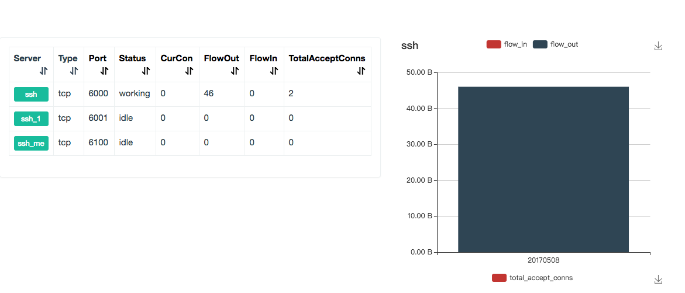

#
### 一、环境准备
最新版本 frp

一台公网 VPS 服务器

内网一台服务器，需要保证能够连接到互联网

### 二、服务器端配置

服务器作为公网访问唯一的固定地址，即作为 server 端。内网客户端作为 client 端，会主动向 server 端创建连接，此时再从 server 端反向发送数据即可实现内网穿透。

###### 1.下载（下载慢的可以用我百度云链接）

```
##下载 frp 并解压
wget https://github.com/fatedier/frp/releases/download/v0.9.3/frp_0.9.3_linux_amd64.tar.gz

tar -zxvf frp_0.9.3_linux_amd64.tar.gz

cd frp_0.9.3_linux_amd64
```
链接：https://pan.baidu.com/s/1CsUK78nR0tomZK11qx07zA 

提取码：z8ac

###### 2.编辑
编辑目录下** frps.ini **文件
```
# 编辑配置文件 # frps.ini#通用设置[common]# frp 监听地址
bind_port = 7000
#frp 控制面板
dashboard_port = 7500
# dashboard 用户名密码可选，默认都为 admin
dashboard_user = admin
dashboard_pwd = admin
# 开启 ssh 穿透(可通过外网链接内网 ssh)[ssh]
type = tcp
listen_port = 6000 #到时候通过 ssh @x.x.x.x -p 6000 连接到PC1
auth_token = 123 # client端的auth_token 需要和这一致
# 内网的多台主机 都可以通过一个公网服务器进行映射[ssh_1]
type = tcp
listen_port = 6001 
auth_token = 1231
```
###### 3.运行
```
 ./frps -c frps.ini #(如需后台运行 在命令后面加个&)
```

### 三、客户端配置
客户端只需要多配置所链接的服务器端地址，以及要映射客户端的哪些服务端口
```
##下载 frp 并解压
wget https://github.com/fatedier/frp/releases/download/v0.9.3/frp_0.9.3_linux_amd64.tar.gz

tar -zxvf frp_0.9.3_linux_amd64.tar.gz

cd frp_0.9.3_linux_amd64
```

链接：https://pan.baidu.com/s/1CsUK78nR0tomZK11qx07zA 

提取码：z8ac

###### 2.编辑
编辑目录下 frpc.ini 文件

```
# 通用配置[common]# 服务器端地址
server_addr = X.X.X.X # 填自己服务器端的IP地址或者域名
server_port = 7000 # 服务器端口
auth_token = 123 # 授权token 要与服务器端的SSH密码一致才能映射 这个密码是6000端口的 1个密码可以对一个端口
[ssh]
type = tcp
local_ip = 127.0.0.1 
local_port = 22
remote_port = 6000
```
###### 3.运行
```
 ./frpc -c frpc.ini
```

### 四、测试
> 服务器会检测到客户端的请求 如果成功/失败 均会有提示
> 客户端开启frp后 成功或失败 也均会有提示
> 服务器和客户端
> 服务端和客户端同时开启完成后，即可访问 http://domain.com（或IP地址）:7500
> 进入 frp 控制面板，如下

  

  

  此时通过 ssh root@domain.com（或IP地址） -p 6000
即可连接到内网服务器


### 五、设为开机启动项
**编辑 rc.local **
```
sudo vim /etc/rc.local
```
在最后加入
```
/home/frp/frps(frps文件的绝对地址) -c /home/frp/frps.ini(同理) &
```

(若不加上& （为了后台运行） CentOS开机时 frp若成功开启 会在rc.local这卡死)

将rc.local 赋予权限

```
sudo chmod +x /etc/rc.d/rc.local
```
### 六、服务器端热加载配置文件
当需要新增一个 frpc 客户端时，为了避免将 frps 重启，可以使用 reload 命令重新加载配置文件。

```
./frps -c ./frps.ini --reload
```