##
## 一、需要版本
* 1、elasticsearch-7.1.1
* 2、elasticsearch-head-5.0.0
* 3、filebeat-7.1.1
* 4、kibana-7.1.1
* 5、logstash-7.1.1
* 6、zookeeper-3.4.14
* 7、kafka_2.11-2.2.0
* 8、zipkin-server-2.14.0-exec

## 二、配置
#### 1、修改elasticsearch-7.1.1/config/jvm.options 文件
```shell
将 -Dfile.encoding=UTF-8 修改为 -Dfile.encoding=GBK
```
#### 2、修改elasticsearch-7.1.1/config/elasticsearch.yml 文件
添加配置：
```yml
network.host: 0.0.0.0
http.port: 9200
transport.host: localhost
transport.tcp.port: 9300
http.cors.enabled: true
http.cors.allow-origin: "*"
```
## 3、创建logs文件件
```
目录：/data/enotefront/logs/logs(改目录下放产生的日志文件)
```
## 4、编辑 filebeat-7.1.1/filebeat.yml 文件 （不同的服务配置不同的日志路径）
  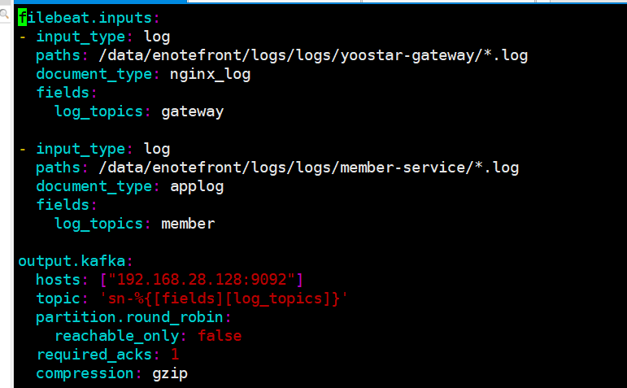

#### filebeat.yml （可以直接替换掉）
```yml
filebeat.inputs:
- input_type: log	
  paths: /data/enotefront/logs/logs/yoostar-gateway/*.log
  document_type: gateway_log
  fields:
    log_topics: gateway  

- input_type: log
  paths: /data/enotefront/logs/logs/member-service/*.log
  document_type: service_log
  fields:
    log_topics: member

output.kafka:
  hosts: ["192.168.28.128:9092"] 
  topic: 'sn-%{[fields][log_topics]}'
  partition.round_robin:
    reachable_only: false
  required_acks: 1
  compression: gzip
```

## 5、编辑 kibana-7.1.1/config/kibana.yml 文件
```yml
server.host: "0.0.0.0"
elasticsearch.hosts: ["http://10.20.22.30:9200"]
```

## 6、修改logstash-7.1.1/config/jvm.options 文件
```
将 -Dfile.encoding=UTF-8 修改为 -Dfile.encoding=GBK
```

## 7、编辑 logstash-7.1.1/config/logstash.conf 文件(`该文件需要手动创建`)
```
input {
    kafka {
        bootstrap_servers =>"192.168.28.128:9092"
        topics_pattern =>"sn-.*"
        consumer_threads =>5 
        decorate_events =>true 
	     codec =>"json"
        auto_offset_reset =>"earliest"
	#集群需要相同
	group_id =>"logstash1" 
    }
}
filter{
    json{
        source =>"message"
        target =>"doc"
    }
}
output{
    elasticsearch{
        action =>"index"
        hosts =>["192.168.28.128:9200"]
        #索引里面如果有大写字母就无法根据topic动态生成索引，topic也不能有大写字母
        index =>"%{[@metadata][topic]}-%{+YYYY-MM-dd}"
    }
    stdout{
        codec =>rubydebug
    }
}
```

## 8、修改 zookeeper-3.4.14/conf/zoo_sample.cfg文件名为zoo.cfg

## 9.启动
#### 9.1、安装node.js
```shell
// 下载
# wget https://nodejs.org/dist/v10.9.0/node-v10.9.0-linux-x64.tar.xz 
# tar xf node-v10.9.0-linux-x64.tar.xz // 解压
# cd node-v10.9.0-linux-x64/ // 进入解压目录
# ./bin/node -v // 执行node命令 查看版本
v10.9.0
配置环境变量
vim /etc/profile
export PATH=$PATH:/usr/local/node-v10.9.0-linux-x64/bin
```
  

```
source /etc/profile
```
  

#### 9.2、启动 elasticsearch-head
```
执行npm install -g grunt-cli 编译源码
执行npm install 安装服务
如果查询install.js错误执行npm -g install phantomjs-prebuilt@2.1.16 --ignore-script
执行grunt server启动服务。或者 nohup grunt server >output 2>&1 &
启动服务之后访问http://10.20.22.30:9100/
```
  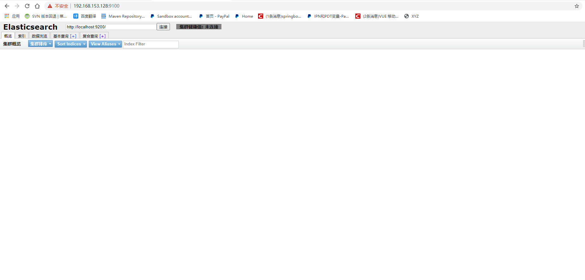

#### 9.3、启动zookeeper

```
./zkServer.sh start
```
#### 9.4、启动kafka

```
nohup ./bin/kafka-server-start.sh ./config/server.properties >output 2>&1 &
```

使用zk客户端连接

  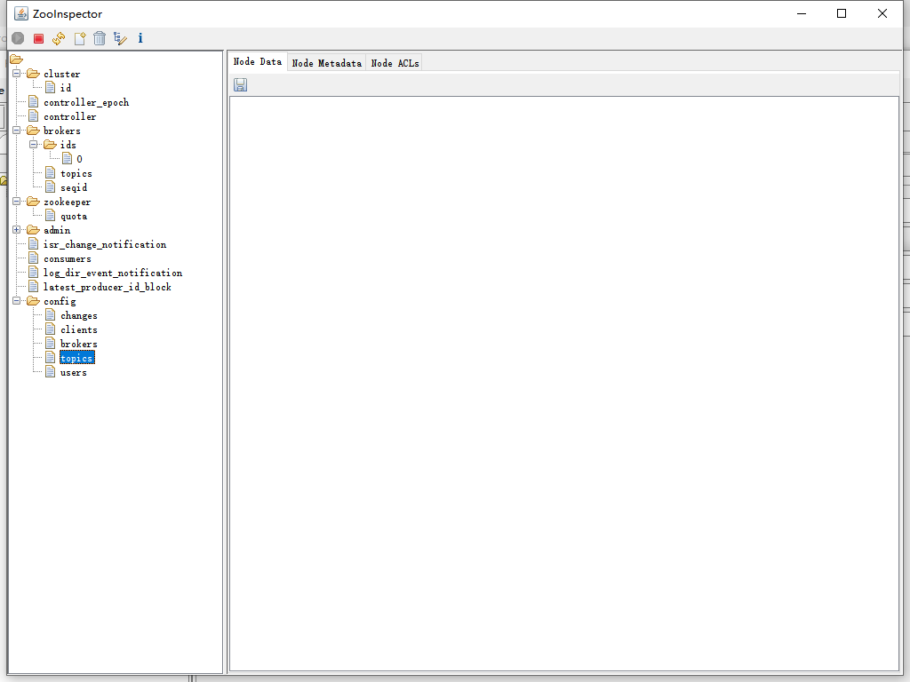

Kafka客户端口连接

  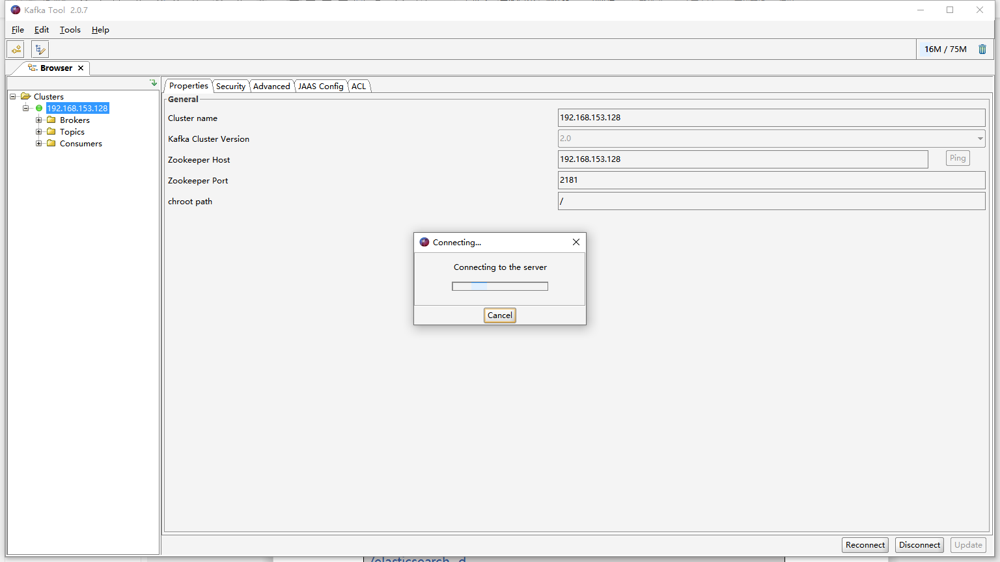

  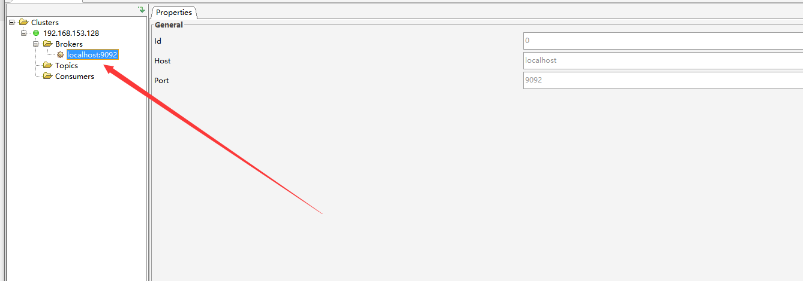

#### 9.5、启动elasticsearch
```
./elasticsearch -d 
如果出现没有权限./elasticsearch: Permission denied 
需要授权执行命令:chmod +x bin/elasticsearch 
再次执行./elasticsearch -d即可启动 
检验：浏览器输入 http://10.20.22.30:9200/ ，看到json数据表示 elasticsearch 启动成功，
```
##### 启动es出现以下错误是不能用root用户进行启动es
  

```
groupadd es
# -g 指定组 -p 指定密码
useradd es -g es -p es  
# -R : 处理指定目录下的所有文件
chown -R es:es  /usr/local/elasticsearch-7.1.1/ 
su es
./elasticsearch -d
```

访问页面

  

#### 9.6、启动kibana
```
nohup bin/kibana >output 2>&1 &
访问 http://10.20.22.30:5601/ ，即可访问 kibana 
```

  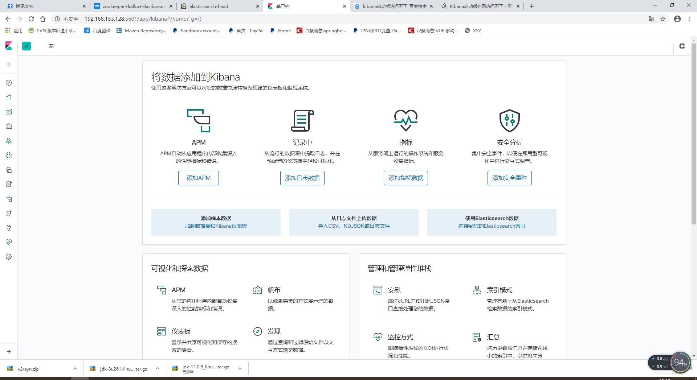

#### 9.7、启动filebeat
```
nohup ./filebeat -e -c filebeat.yml >output 2>&1 &
```
#### 9.8、启动logstash
```
nohup ./bin/logstash -f ./config/logstash.conf >output 2>&1 &
```
#### 9.9、启动zipkin
```
nohup java -jar zipkin-server-2.19.0-exec.jar --KAFKA_BOOTSTRAP_SERVERS=10.20.22.30:9092 --STORAGE_TYPE=elasticsearch --ES_HOSTS=http://10.20.22.30:9200 >output 2>&1 &
访问 http://10.20.22.30:9411/zipkin/ 即可查看zipkin
```
#### 9.10.测试
1.在/data/enotefront/logs/logs目录下放入二个日志文件

  

2.查看采集的日志是否输出到kafka

```
bin/kafka-topics.sh --list --zookeeper localhost:2181
```
  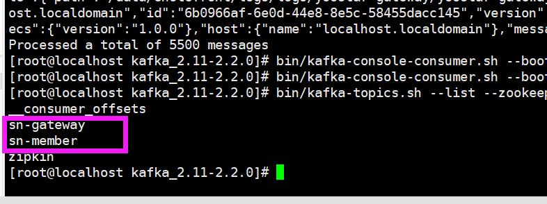

3.Elasticsearch查询索引数据

  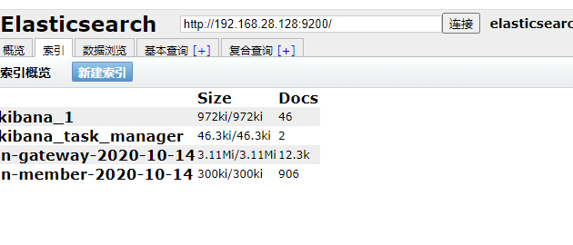

  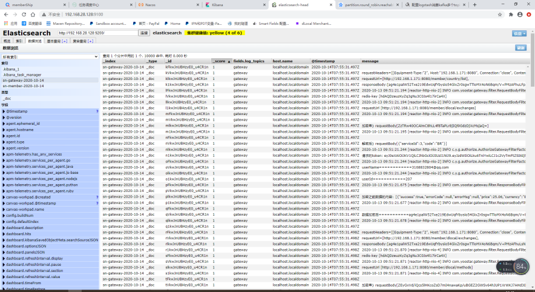

4.kinaba查看数据

  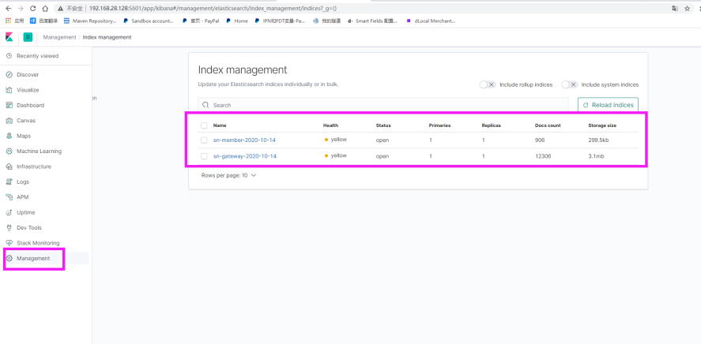

  
  
  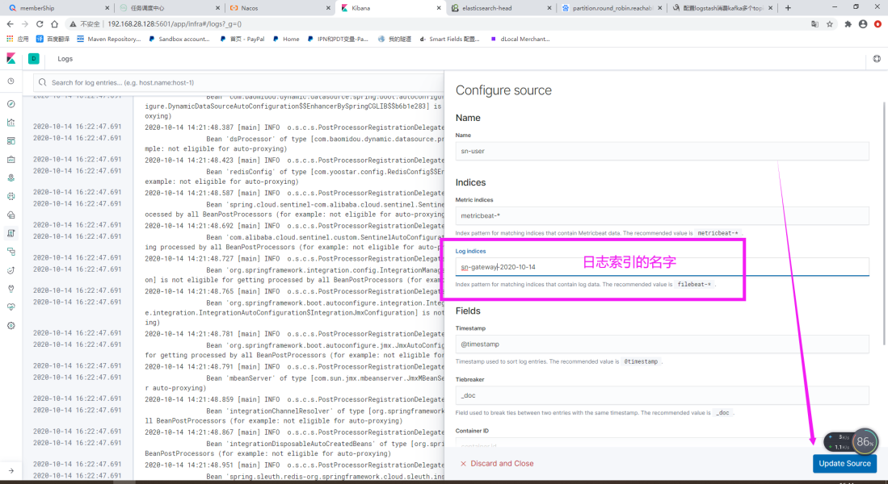
